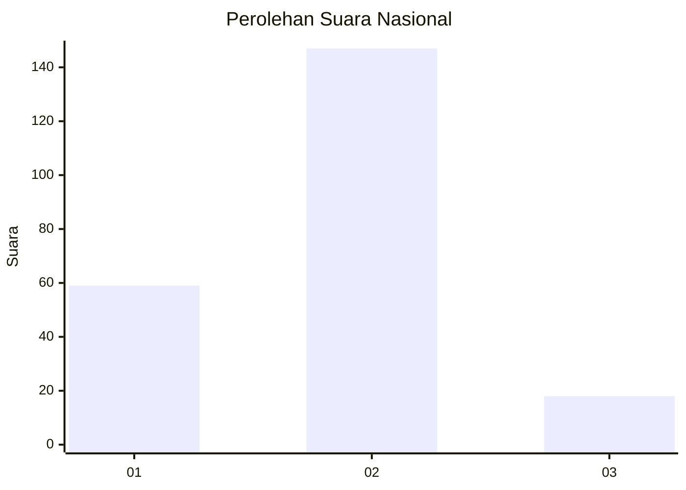
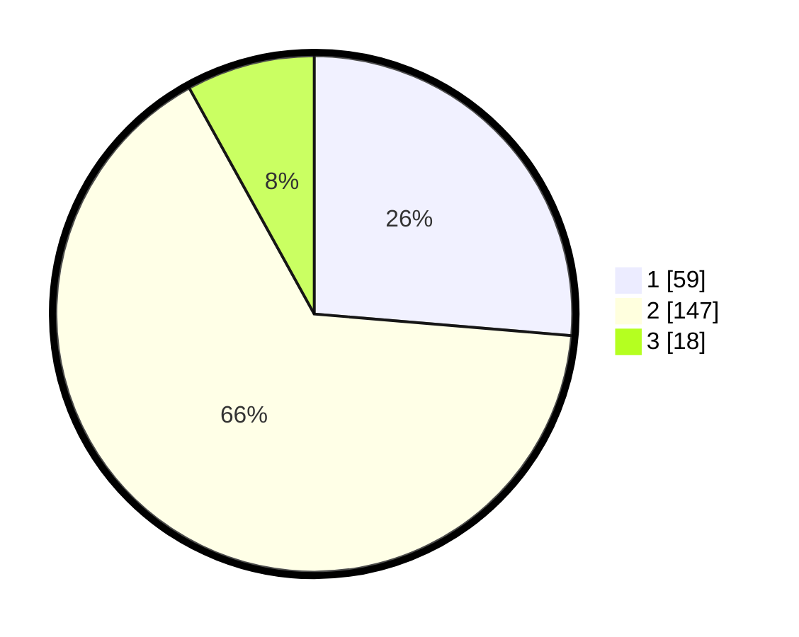

# Hasil

## Grafik

## Tabel

| No. | Nama Paslon    | Suara | Suara (raw) | Persentase |
|:--- |:-------------- | -----:| -----------:| ----------:|
| 1   | ANIES MUHAIMIN | 59    | [59][p-1]   | 26,34      |
| 2   | PRABOWO GIBRAN | 147   | [147][p-2]  | 65,63      |
| 3   | GANJAR MAHFUD  | 18    | [18][p-3]   | 8,04       |

[p-1]: https://github.com/gigit-pemilu/pemilu-2024/blob/main/pilpres/hitung-suara/sub/16-sumatera-selatan/sub/71-kota-palembang/sub/01-ilir-barat-dua/sub/1004-dua-puluh-sembilan-ilir/sub/006-tps/sub/paslon-1.txt
[p-2]: https://github.com/gigit-pemilu/pemilu-2024/blob/main/pilpres/hitung-suara/sub/16-sumatera-selatan/sub/71-kota-palembang/sub/01-ilir-barat-dua/sub/1004-dua-puluh-sembilan-ilir/sub/006-tps/sub/paslon-2.txt
[p-3]: https://github.com/gigit-pemilu/pemilu-2024/blob/main/pilpres/hitung-suara/sub/16-sumatera-selatan/sub/71-kota-palembang/sub/01-ilir-barat-dua/sub/1004-dua-puluh-sembilan-ilir/sub/006-tps/sub/paslon-3.txt

## Foto C Plano

https://sirekap-obj-formc.kpu.go.id/1fe5/pemilu/ppwp/16/71/01/10/04/1671011004006-20240214-193136--38055a98-8e42-412e-a7a0-3aff580c7b9d.jpg

https://sirekap-obj-formc.kpu.go.id/1fe5/pemilu/ppwp/16/71/01/10/04/1671011004006-20240214-193450--71178dab-64bf-48c4-8461-398e098b66c3.jpg

https://sirekap-obj-formc.kpu.go.id/1fe5/pemilu/ppwp/16/71/01/10/04/1671011004006-20240214-193716--e6b8bdd5-9863-49fa-a411-50966fa51fb1.jpg

## Metadata

| Key        | Value               |
| ---------- | ------------------- |
| Time Stamp | 2024-02-26 11:00:00 |

