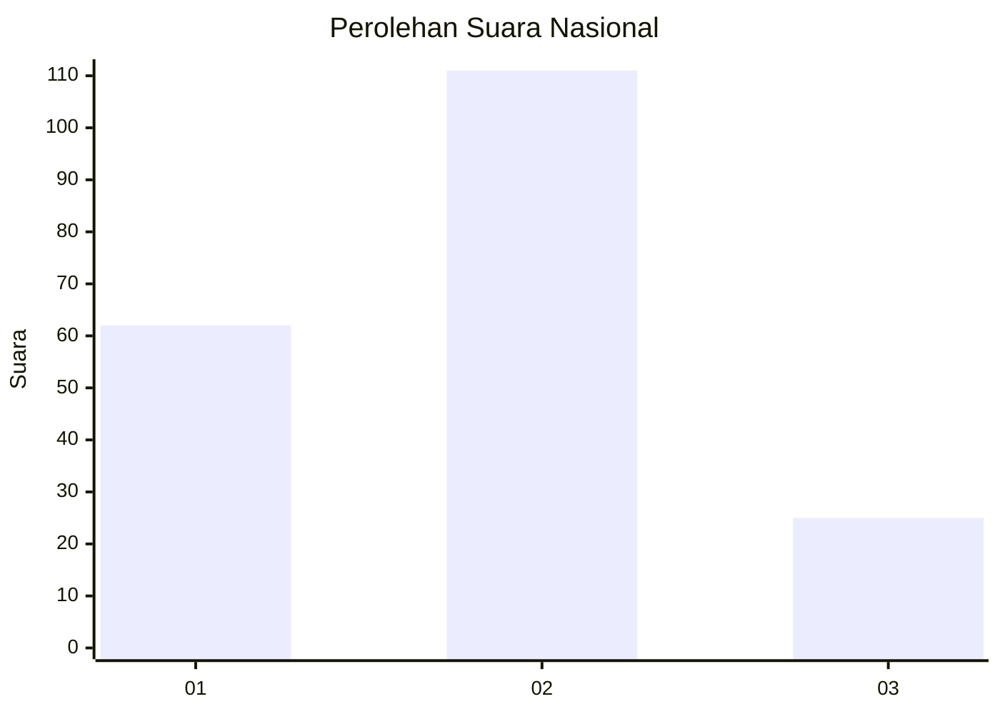
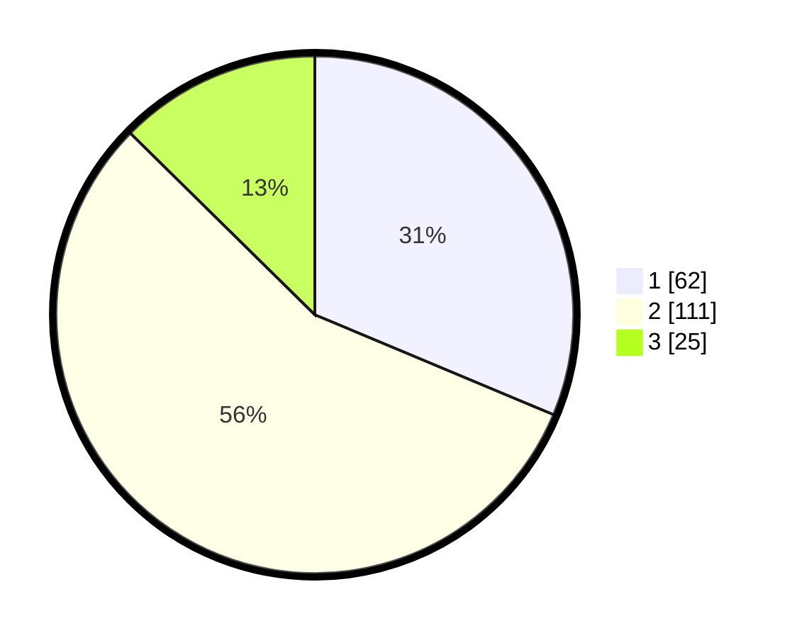

# Hasil

## Grafik

## Tabel

| No. | Nama Paslon    | Suara | Suara (raw) | Persentase |
|:--- |:-------------- | -----:| -----------:| ----------:|
| 1   | ANIES MUHAIMIN | 62    | [62][p-1]   | 31,31      |
| 2   | PRABOWO GIBRAN | 111   | [111][p-2]  | 56,06      |
| 3   | GANJAR MAHFUD  | 25    | [25][p-3]   | 12,63      |

[p-1]: https://github.com/gigit-pemilu/pemilu-2024/blob/main/pilpres/hitung-suara/sub/16-sumatera-selatan/sub/71-kota-palembang/sub/01-ilir-barat-dua/sub/1005-dua-puluh-delapan-ilir/sub/002-tps/sub/paslon-1.txt
[p-2]: https://github.com/gigit-pemilu/pemilu-2024/blob/main/pilpres/hitung-suara/sub/16-sumatera-selatan/sub/71-kota-palembang/sub/01-ilir-barat-dua/sub/1005-dua-puluh-delapan-ilir/sub/002-tps/sub/paslon-2.txt
[p-3]: https://github.com/gigit-pemilu/pemilu-2024/blob/main/pilpres/hitung-suara/sub/16-sumatera-selatan/sub/71-kota-palembang/sub/01-ilir-barat-dua/sub/1005-dua-puluh-delapan-ilir/sub/002-tps/sub/paslon-3.txt

## Foto C Plano

https://sirekap-obj-formc.kpu.go.id/1000/pemilu/ppwp/16/71/01/10/05/1671011005002-20240214-155039--5dbebf43-efbb-4e9e-8c91-f60f8ec9ff3f.jpg

https://sirekap-obj-formc.kpu.go.id/1000/pemilu/ppwp/16/71/01/10/05/1671011005002-20240214-155401--b4146732-9cb6-4c2e-9ed2-30f8a3f8654e.jpg

https://sirekap-obj-formc.kpu.go.id/1000/pemilu/ppwp/16/71/01/10/05/1671011005002-20240214-155626--51bd88ab-0f83-433c-8ce2-0ac60ba9f566.jpg

## Metadata

| Key        | Value               |
| ---------- | ------------------- |
| Time Stamp | 2024-02-14 21:46:01 |

