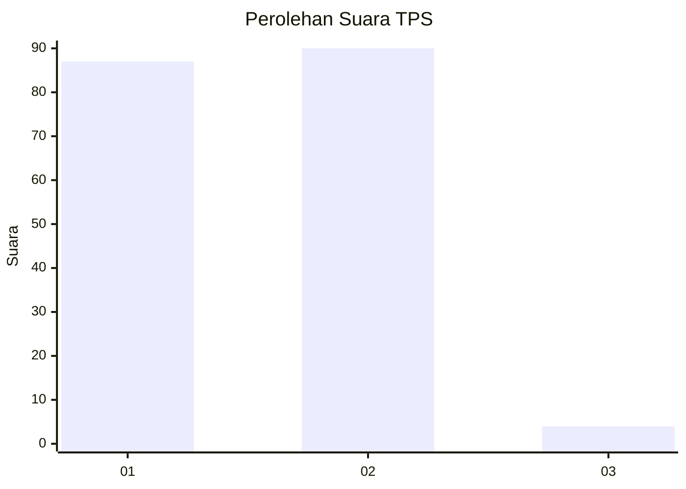
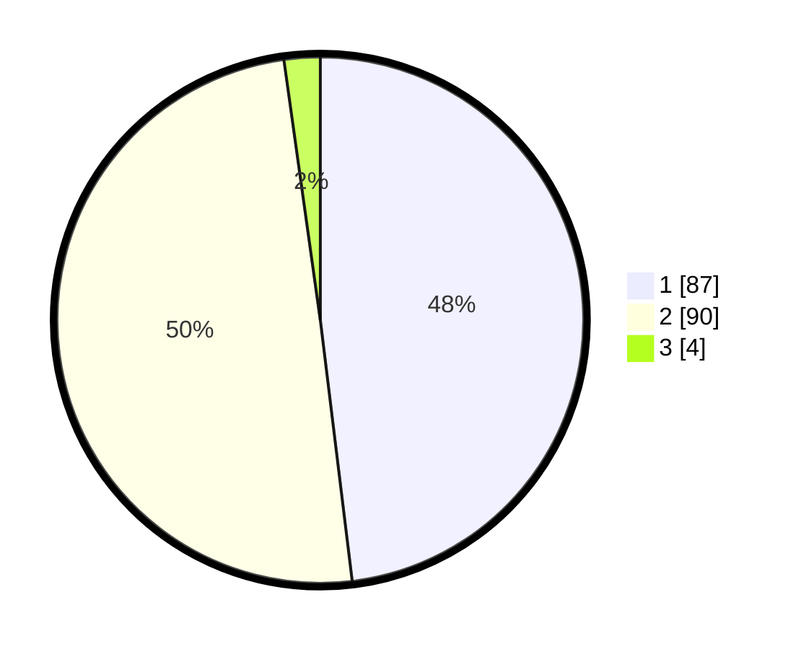

# Hasil

## Grafik

## Tabel

| No. | Nama Paslon    | Suara | Suara (raw) | Persentase |
|:--- |:-------------- | -----:| -----------:| ----------:|
| 1   | ANIES MUHAIMIN | 87    | [87][p-1]   | 48,07      |
| 2   | PRABOWO GIBRAN | 90    | [90][p-2]   | 49,72      |
| 3   | GANJAR MAHFUD  | 4     | [4][p-3]    | 2,21       |

[p-1]: https://github.com/gigit-pemilu/pemilu-2024-16-sumatera-selatan/blob/main/pilpres/hitung-suara/sub/16-sumatera-selatan/sub/71-kota-palembang/sub/01-ilir-barat-dua/sub/1006-dua-puluh-tujuh-ilir/sub/001-tps/sub/paslon-1.txt
[p-2]: https://github.com/gigit-pemilu/pemilu-2024-16-sumatera-selatan/blob/main/pilpres/hitung-suara/sub/16-sumatera-selatan/sub/71-kota-palembang/sub/01-ilir-barat-dua/sub/1006-dua-puluh-tujuh-ilir/sub/001-tps/sub/paslon-2.txt
[p-3]: https://github.com/gigit-pemilu/pemilu-2024-16-sumatera-selatan/blob/main/pilpres/hitung-suara/sub/16-sumatera-selatan/sub/71-kota-palembang/sub/01-ilir-barat-dua/sub/1006-dua-puluh-tujuh-ilir/sub/001-tps/sub/paslon-3.txt

## Foto C Plano

https://sirekap-obj-formc.kpu.go.id/c3dc/pemilu/ppwp/16/71/01/10/06/1671011006001-20240214-190147--a75fffef-c09d-43fc-8bf8-01188f862427.jpg

https://sirekap-obj-formc.kpu.go.id/c3dc/pemilu/ppwp/16/71/01/10/06/1671011006001-20240214-190231--be3a9c49-ccb0-4a96-b19a-20ca35664888.jpg

https://sirekap-obj-formc.kpu.go.id/c3dc/pemilu/ppwp/16/71/01/10/06/1671011006001-20240214-190337--6b184195-d5be-454e-8fbe-7ebaa389acf4.jpg

## Metadata

| Key        | Value               |
| ---------- | ------------------- |
| Time Stamp | 2024-02-25 21:00:00 |

