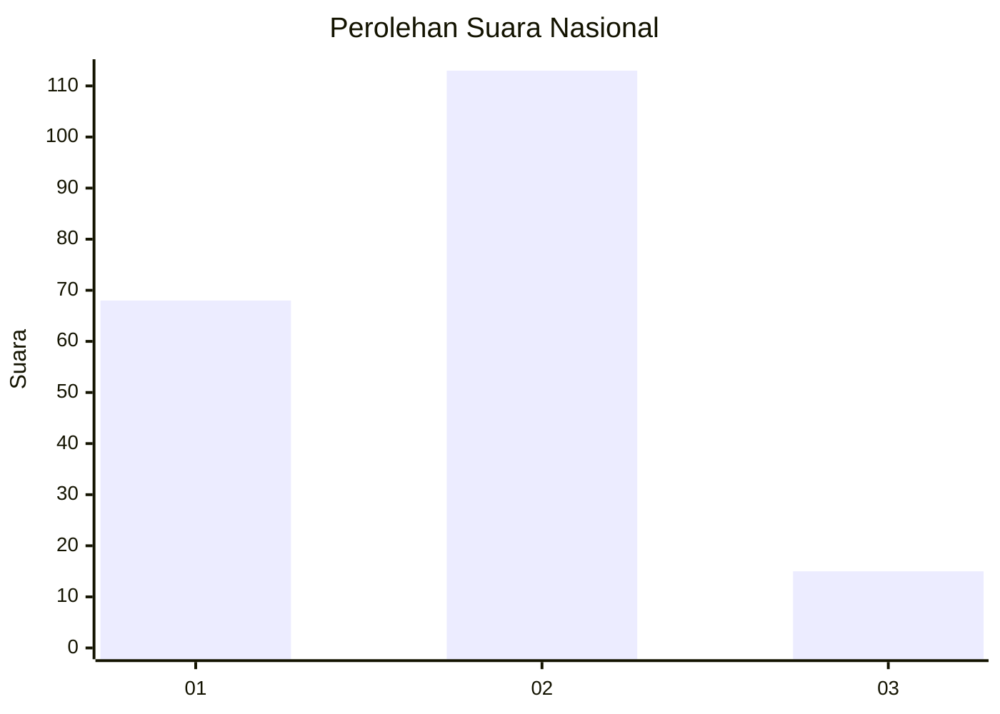
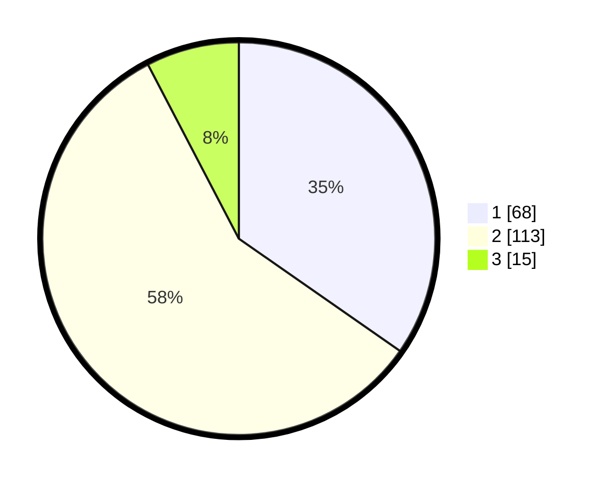

# Hasil

## Grafik

## Tabel

| No. | Nama Paslon    | Suara | Suara (raw) | Persentase |
|:--- |:-------------- | -----:| -----------:| ----------:|
| 1   | ANIES MUHAIMIN | 68    | [68][p-1]   | 34,69      |
| 2   | PRABOWO GIBRAN | 113   | [113][p-2]  | 57,65      |
| 3   | GANJAR MAHFUD  | 15    | [15][p-3]   | 7,65       |

[p-1]: https://github.com/gigit-pemilu/pemilu-2024/blob/main/pilpres/hitung-suara/sub/16-sumatera-selatan/sub/71-kota-palembang/sub/01-ilir-barat-dua/sub/1006-dua-puluh-tujuh-ilir/sub/005-tps/sub/paslon-1.txt
[p-2]: https://github.com/gigit-pemilu/pemilu-2024/blob/main/pilpres/hitung-suara/sub/16-sumatera-selatan/sub/71-kota-palembang/sub/01-ilir-barat-dua/sub/1006-dua-puluh-tujuh-ilir/sub/005-tps/sub/paslon-2.txt
[p-3]: https://github.com/gigit-pemilu/pemilu-2024/blob/main/pilpres/hitung-suara/sub/16-sumatera-selatan/sub/71-kota-palembang/sub/01-ilir-barat-dua/sub/1006-dua-puluh-tujuh-ilir/sub/005-tps/sub/paslon-3.txt

## Foto C Plano

https://sirekap-obj-formc.kpu.go.id/1a0c/pemilu/ppwp/16/71/01/10/06/1671011006005-20240214-234613--996f52e9-a385-4a47-b7c8-463c91d5be34.jpg

https://sirekap-obj-formc.kpu.go.id/1a0c/pemilu/ppwp/16/71/01/10/06/1671011006005-20240214-234620--b155601d-d42c-495f-ab76-976160e1dc47.jpg

https://sirekap-obj-formc.kpu.go.id/1a0c/pemilu/ppwp/16/71/01/10/06/1671011006005-20240214-234625--a0ab89dc-9d5c-412b-bf76-fa34214476f4.jpg

## Metadata

| Key        | Value               |
| ---------- | ------------------- |
| Time Stamp | 2024-02-25 00:00:00 |

