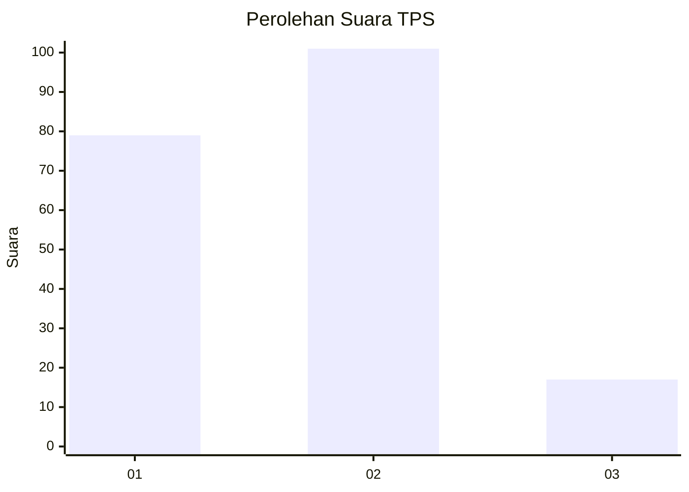
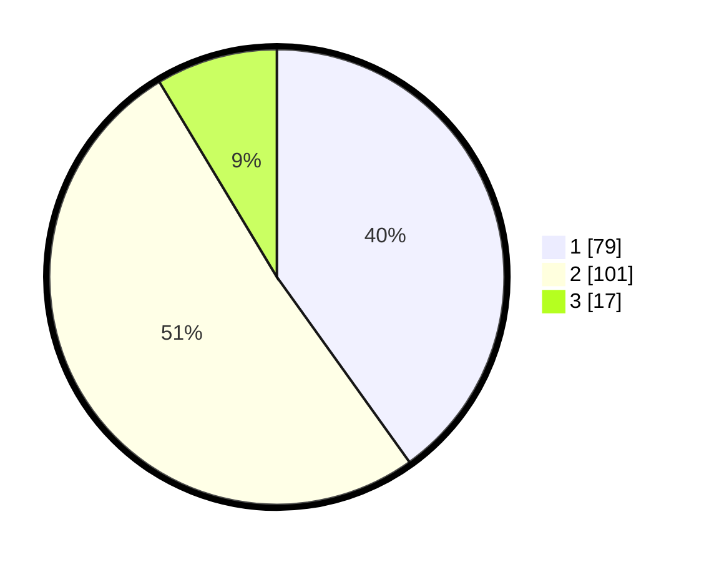

# Hasil

## Grafik

## Tabel

| No. | Nama Paslon    | Suara | Suara (raw) | Persentase |
|:--- |:-------------- | -----:| -----------:| ----------:|
| 1   | ANIES MUHAIMIN | 79    | [79][p-1]   | 40,10      |
| 2   | PRABOWO GIBRAN | 101   | [101][p-2]  | 51,27      |
| 3   | GANJAR MAHFUD  | 17    | [17][p-3]   | 8,63       |

[p-1]: https://github.com/gigit-pemilu/pemilu-2024-16-sumatera-selatan/blob/main/pilpres/hitung-suara/sub/16-sumatera-selatan/sub/71-kota-palembang/sub/01-ilir-barat-dua/sub/1007-kemangmanis/sub/009-tps/sub/paslon-1.txt
[p-2]: https://github.com/gigit-pemilu/pemilu-2024-16-sumatera-selatan/blob/main/pilpres/hitung-suara/sub/16-sumatera-selatan/sub/71-kota-palembang/sub/01-ilir-barat-dua/sub/1007-kemangmanis/sub/009-tps/sub/paslon-2.txt
[p-3]: https://github.com/gigit-pemilu/pemilu-2024-16-sumatera-selatan/blob/main/pilpres/hitung-suara/sub/16-sumatera-selatan/sub/71-kota-palembang/sub/01-ilir-barat-dua/sub/1007-kemangmanis/sub/009-tps/sub/paslon-3.txt

## Foto C Plano

https://sirekap-obj-formc.kpu.go.id/eff0/pemilu/ppwp/16/71/01/10/07/1671011007009-20240215-013131--eb87c23d-21a0-482c-a379-90c7c2332009.jpg

https://sirekap-obj-formc.kpu.go.id/eff0/pemilu/ppwp/16/71/01/10/07/1671011007009-20240215-013139--3078d523-4ff2-42f9-a420-09841c0aa82f.jpg

https://sirekap-obj-formc.kpu.go.id/eff0/pemilu/ppwp/16/71/01/10/07/1671011007009-20240215-013146--9afd022b-5eb6-4b65-b66c-6a3220daac1e.jpg

## Metadata

| Key        | Value               |
| ---------- | ------------------- |
| Time Stamp | 2024-02-25 16:00:00 |

