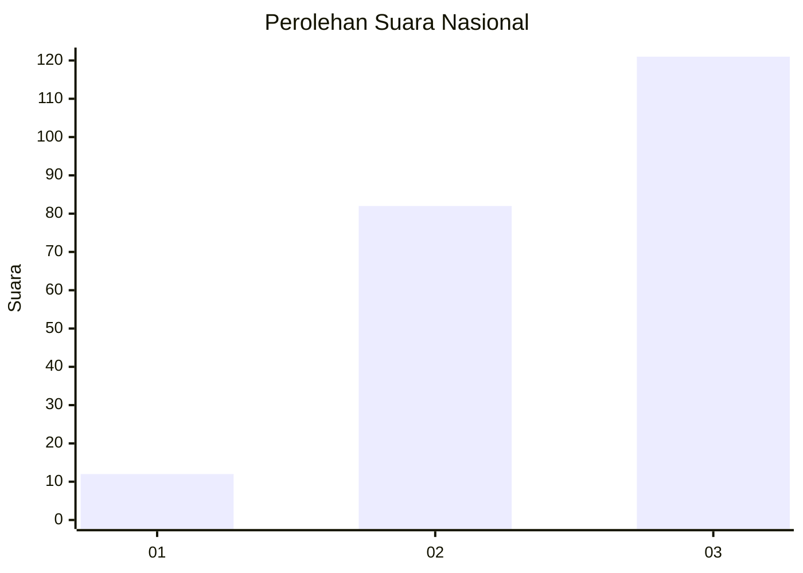
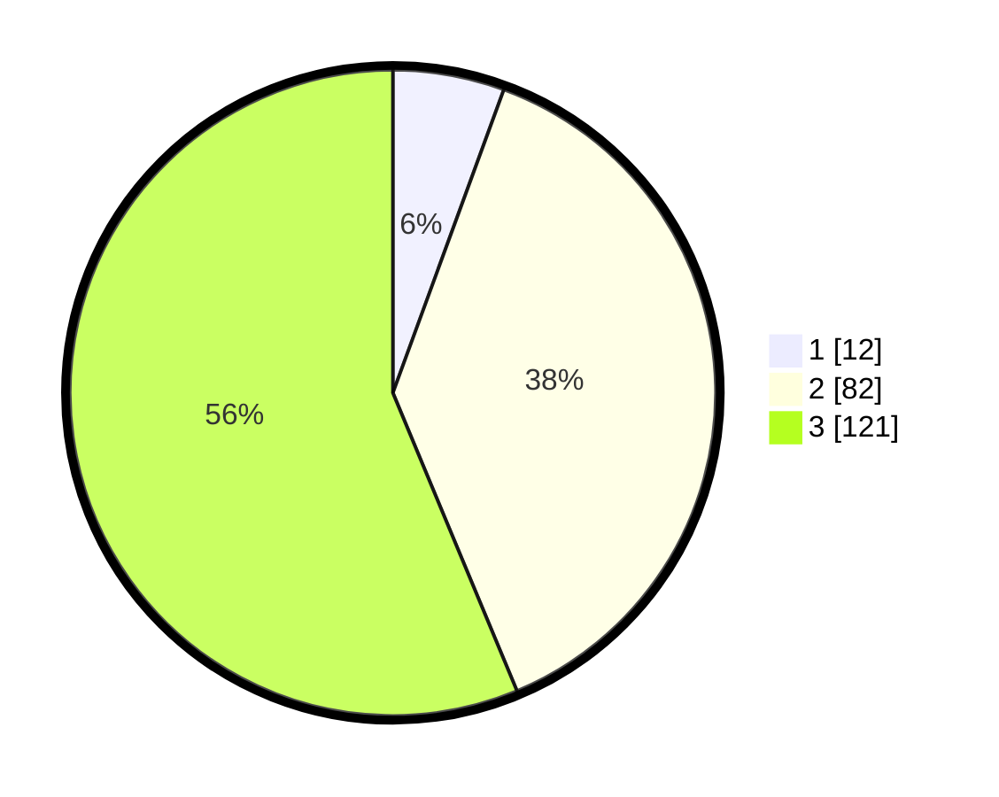

# Hasil

## Grafik

## Tabel

| No. | Nama Paslon    | Suara | Suara (raw) | Persentase |
|:--- |:-------------- | -----:| -----------:| ----------:|
| 1   | ANIES MUHAIMIN | 12    | [12][p-1]   | 5,58       |
| 2   | PRABOWO GIBRAN | 82    | [82][p-2]   | 38,14      |
| 3   | GANJAR MAHFUD  | 121   | [121][p-3]  | 56,28      |

[p-1]: https://github.com/gigit-pemilu/pemilu-2024/blob/main/pilpres/hitung-suara/sub/16-sumatera-selatan/sub/71-kota-palembang/sub/01-ilir-barat-dua/sub/1007-kemangmanis/sub/015-tps/sub/paslon-1.txt
[p-2]: https://github.com/gigit-pemilu/pemilu-2024/blob/main/pilpres/hitung-suara/sub/16-sumatera-selatan/sub/71-kota-palembang/sub/01-ilir-barat-dua/sub/1007-kemangmanis/sub/015-tps/sub/paslon-2.txt
[p-3]: https://github.com/gigit-pemilu/pemilu-2024/blob/main/pilpres/hitung-suara/sub/16-sumatera-selatan/sub/71-kota-palembang/sub/01-ilir-barat-dua/sub/1007-kemangmanis/sub/015-tps/sub/paslon-3.txt

## Foto C Plano

https://sirekap-obj-formc.kpu.go.id/27c5/pemilu/ppwp/16/71/01/10/07/1671011007015-20240214-202224--18602da4-1e48-4917-b4b6-357921756d11.jpg

https://sirekap-obj-formc.kpu.go.id/27c5/pemilu/ppwp/16/71/01/10/07/1671011007015-20240214-202403--134599fb-3400-4e94-b527-7a33640e37f7.jpg

https://sirekap-obj-formc.kpu.go.id/27c5/pemilu/ppwp/16/71/01/10/07/1671011007015-20240214-202441--281b829c-3011-462a-8b81-d51e076c2fae.jpg

## Metadata

| Key        | Value               |
| ---------- | ------------------- |
| Time Stamp | 2024-02-25 22:00:00 |

