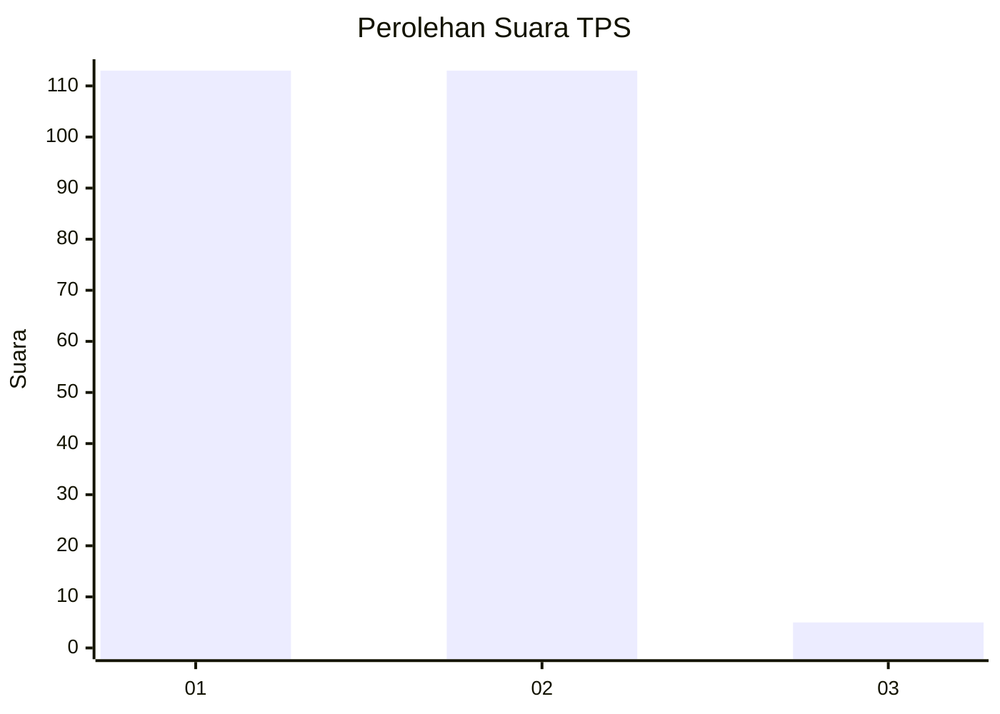
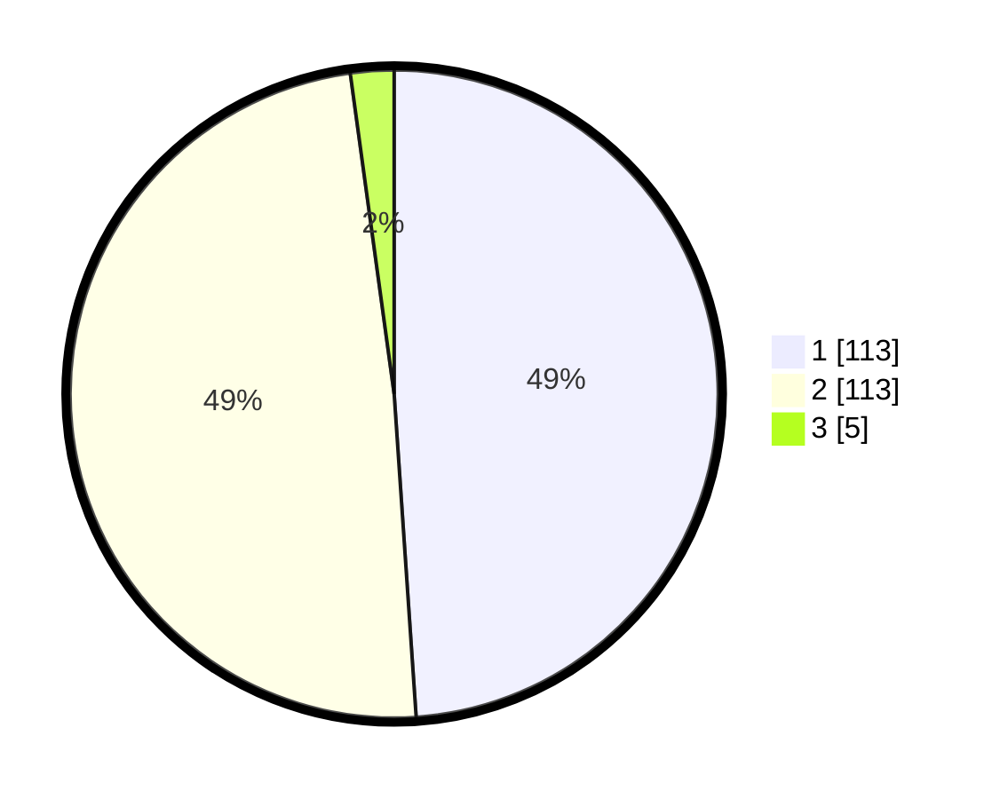

# Hasil

## Grafik

## Tabel

| No. | Nama Paslon    | Suara | Suara (raw) | Persentase |
|:--- |:-------------- | -----:| -----------:| ----------:|
| 1   | ANIES MUHAIMIN | 113   | [113][p-1]  | 48,92      |
| 2   | PRABOWO GIBRAN | 113   | [113][p-2]  | 48,92      |
| 3   | GANJAR MAHFUD  | 5     | [5][p-3]    | 2,16       |

[p-1]: https://github.com/gigit-pemilu/pemilu-2024-16-sumatera-selatan/blob/main/pilpres/hitung-suara/sub/16-sumatera-selatan/sub/71-kota-palembang/sub/02-seberang-ulu-satu/sub/1002-satu-ulu/sub/013-tps/sub/paslon-1.txt
[p-2]: https://github.com/gigit-pemilu/pemilu-2024-16-sumatera-selatan/blob/main/pilpres/hitung-suara/sub/16-sumatera-selatan/sub/71-kota-palembang/sub/02-seberang-ulu-satu/sub/1002-satu-ulu/sub/013-tps/sub/paslon-2.txt
[p-3]: https://github.com/gigit-pemilu/pemilu-2024-16-sumatera-selatan/blob/main/pilpres/hitung-suara/sub/16-sumatera-selatan/sub/71-kota-palembang/sub/02-seberang-ulu-satu/sub/1002-satu-ulu/sub/013-tps/sub/paslon-3.txt

## Foto C Plano

https://sirekap-obj-formc.kpu.go.id/6fdd/pemilu/ppwp/16/71/02/10/02/1671021002013-20240215-013851--5777934a-305a-4683-9c49-9f1b899cd687.jpg

https://sirekap-obj-formc.kpu.go.id/6fdd/pemilu/ppwp/16/71/02/10/02/1671021002013-20240215-013937--850314ba-60d8-416b-8bb3-90d9bf68f5f0.jpg

https://sirekap-obj-formc.kpu.go.id/6fdd/pemilu/ppwp/16/71/02/10/02/1671021002013-20240215-015745--cf57bd1f-c12d-48f2-8e19-0e830fe8fd4c.jpg

## Metadata

| Key        | Value               |
| ---------- | ------------------- |
| Time Stamp | 2024-02-24 22:31:28 |

