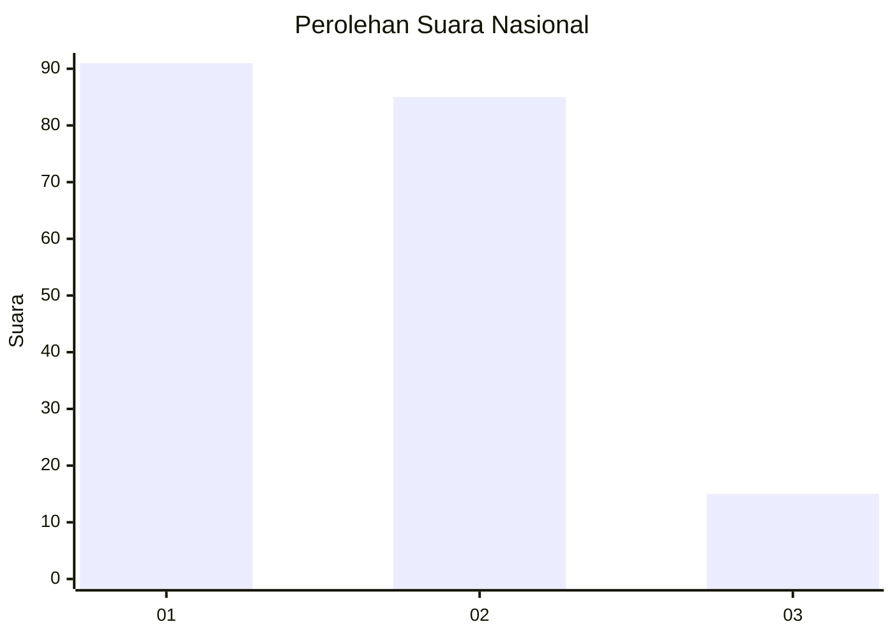
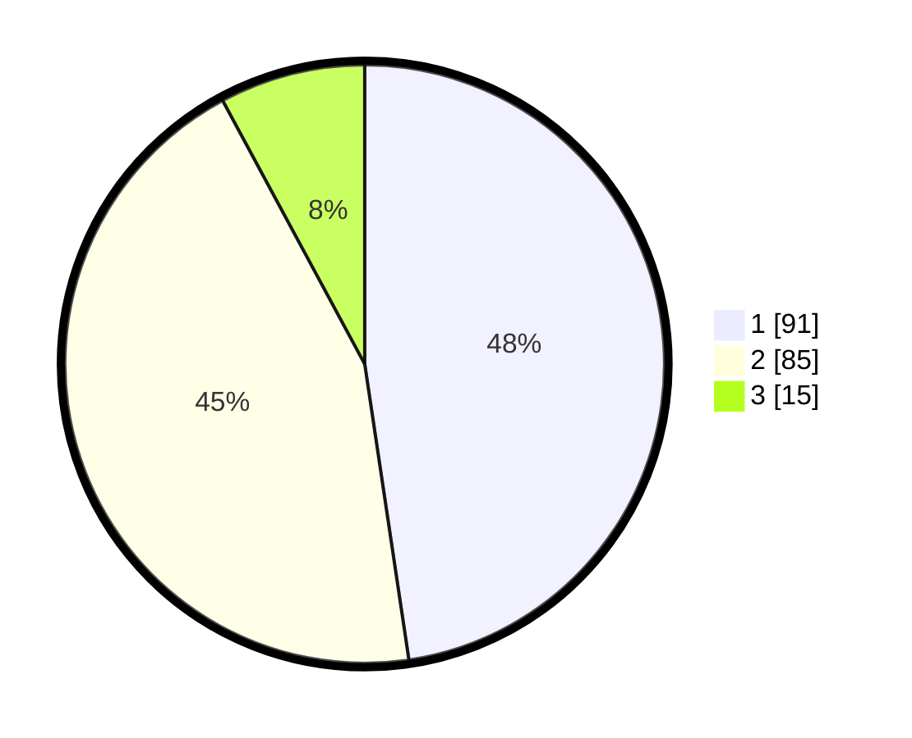

# Hasil

## Grafik

## Tabel

| No. | Nama Paslon    | Suara | Suara (raw) | Persentase |
|:--- |:-------------- | -----:| -----------:| ----------:|
| 1   | ANIES MUHAIMIN | 91    | [91][p-1]   | 47,64      |
| 2   | PRABOWO GIBRAN | 85    | [85][p-2]   | 44,50      |
| 3   | GANJAR MAHFUD  | 15    | [15][p-3]   | 7,85       |

[p-1]: https://github.com/gigit-pemilu/pemilu-2024/blob/main/pilpres/hitung-suara/sub/16-sumatera-selatan/sub/71-kota-palembang/sub/02-seberang-ulu-satu/sub/1003-dua-ulu/sub/001-tps/sub/paslon-1.txt
[p-2]: https://github.com/gigit-pemilu/pemilu-2024/blob/main/pilpres/hitung-suara/sub/16-sumatera-selatan/sub/71-kota-palembang/sub/02-seberang-ulu-satu/sub/1003-dua-ulu/sub/001-tps/sub/paslon-2.txt
[p-3]: https://github.com/gigit-pemilu/pemilu-2024/blob/main/pilpres/hitung-suara/sub/16-sumatera-selatan/sub/71-kota-palembang/sub/02-seberang-ulu-satu/sub/1003-dua-ulu/sub/001-tps/sub/paslon-3.txt

## Foto C Plano

https://sirekap-obj-formc.kpu.go.id/8b50/pemilu/ppwp/16/71/02/10/03/1671021003001-20240214-214549--d7b55e5e-16db-4fe7-b787-dbaf2b1eb733.jpg

https://sirekap-obj-formc.kpu.go.id/8b50/pemilu/ppwp/16/71/02/10/03/1671021003001-20240214-214554--2bffcc5a-8956-4bf0-931c-7e90b97fc9b4.jpg

https://sirekap-obj-formc.kpu.go.id/8b50/pemilu/ppwp/16/71/02/10/03/1671021003001-20240214-214559--d48769f8-5619-4cb2-868f-948590c6d5c8.jpg

## Metadata

| Key        | Value               |
| ---------- | ------------------- |
| Time Stamp | 2024-02-25 14:00:00 |

