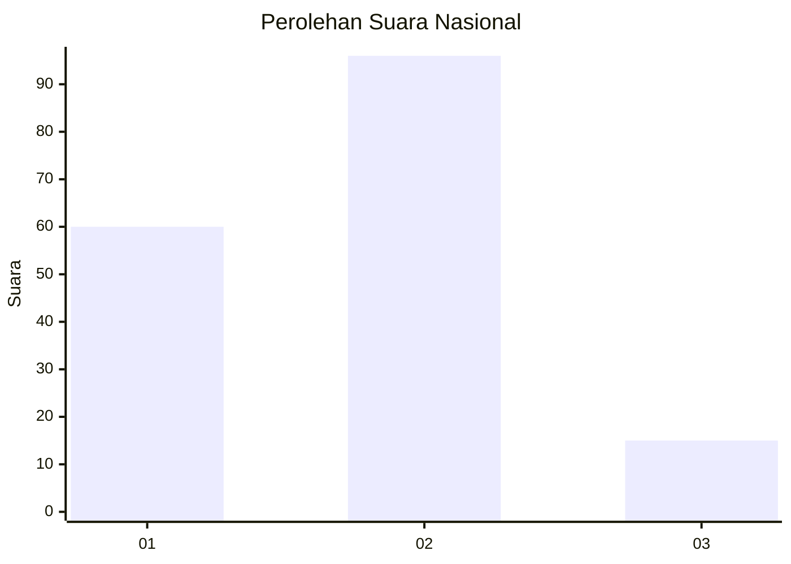
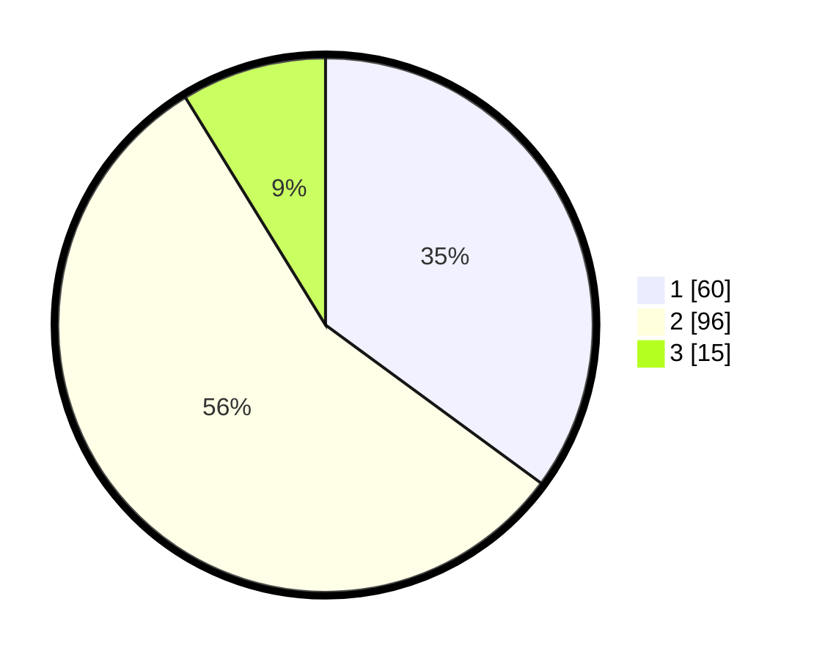

# Hasil

## Grafik

## Tabel

| No. | Nama Paslon    | Suara | Suara (raw) | Persentase |
|:--- |:-------------- | -----:| -----------:| ----------:|
| 1   | ANIES MUHAIMIN | 60    | [60][p-1]   | 35,09      |
| 2   | PRABOWO GIBRAN | 96    | [96][p-2]   | 56,14      |
| 3   | GANJAR MAHFUD  | 15    | [15][p-3]   | 8,77       |

[p-1]: https://github.com/gigit-pemilu/pemilu-2024/blob/main/pilpres/hitung-suara/sub/16-sumatera-selatan/sub/71-kota-palembang/sub/02-seberang-ulu-satu/sub/1003-dua-ulu/sub/028-tps/sub/paslon-1.txt
[p-2]: https://github.com/gigit-pemilu/pemilu-2024/blob/main/pilpres/hitung-suara/sub/16-sumatera-selatan/sub/71-kota-palembang/sub/02-seberang-ulu-satu/sub/1003-dua-ulu/sub/028-tps/sub/paslon-2.txt
[p-3]: https://github.com/gigit-pemilu/pemilu-2024/blob/main/pilpres/hitung-suara/sub/16-sumatera-selatan/sub/71-kota-palembang/sub/02-seberang-ulu-satu/sub/1003-dua-ulu/sub/028-tps/sub/paslon-3.txt

## Foto C Plano

https://sirekap-obj-formc.kpu.go.id/beb3/pemilu/ppwp/16/71/02/10/03/1671021003028-20240214-195038--e8f6e931-9540-409e-b8ac-26b87dea88eb.jpg

https://sirekap-obj-formc.kpu.go.id/beb3/pemilu/ppwp/16/71/02/10/03/1671021003028-20240214-195056--31c6df75-a138-4429-8029-edd5304c45d9.jpg

https://sirekap-obj-formc.kpu.go.id/beb3/pemilu/ppwp/16/71/02/10/03/1671021003028-20240214-195100--5d06289e-b1d1-4f83-91a7-27aa2484893a.jpg

## Metadata

| Key        | Value               |
| ---------- | ------------------- |
| Time Stamp | 2024-02-25 16:00:00 |

