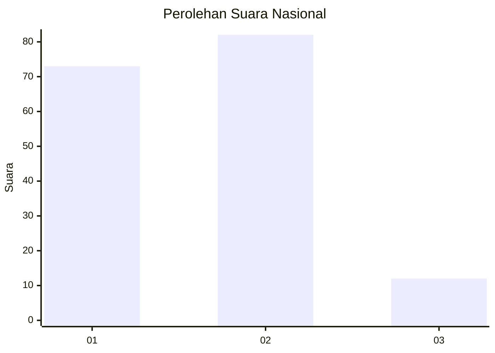
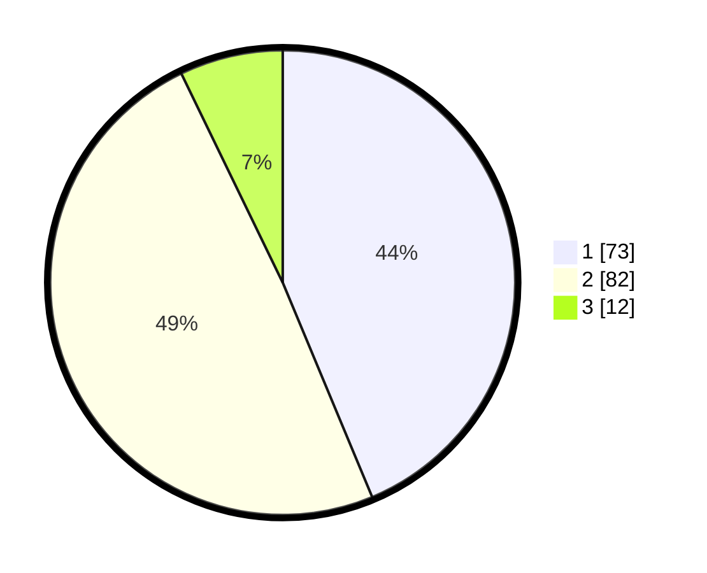

# Hasil

## Grafik

## Tabel

| No. | Nama Paslon    | Suara | Suara (raw) | Persentase |
|:--- |:-------------- | -----:| -----------:| ----------:|
| 1   | ANIES MUHAIMIN | 73    | [73][p-1]   | 43,71      |
| 2   | PRABOWO GIBRAN | 82    | [82][p-2]   | 49,10      |
| 3   | GANJAR MAHFUD  | 12    | [12][p-3]   | 7,19       |

[p-1]: https://github.com/gigit-pemilu/pemilu-2024/blob/main/pilpres/hitung-suara/sub/16-sumatera-selatan/sub/71-kota-palembang/sub/02-seberang-ulu-satu/sub/1004-tiga-empat-ulu/sub/049-tps/sub/paslon-1.txt
[p-2]: https://github.com/gigit-pemilu/pemilu-2024/blob/main/pilpres/hitung-suara/sub/16-sumatera-selatan/sub/71-kota-palembang/sub/02-seberang-ulu-satu/sub/1004-tiga-empat-ulu/sub/049-tps/sub/paslon-2.txt
[p-3]: https://github.com/gigit-pemilu/pemilu-2024/blob/main/pilpres/hitung-suara/sub/16-sumatera-selatan/sub/71-kota-palembang/sub/02-seberang-ulu-satu/sub/1004-tiga-empat-ulu/sub/049-tps/sub/paslon-3.txt

## Foto C Plano

https://sirekap-obj-formc.kpu.go.id/2c3c/pemilu/ppwp/16/71/02/10/04/1671021004049-20240214-232209--9ddeac55-b86a-4cf5-9355-e3386339b566.jpg

https://sirekap-obj-formc.kpu.go.id/2c3c/pemilu/ppwp/16/71/02/10/04/1671021004049-20240214-232414--3cd6cd75-f673-4b18-b4d1-88daad61d48b.jpg

https://sirekap-obj-formc.kpu.go.id/2c3c/pemilu/ppwp/16/71/02/10/04/1671021004049-20240214-232551--76d92c61-3f84-4607-a4fd-d20f2d80f82f.jpg

## Metadata

| Key        | Value               |
| ---------- | ------------------- |
| Time Stamp | 2024-02-25 15:00:00 |

