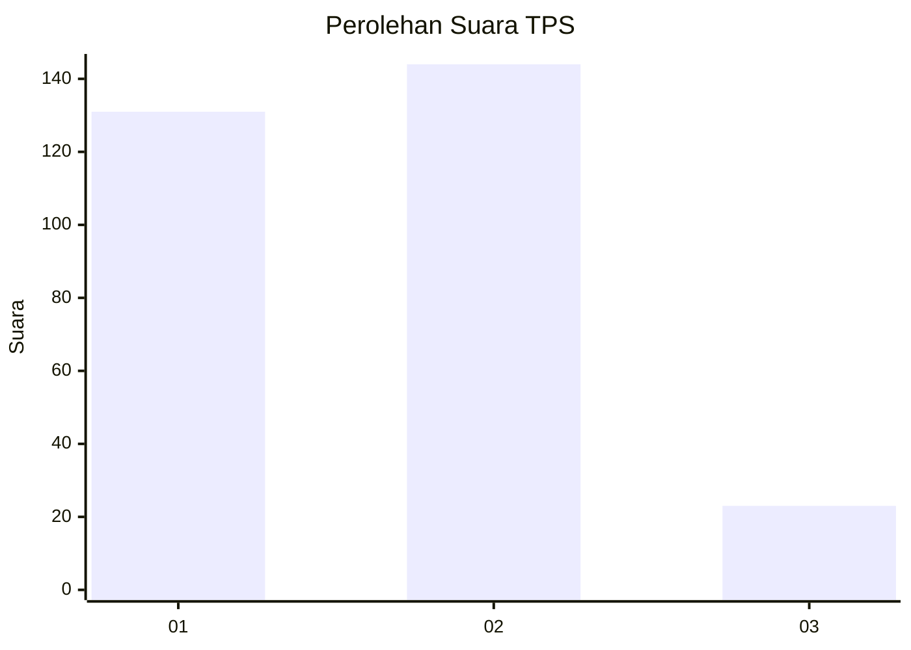
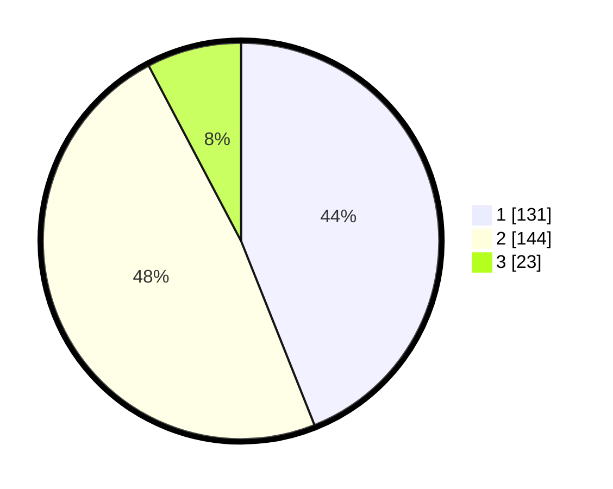

# Hasil

## Grafik

## Tabel

| No. | Nama Paslon    | Suara | Suara (raw) | Persentase |
|:--- |:-------------- | -----:| -----------:| ----------:|
| 1   | ANIES MUHAIMIN | 131   | [131][p-1]  | 43,96      |
| 2   | PRABOWO GIBRAN | 144   | [144][p-2]  | 48,32      |
| 3   | GANJAR MAHFUD  | 23    | [23][p-3]   | 7,72       |

[p-1]: https://github.com/gigit-pemilu/pemilu-2024-16-sumatera-selatan/blob/main/pilpres/hitung-suara/sub/16-sumatera-selatan/sub/71-kota-palembang/sub/02-seberang-ulu-satu/sub/1005-lima-ulu/sub/045-tps/sub/paslon-1.txt
[p-2]: https://github.com/gigit-pemilu/pemilu-2024-16-sumatera-selatan/blob/main/pilpres/hitung-suara/sub/16-sumatera-selatan/sub/71-kota-palembang/sub/02-seberang-ulu-satu/sub/1005-lima-ulu/sub/045-tps/sub/paslon-2.txt
[p-3]: https://github.com/gigit-pemilu/pemilu-2024-16-sumatera-selatan/blob/main/pilpres/hitung-suara/sub/16-sumatera-selatan/sub/71-kota-palembang/sub/02-seberang-ulu-satu/sub/1005-lima-ulu/sub/045-tps/sub/paslon-3.txt

## Foto C Plano

https://sirekap-obj-formc.kpu.go.id/de8b/pemilu/ppwp/16/71/02/10/05/1671021005045-20240215-070527--dfa50b01-9517-4ff3-b995-6892ee993508.jpg

https://sirekap-obj-formc.kpu.go.id/de8b/pemilu/ppwp/16/71/02/10/05/1671021005045-20240215-070605--ca11178e-df1e-4cbd-aa2b-7fcd4cabc930.jpg

https://sirekap-obj-formc.kpu.go.id/de8b/pemilu/ppwp/16/71/02/10/05/1671021005045-20240215-070638--320d52bd-fd35-4396-b3da-aa8f37b2b66b.jpg

## Metadata

| Key        | Value               |
| ---------- | ------------------- |
| Time Stamp | 2024-02-25 14:00:00 |

