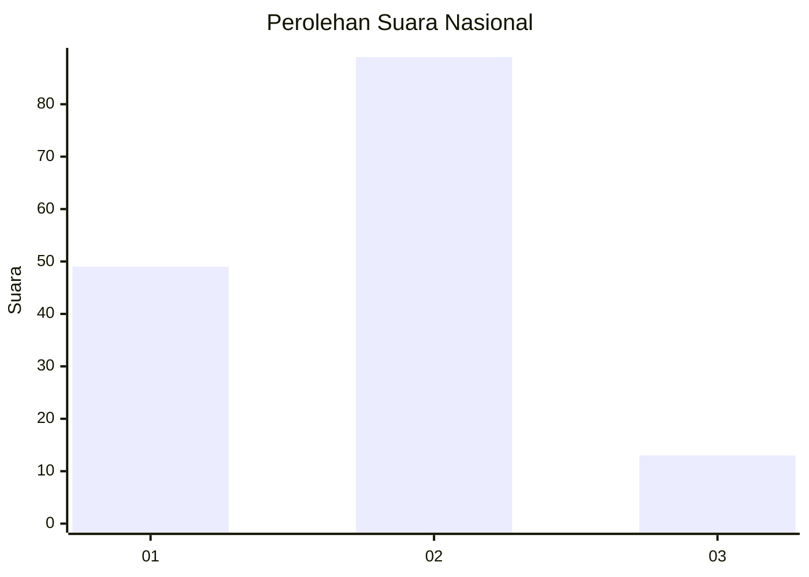
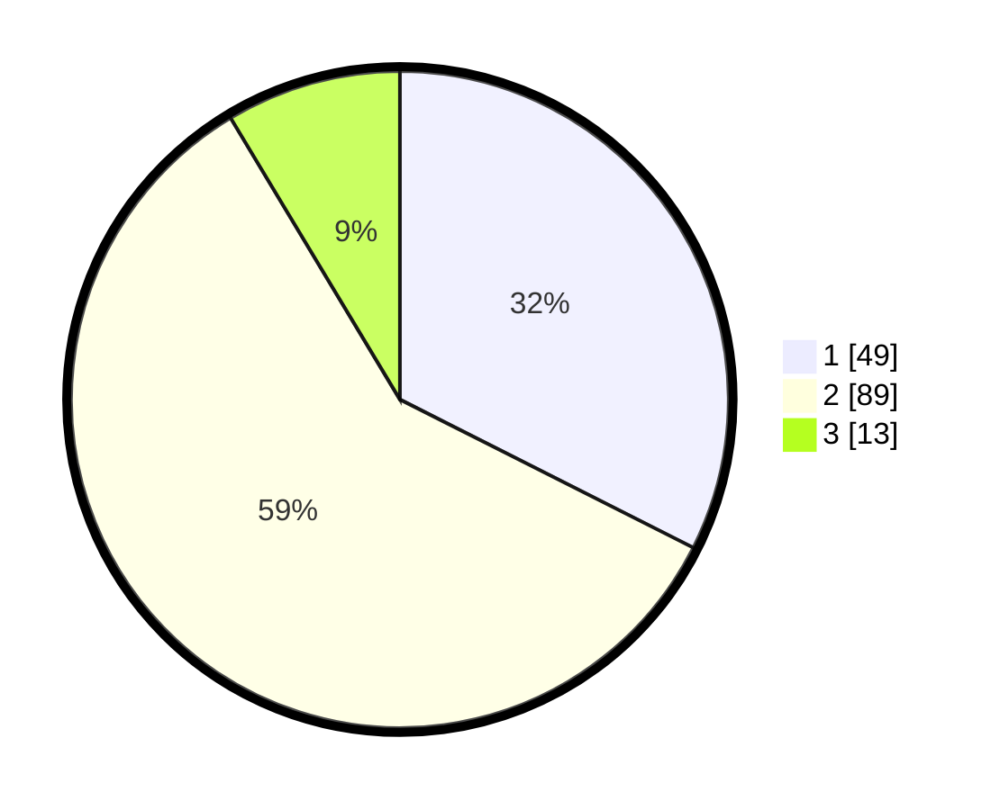

# Hasil

## Grafik

## Tabel

| No. | Nama Paslon    | Suara | Suara (raw) | Persentase |
|:--- |:-------------- | -----:| -----------:| ----------:|
| 1   | ANIES MUHAIMIN | 49    | [49][p-1]   | 32,45      |
| 2   | PRABOWO GIBRAN | 89    | [89][p-2]   | 58,94      |
| 3   | GANJAR MAHFUD  | 13    | [13][p-3]   | 8,61       |

[p-1]: https://github.com/gigit-pemilu/pemilu-2024/blob/main/pilpres/hitung-suara/sub/16-sumatera-selatan/sub/71-kota-palembang/sub/02-seberang-ulu-satu/sub/1005-lima-ulu/sub/073-tps/sub/paslon-1.txt
[p-2]: https://github.com/gigit-pemilu/pemilu-2024/blob/main/pilpres/hitung-suara/sub/16-sumatera-selatan/sub/71-kota-palembang/sub/02-seberang-ulu-satu/sub/1005-lima-ulu/sub/073-tps/sub/paslon-2.txt
[p-3]: https://github.com/gigit-pemilu/pemilu-2024/blob/main/pilpres/hitung-suara/sub/16-sumatera-selatan/sub/71-kota-palembang/sub/02-seberang-ulu-satu/sub/1005-lima-ulu/sub/073-tps/sub/paslon-3.txt

## Foto C Plano

https://sirekap-obj-formc.kpu.go.id/4ba5/pemilu/ppwp/16/71/02/10/05/1671021005073-20240214-205653--3bc63bc3-375c-46b7-a64b-edaff8433775.jpg

https://sirekap-obj-formc.kpu.go.id/4ba5/pemilu/ppwp/16/71/02/10/05/1671021005073-20240214-205421--121c6ebe-0672-4314-8897-508c769d6c97.jpg

https://sirekap-obj-formc.kpu.go.id/4ba5/pemilu/ppwp/16/71/02/10/05/1671021005073-20240214-205539--50d2eca9-3aeb-43d0-88ba-7ac1a4aee2b5.jpg

## Metadata

| Key        | Value               |
| ---------- | ------------------- |
| Time Stamp | 2024-02-25 22:00:00 |

