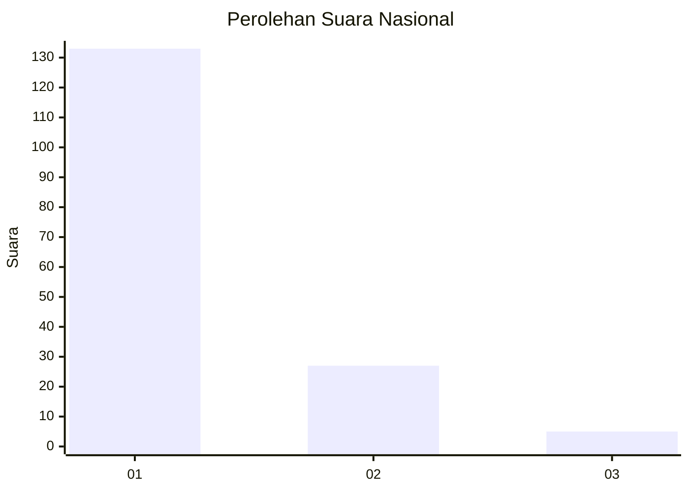
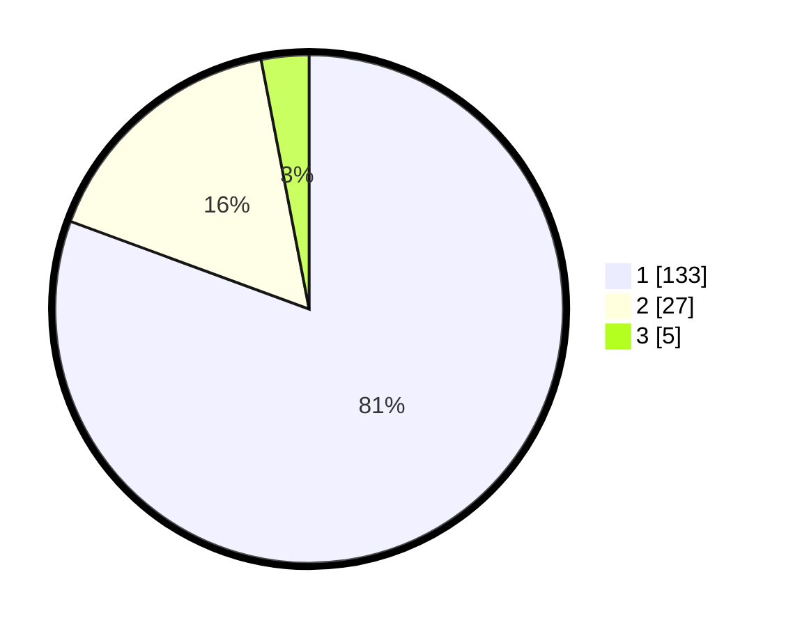

# Hasil

## Grafik

## Tabel

| No. | Nama Paslon    | Suara | Suara (raw) | Persentase |
|:--- |:-------------- | -----:| -----------:| ----------:|
| 1   | ANIES MUHAIMIN | 133   | [133][p-1]  | 80,61      |
| 2   | PRABOWO GIBRAN | 27    | [27][p-2]   | 16,36      |
| 3   | GANJAR MAHFUD  | 5     | [5][p-3]    | 3,03       |

[p-1]: https://github.com/gigit-pemilu/pemilu-2024/blob/main/pilpres/hitung-suara/sub/16-sumatera-selatan/sub/71-kota-palembang/sub/02-seberang-ulu-satu/sub/1006-tujuh-ulu/sub/044-tps/sub/paslon-1.txt
[p-2]: https://github.com/gigit-pemilu/pemilu-2024/blob/main/pilpres/hitung-suara/sub/16-sumatera-selatan/sub/71-kota-palembang/sub/02-seberang-ulu-satu/sub/1006-tujuh-ulu/sub/044-tps/sub/paslon-2.txt
[p-3]: https://github.com/gigit-pemilu/pemilu-2024/blob/main/pilpres/hitung-suara/sub/16-sumatera-selatan/sub/71-kota-palembang/sub/02-seberang-ulu-satu/sub/1006-tujuh-ulu/sub/044-tps/sub/paslon-3.txt

## Foto C Plano

https://sirekap-obj-formc.kpu.go.id/1c44/pemilu/ppwp/16/71/02/10/06/1671021006044-20240215-012308--2fd13a11-fdd9-466e-895b-56880b14311e.jpg

https://sirekap-obj-formc.kpu.go.id/1c44/pemilu/ppwp/16/71/02/10/06/1671021006044-20240215-012624--6fa097ef-e889-4f7f-8dab-3da50ad63766.jpg

https://sirekap-obj-formc.kpu.go.id/1c44/pemilu/ppwp/16/71/02/10/06/1671021006044-20240215-012804--4ea0b193-c4f4-4a9f-a3c0-c5e6063b4838.jpg

## Metadata

| Key        | Value               |
| ---------- | ------------------- |
| Time Stamp | 2024-02-24 22:31:28 |

