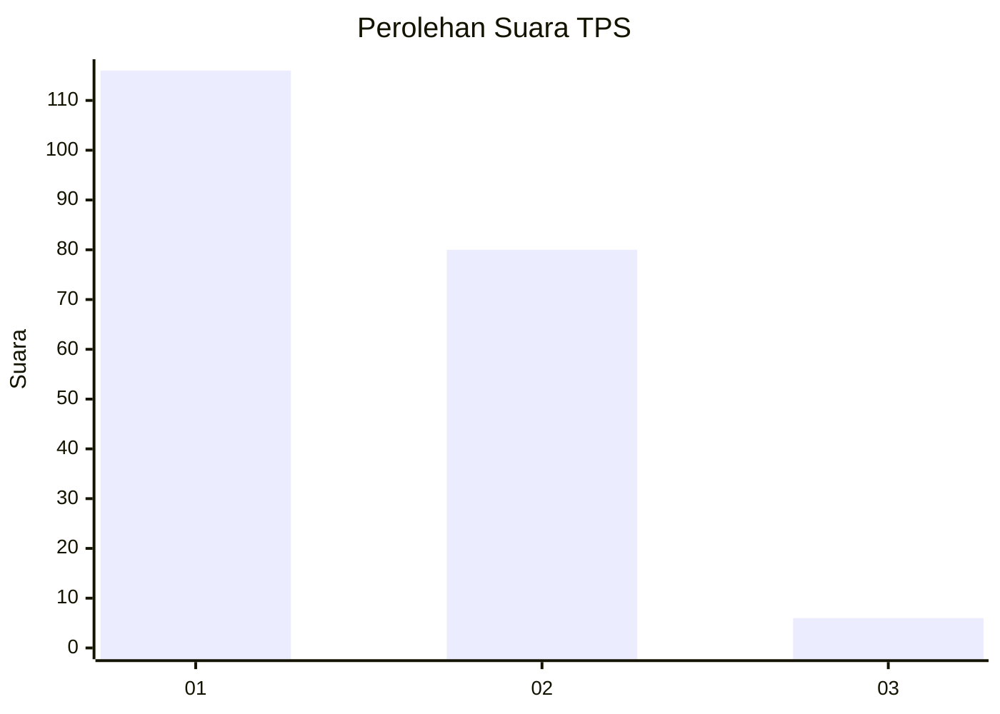
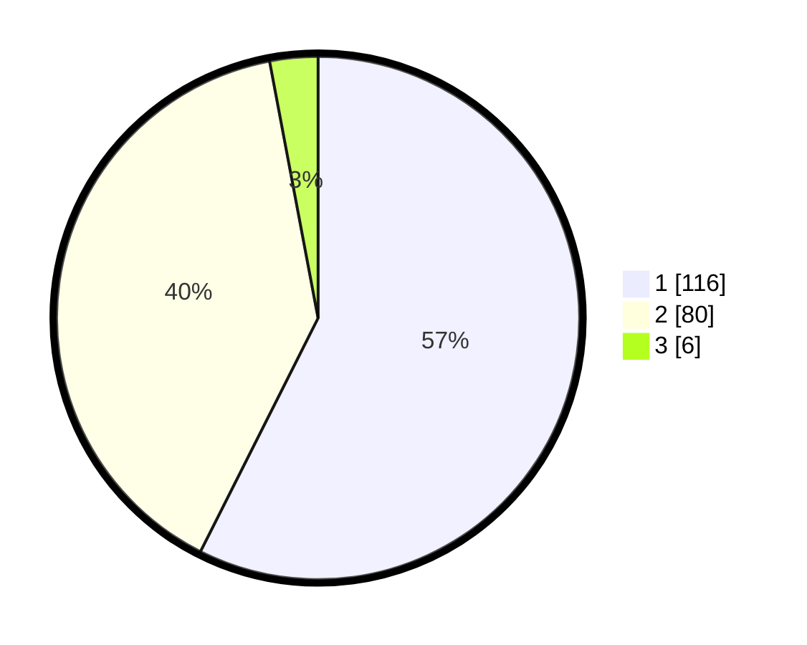

# Hasil

## Grafik

## Tabel

| No. | Nama Paslon    | Suara | Suara (raw) | Persentase |
|:--- |:-------------- | -----:| -----------:| ----------:|
| 1   | ANIES MUHAIMIN | 116   | [116][p-1]  | 57,43      |
| 2   | PRABOWO GIBRAN | 80    | [80][p-2]   | 39,60      |
| 3   | GANJAR MAHFUD  | 6     | [6][p-3]    | 2,97       |

[p-1]: https://github.com/gigit-pemilu/pemilu-2024-16-sumatera-selatan/blob/main/pilpres/hitung-suara/sub/16-sumatera-selatan/sub/71-kota-palembang/sub/03-seberang-ulu-dua/sub/1003-tiga-belas-ulu/sub/002-tps/sub/paslon-1.txt
[p-2]: https://github.com/gigit-pemilu/pemilu-2024-16-sumatera-selatan/blob/main/pilpres/hitung-suara/sub/16-sumatera-selatan/sub/71-kota-palembang/sub/03-seberang-ulu-dua/sub/1003-tiga-belas-ulu/sub/002-tps/sub/paslon-2.txt
[p-3]: https://github.com/gigit-pemilu/pemilu-2024-16-sumatera-selatan/blob/main/pilpres/hitung-suara/sub/16-sumatera-selatan/sub/71-kota-palembang/sub/03-seberang-ulu-dua/sub/1003-tiga-belas-ulu/sub/002-tps/sub/paslon-3.txt

## Foto C Plano

https://sirekap-obj-formc.kpu.go.id/659f/pemilu/ppwp/16/71/03/10/03/1671031003002-20240218-154626--10f4e367-a9bc-4bf2-ad6e-5a0c0ff1c5ea.jpg

https://sirekap-obj-formc.kpu.go.id/659f/pemilu/ppwp/16/71/03/10/03/1671031003002-20240218-154424--0b6605e7-5e3a-4a85-a200-eb45b1438ab2.jpg

https://sirekap-obj-formc.kpu.go.id/659f/pemilu/ppwp/16/71/03/10/03/1671031003002-20240218-154454--8146ab7b-8842-474b-b0d1-0cc4e0faf89d.jpg

## Metadata

| Key        | Value               |
| ---------- | ------------------- |
| Time Stamp | 2024-02-25 11:00:00 |

