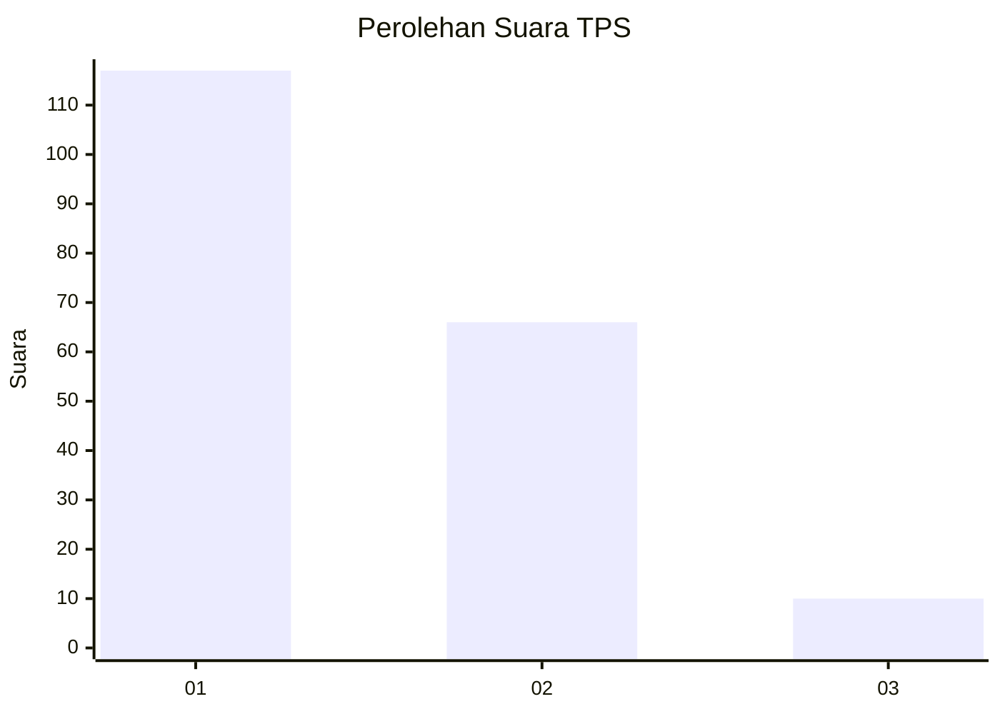
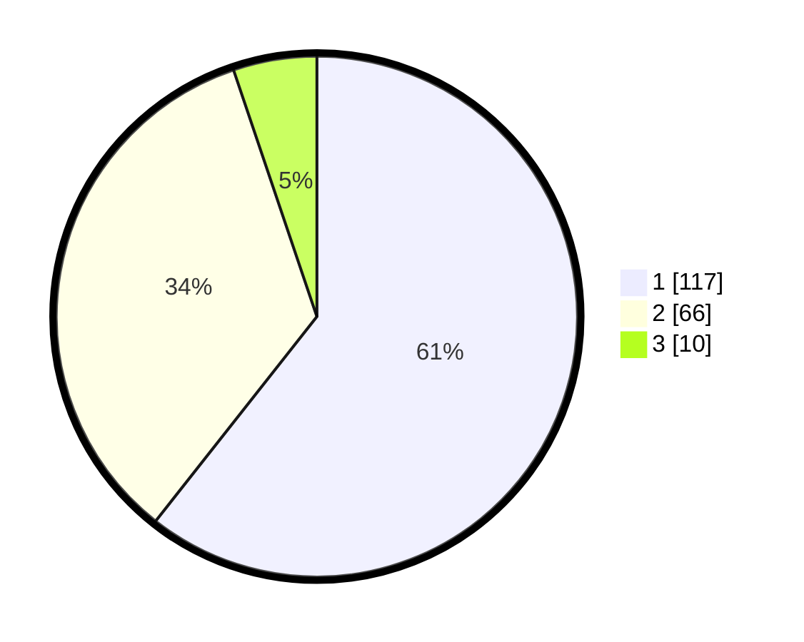

# Hasil

## Grafik

## Tabel

| No. | Nama Paslon    | Suara | Suara (raw) | Persentase |
|:--- |:-------------- | -----:| -----------:| ----------:|
| 1   | ANIES MUHAIMIN | 117   | [117][p-1]  | 60,62      |
| 2   | PRABOWO GIBRAN | 66    | [66][p-2]   | 34,20      |
| 3   | GANJAR MAHFUD  | 10    | [10][p-3]   | 5,18       |

[p-1]: https://github.com/gigit-pemilu/pemilu-2024-16-sumatera-selatan/blob/main/pilpres/hitung-suara/sub/16-sumatera-selatan/sub/71-kota-palembang/sub/03-seberang-ulu-dua/sub/1003-tiga-belas-ulu/sub/003-tps/sub/paslon-1.txt
[p-2]: https://github.com/gigit-pemilu/pemilu-2024-16-sumatera-selatan/blob/main/pilpres/hitung-suara/sub/16-sumatera-selatan/sub/71-kota-palembang/sub/03-seberang-ulu-dua/sub/1003-tiga-belas-ulu/sub/003-tps/sub/paslon-2.txt
[p-3]: https://github.com/gigit-pemilu/pemilu-2024-16-sumatera-selatan/blob/main/pilpres/hitung-suara/sub/16-sumatera-selatan/sub/71-kota-palembang/sub/03-seberang-ulu-dua/sub/1003-tiga-belas-ulu/sub/003-tps/sub/paslon-3.txt

## Foto C Plano

https://sirekap-obj-formc.kpu.go.id/e2c8/pemilu/ppwp/16/71/03/10/03/1671031003003-20240218-155258--d94773ff-cc6d-4670-abde-fe0a8c71c9a6.jpg

https://sirekap-obj-formc.kpu.go.id/e2c8/pemilu/ppwp/16/71/03/10/03/1671031003003-20240218-155328--33200852-c19d-49c1-a612-9823397fcb8f.jpg

https://sirekap-obj-formc.kpu.go.id/e2c8/pemilu/ppwp/16/71/03/10/03/1671031003003-20240218-155402--9658a168-8616-490f-8cfa-042e1e44c767.jpg

## Metadata

| Key        | Value               |
| ---------- | ------------------- |
| Time Stamp | 2024-02-24 22:31:28 |

