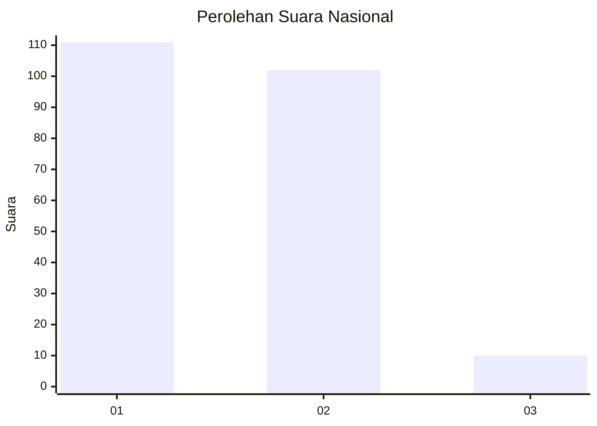
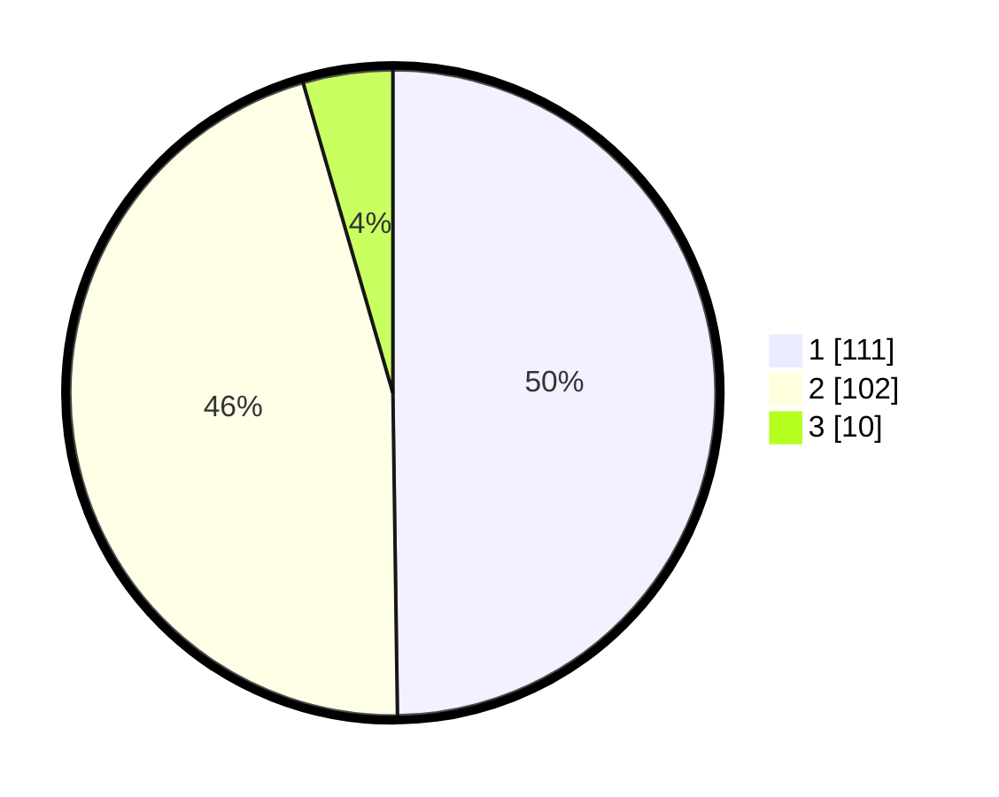

# Hasil

## Grafik

## Tabel

| No. | Nama Paslon    | Suara | Suara (raw) | Persentase |
|:--- |:-------------- | -----:| -----------:| ----------:|
| 1   | ANIES MUHAIMIN | 111   | [111][p-1]  | 49,78      |
| 2   | PRABOWO GIBRAN | 102   | [102][p-2]  | 45,74      |
| 3   | GANJAR MAHFUD  | 10    | [10][p-3]   | 4,48       |

[p-1]: https://github.com/gigit-pemilu/pemilu-2024/blob/main/pilpres/hitung-suara/sub/16-sumatera-selatan/sub/71-kota-palembang/sub/03-seberang-ulu-dua/sub/1003-tiga-belas-ulu/sub/007-tps/sub/paslon-1.txt
[p-2]: https://github.com/gigit-pemilu/pemilu-2024/blob/main/pilpres/hitung-suara/sub/16-sumatera-selatan/sub/71-kota-palembang/sub/03-seberang-ulu-dua/sub/1003-tiga-belas-ulu/sub/007-tps/sub/paslon-2.txt
[p-3]: https://github.com/gigit-pemilu/pemilu-2024/blob/main/pilpres/hitung-suara/sub/16-sumatera-selatan/sub/71-kota-palembang/sub/03-seberang-ulu-dua/sub/1003-tiga-belas-ulu/sub/007-tps/sub/paslon-3.txt

## Foto C Plano

https://sirekap-obj-formc.kpu.go.id/04c4/pemilu/ppwp/16/71/03/10/03/1671031003007-20240214-235224--785eb7a0-f45f-4766-a1c0-a0aae8493385.jpg

https://sirekap-obj-formc.kpu.go.id/04c4/pemilu/ppwp/16/71/03/10/03/1671031003007-20240214-205431--9721f781-a388-4620-aba7-a0e43ebf856b.jpg

https://sirekap-obj-formc.kpu.go.id/04c4/pemilu/ppwp/16/71/03/10/03/1671031003007-20240214-205708--255c4c35-457f-43c4-9a40-0b6b0fa7db16.jpg

## Metadata

| Key        | Value               |
| ---------- | ------------------- |
| Time Stamp | 2024-02-15 12:00:28 |

