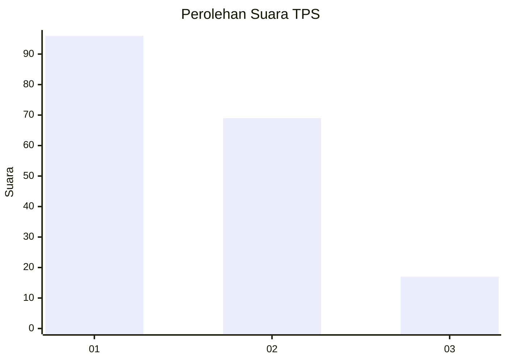
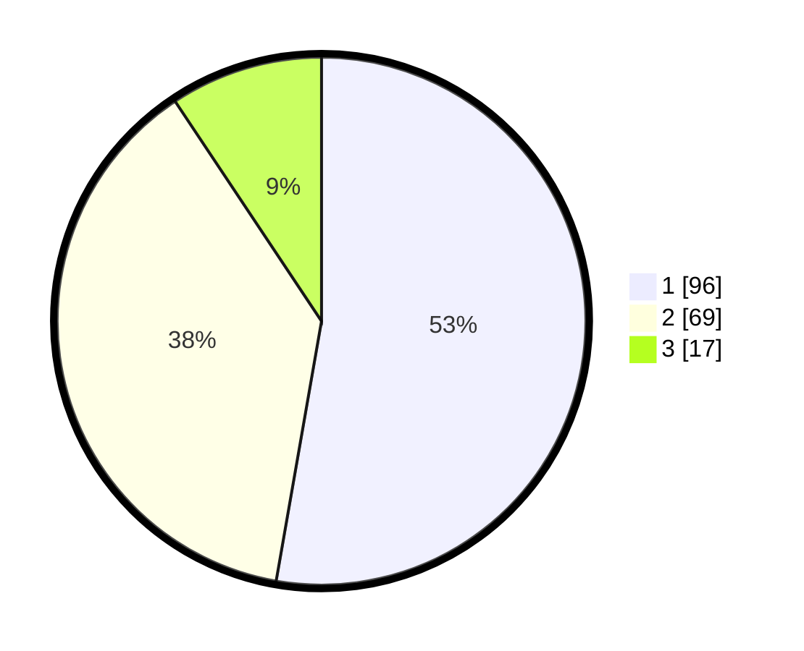

# Hasil

## Grafik

## Tabel

| No. | Nama Paslon    | Suara | Suara (raw) | Persentase |
|:--- |:-------------- | -----:| -----------:| ----------:|
| 1   | ANIES MUHAIMIN | 96    | [96][p-1]   | 52,75      |
| 2   | PRABOWO GIBRAN | 69    | [69][p-2]   | 37,91      |
| 3   | GANJAR MAHFUD  | 17    | [17][p-3]   | 9,34       |

[p-1]: https://github.com/gigit-pemilu/pemilu-2024-16-sumatera-selatan/blob/main/pilpres/hitung-suara/sub/16-sumatera-selatan/sub/71-kota-palembang/sub/03-seberang-ulu-dua/sub/1005-enam-belas-ulu/sub/027-tps/sub/paslon-1.txt
[p-2]: https://github.com/gigit-pemilu/pemilu-2024-16-sumatera-selatan/blob/main/pilpres/hitung-suara/sub/16-sumatera-selatan/sub/71-kota-palembang/sub/03-seberang-ulu-dua/sub/1005-enam-belas-ulu/sub/027-tps/sub/paslon-2.txt
[p-3]: https://github.com/gigit-pemilu/pemilu-2024-16-sumatera-selatan/blob/main/pilpres/hitung-suara/sub/16-sumatera-selatan/sub/71-kota-palembang/sub/03-seberang-ulu-dua/sub/1005-enam-belas-ulu/sub/027-tps/sub/paslon-3.txt

## Foto C Plano

https://sirekap-obj-formc.kpu.go.id/fd30/pemilu/ppwp/16/71/03/10/05/1671031005027-20240214-211046--a9ab2f08-e624-45b6-bee0-f24c554f1b9a.jpg

https://sirekap-obj-formc.kpu.go.id/fd30/pemilu/ppwp/16/71/03/10/05/1671031005027-20240214-211201--421fc8af-0090-40f2-b88e-5d1b4e2eae71.jpg

https://sirekap-obj-formc.kpu.go.id/fd30/pemilu/ppwp/16/71/03/10/05/1671031005027-20240214-211232--d7866f27-c268-47f7-bb82-49c9f6283fe2.jpg

## Metadata

| Key        | Value               |
| ---------- | ------------------- |
| Time Stamp | 2024-02-26 14:00:00 |

