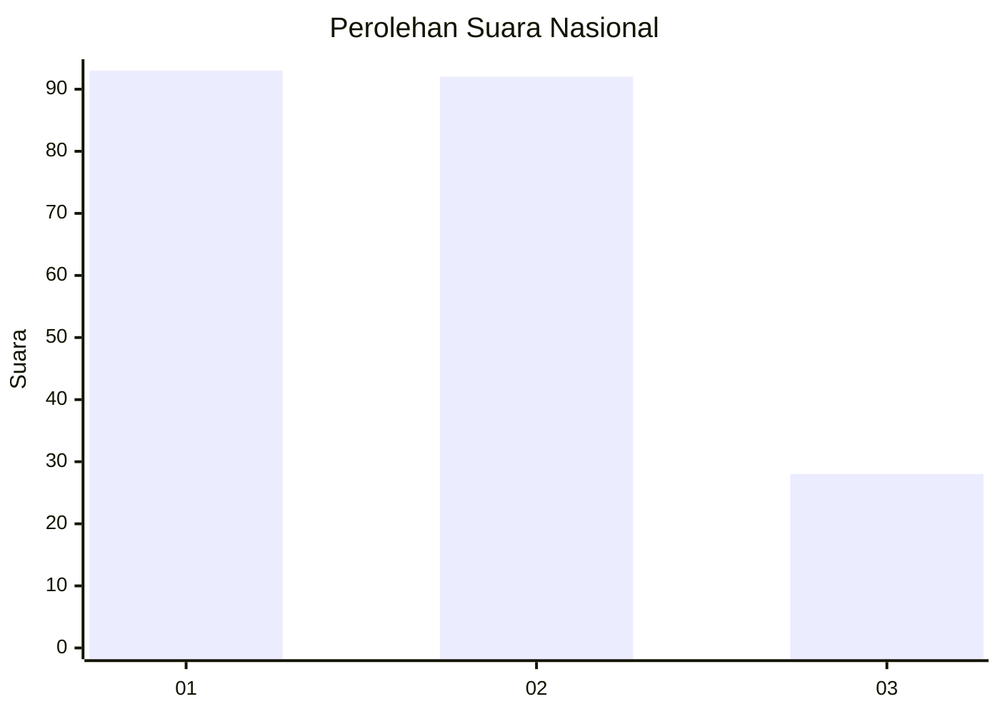
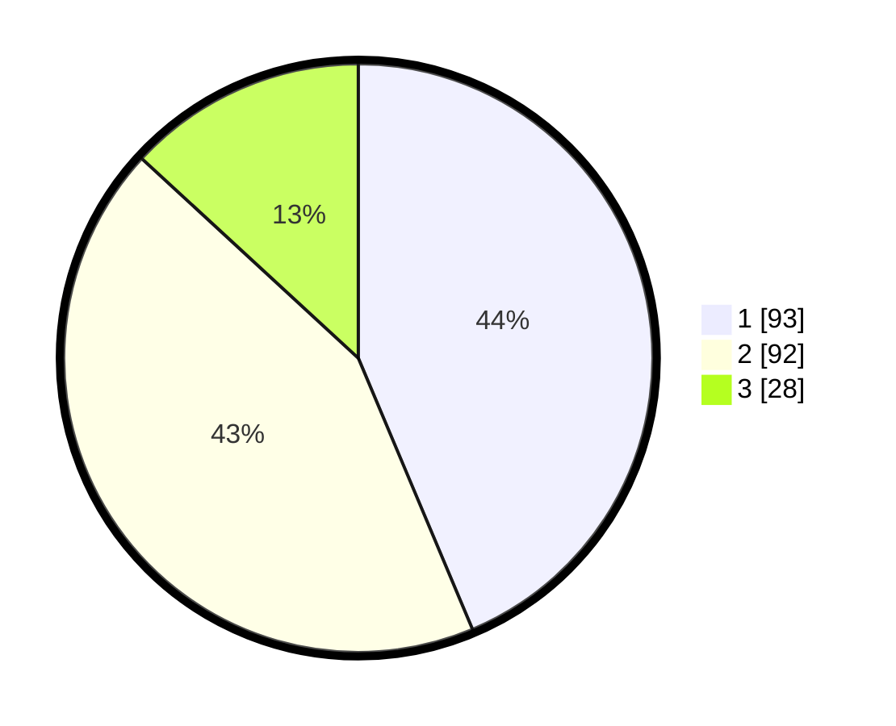

# Hasil

## Grafik

## Tabel

| No. | Nama Paslon    | Suara | Suara (raw) | Persentase |
|:--- |:-------------- | -----:| -----------:| ----------:|
| 1   | ANIES MUHAIMIN | 93    | [93][p-1]   | 43,66      |
| 2   | PRABOWO GIBRAN | 92    | [92][p-2]   | 43,19      |
| 3   | GANJAR MAHFUD  | 28    | [28][p-3]   | 13,15      |

[p-1]: https://github.com/gigit-pemilu/pemilu-2024/blob/main/pilpres/hitung-suara/sub/16-sumatera-selatan/sub/71-kota-palembang/sub/03-seberang-ulu-dua/sub/1005-enam-belas-ulu/sub/041-tps/sub/paslon-1.txt
[p-2]: https://github.com/gigit-pemilu/pemilu-2024/blob/main/pilpres/hitung-suara/sub/16-sumatera-selatan/sub/71-kota-palembang/sub/03-seberang-ulu-dua/sub/1005-enam-belas-ulu/sub/041-tps/sub/paslon-2.txt
[p-3]: https://github.com/gigit-pemilu/pemilu-2024/blob/main/pilpres/hitung-suara/sub/16-sumatera-selatan/sub/71-kota-palembang/sub/03-seberang-ulu-dua/sub/1005-enam-belas-ulu/sub/041-tps/sub/paslon-3.txt

## Foto C Plano

https://sirekap-obj-formc.kpu.go.id/e7ee/pemilu/ppwp/16/71/03/10/05/1671031005041-20240214-205209--fbfd35ea-439d-41f6-974f-28613bd00897.jpg

https://sirekap-obj-formc.kpu.go.id/e7ee/pemilu/ppwp/16/71/03/10/05/1671031005041-20240214-195645--e6dc229c-b832-4f47-9af8-1d2d44eaa974.jpg

https://sirekap-obj-formc.kpu.go.id/e7ee/pemilu/ppwp/16/71/03/10/05/1671031005041-20240214-195813--ce37b80f-5e17-4427-a094-71cbda8ae15d.jpg

## Metadata

| Key        | Value               |
| ---------- | ------------------- |
| Time Stamp | 2024-02-15 15:00:29 |

