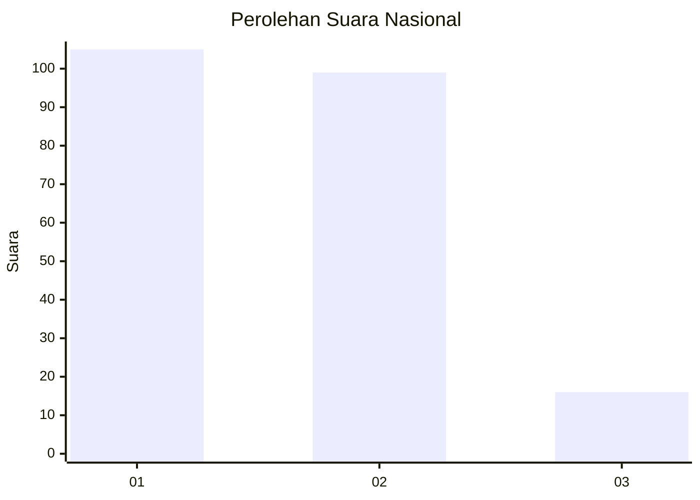
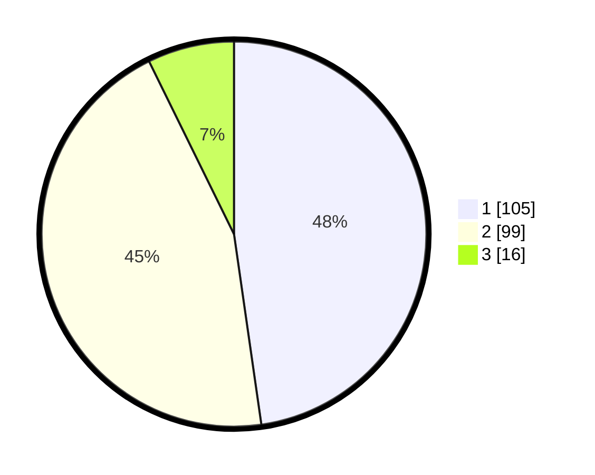

# Hasil

## Grafik

## Tabel

| No. | Nama Paslon    | Suara | Suara (raw) | Persentase |
|:--- |:-------------- | -----:| -----------:| ----------:|
| 1   | ANIES MUHAIMIN | 105   | [105][p-1]  | 47,73      |
| 2   | PRABOWO GIBRAN | 99    | [99][p-2]   | 45,00      |
| 3   | GANJAR MAHFUD  | 16    | [16][p-3]   | 7,27       |

[p-1]: https://github.com/gigit-pemilu/pemilu-2024/blob/main/pilpres/hitung-suara/sub/16-sumatera-selatan/sub/71-kota-palembang/sub/03-seberang-ulu-dua/sub/1005-enam-belas-ulu/sub/046-tps/sub/paslon-1.txt
[p-2]: https://github.com/gigit-pemilu/pemilu-2024/blob/main/pilpres/hitung-suara/sub/16-sumatera-selatan/sub/71-kota-palembang/sub/03-seberang-ulu-dua/sub/1005-enam-belas-ulu/sub/046-tps/sub/paslon-2.txt
[p-3]: https://github.com/gigit-pemilu/pemilu-2024/blob/main/pilpres/hitung-suara/sub/16-sumatera-selatan/sub/71-kota-palembang/sub/03-seberang-ulu-dua/sub/1005-enam-belas-ulu/sub/046-tps/sub/paslon-3.txt

## Foto C Plano

https://sirekap-obj-formc.kpu.go.id/e9c6/pemilu/ppwp/16/71/03/10/05/1671031005046-20240214-155703--f5ce9cc1-a0ce-4c97-bf97-9f476520a709.jpg

https://sirekap-obj-formc.kpu.go.id/e9c6/pemilu/ppwp/16/71/03/10/05/1671031005046-20240214-155723--e5780816-a6bc-45a8-8b5e-0d0e7c388f83.jpg

https://sirekap-obj-formc.kpu.go.id/e9c6/pemilu/ppwp/16/71/03/10/05/1671031005046-20240214-162247--b10451c7-1ad9-4687-9053-1ebbb4cff37c.jpg

## Metadata

| Key        | Value               |
| ---------- | ------------------- |
| Time Stamp | 2024-02-14 21:46:01 |

