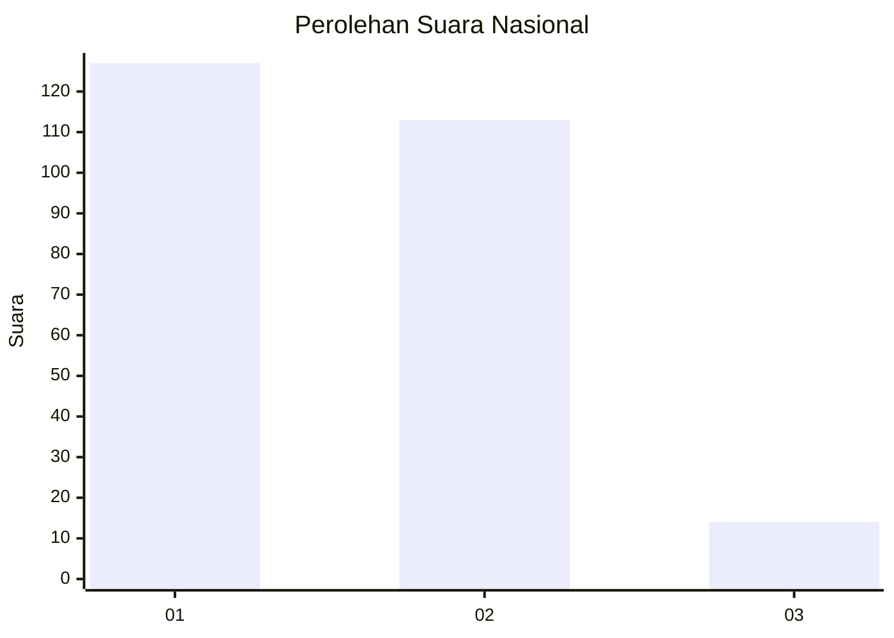
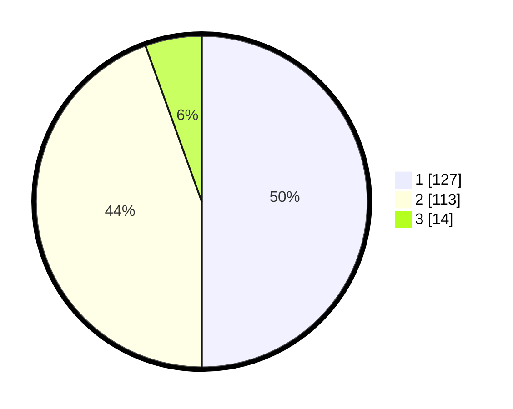

# Hasil

## Grafik

## Tabel

| No. | Nama Paslon    | Suara | Suara (raw) | Persentase |
|:--- |:-------------- | -----:| -----------:| ----------:|
| 1   | ANIES MUHAIMIN | 127   | [127][p-1]  | 50,00      |
| 2   | PRABOWO GIBRAN | 113   | [113][p-2]  | 44,49      |
| 3   | GANJAR MAHFUD  | 14    | [14][p-3]   | 5,51       |

[p-1]: https://github.com/gigit-pemilu/pemilu-2024/blob/main/pilpres/hitung-suara/sub/16-sumatera-selatan/sub/71-kota-palembang/sub/03-seberang-ulu-dua/sub/1005-enam-belas-ulu/sub/075-tps/sub/paslon-1.txt
[p-2]: https://github.com/gigit-pemilu/pemilu-2024/blob/main/pilpres/hitung-suara/sub/16-sumatera-selatan/sub/71-kota-palembang/sub/03-seberang-ulu-dua/sub/1005-enam-belas-ulu/sub/075-tps/sub/paslon-2.txt
[p-3]: https://github.com/gigit-pemilu/pemilu-2024/blob/main/pilpres/hitung-suara/sub/16-sumatera-selatan/sub/71-kota-palembang/sub/03-seberang-ulu-dua/sub/1005-enam-belas-ulu/sub/075-tps/sub/paslon-3.txt

## Foto C Plano

https://sirekap-obj-formc.kpu.go.id/69f0/pemilu/ppwp/16/71/03/10/05/1671031005075-20240214-222239--a444cd7b-b3f2-4eb3-bd99-65a63b9e6f7e.jpg

https://sirekap-obj-formc.kpu.go.id/69f0/pemilu/ppwp/16/71/03/10/05/1671031005075-20240214-222540--b89f2f16-1428-4a14-ab59-fe0e8e91e759.jpg

https://sirekap-obj-formc.kpu.go.id/69f0/pemilu/ppwp/16/71/03/10/05/1671031005075-20240214-204416--e417cf18-ef7b-4b55-b4de-b3a6a93d8aed.jpg

## Metadata

| Key        | Value               |
| ---------- | ------------------- |
| Time Stamp | 2024-02-25 12:00:00 |

