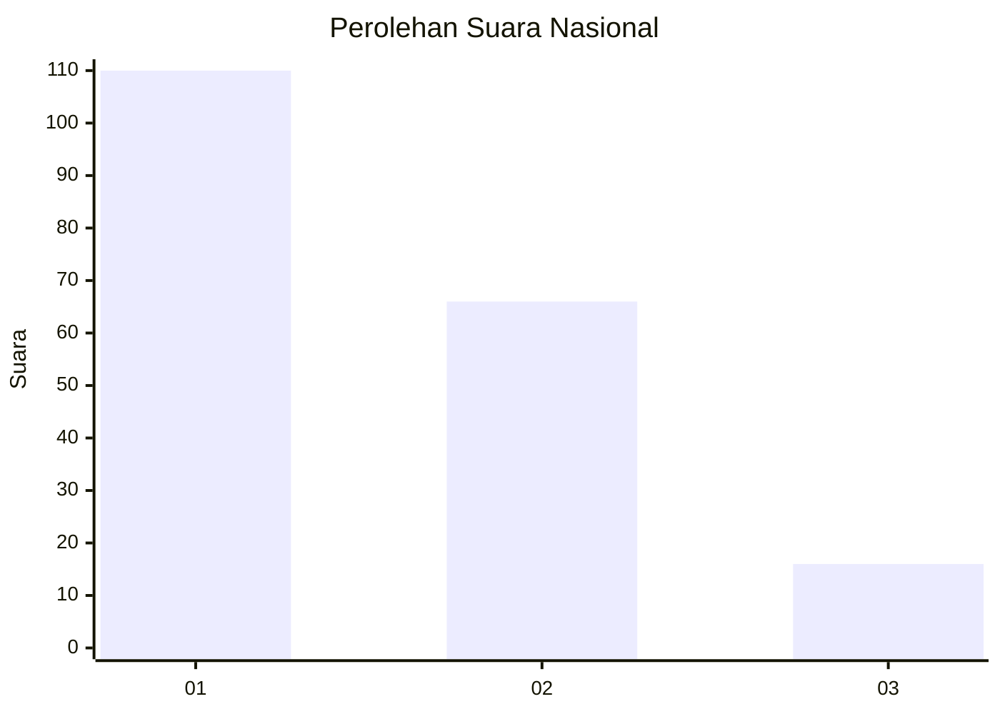
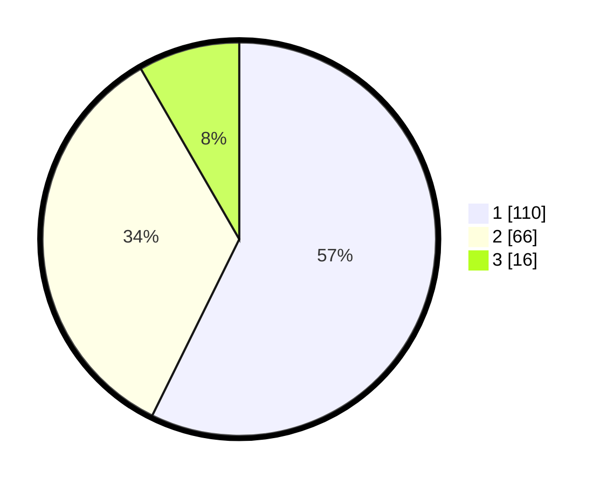

# Hasil

## Grafik

## Tabel

| No. | Nama Paslon    | Suara | Suara (raw) | Persentase |
|:--- |:-------------- | -----:| -----------:| ----------:|
| 1   | ANIES MUHAIMIN | 110   | [110][p-1]  | 57,29      |
| 2   | PRABOWO GIBRAN | 66    | [66][p-2]   | 34,38      |
| 3   | GANJAR MAHFUD  | 16    | [16][p-3]   | 8,33       |

[p-1]: https://github.com/gigit-pemilu/pemilu-2024/blob/main/pilpres/hitung-suara/sub/16-sumatera-selatan/sub/71-kota-palembang/sub/03-seberang-ulu-dua/sub/1006-tanggatakat/sub/045-tps/sub/paslon-1.txt
[p-2]: https://github.com/gigit-pemilu/pemilu-2024/blob/main/pilpres/hitung-suara/sub/16-sumatera-selatan/sub/71-kota-palembang/sub/03-seberang-ulu-dua/sub/1006-tanggatakat/sub/045-tps/sub/paslon-2.txt
[p-3]: https://github.com/gigit-pemilu/pemilu-2024/blob/main/pilpres/hitung-suara/sub/16-sumatera-selatan/sub/71-kota-palembang/sub/03-seberang-ulu-dua/sub/1006-tanggatakat/sub/045-tps/sub/paslon-3.txt

## Foto C Plano

https://sirekap-obj-formc.kpu.go.id/9afc/pemilu/ppwp/16/71/03/10/06/1671031006045-20240215-034047--d6af7e71-8c21-4e42-9100-ec154208e8a0.jpg

https://sirekap-obj-formc.kpu.go.id/9afc/pemilu/ppwp/16/71/03/10/06/1671031006045-20240215-034119--ef5a6781-71b4-4db0-aa22-d9aa8195989f.jpg

https://sirekap-obj-formc.kpu.go.id/9afc/pemilu/ppwp/16/71/03/10/06/1671031006045-20240215-034247--1e2ed71a-380d-4ea7-b000-c64d64798bd2.jpg

## Metadata

| Key        | Value               |
| ---------- | ------------------- |
| Time Stamp | 2024-02-24 22:31:28 |

