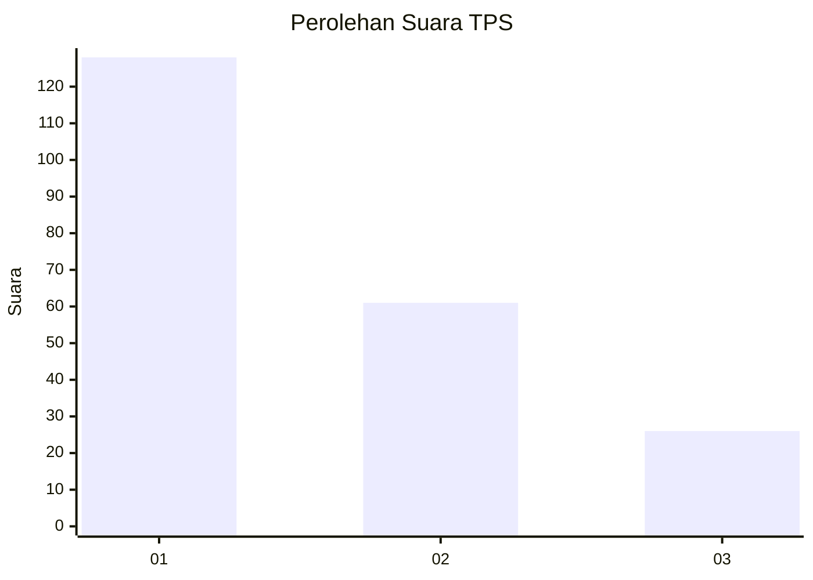
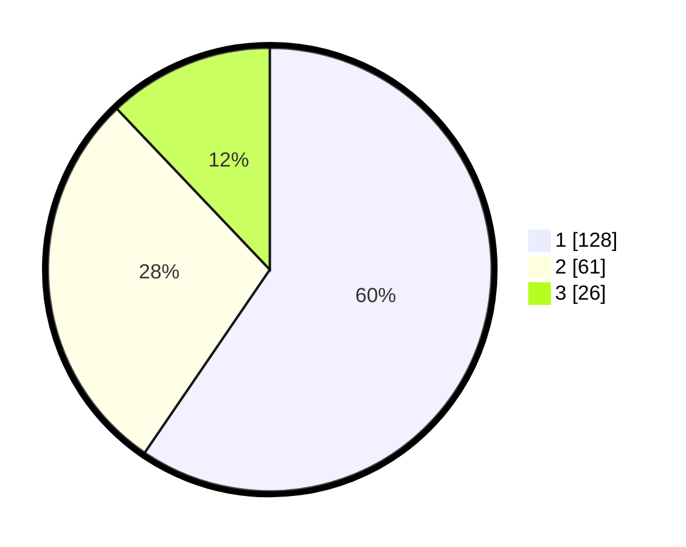

# Hasil

## Grafik

## Tabel

| No. | Nama Paslon    | Suara | Suara (raw) | Persentase |
|:--- |:-------------- | -----:| -----------:| ----------:|
| 1   | ANIES MUHAIMIN | 128   | [128][p-1]  | 59,53      |
| 2   | PRABOWO GIBRAN | 61    | [61][p-2]   | 28,37      |
| 3   | GANJAR MAHFUD  | 26    | [26][p-3]   | 12,09      |

[p-1]: https://github.com/gigit-pemilu/pemilu-2024-16-sumatera-selatan/blob/main/pilpres/hitung-suara/sub/16-sumatera-selatan/sub/71-kota-palembang/sub/04-ilir-barat-satu/sub/1001-bukitlama/sub/001-tps/sub/paslon-1.txt
[p-2]: https://github.com/gigit-pemilu/pemilu-2024-16-sumatera-selatan/blob/main/pilpres/hitung-suara/sub/16-sumatera-selatan/sub/71-kota-palembang/sub/04-ilir-barat-satu/sub/1001-bukitlama/sub/001-tps/sub/paslon-2.txt
[p-3]: https://github.com/gigit-pemilu/pemilu-2024-16-sumatera-selatan/blob/main/pilpres/hitung-suara/sub/16-sumatera-selatan/sub/71-kota-palembang/sub/04-ilir-barat-satu/sub/1001-bukitlama/sub/001-tps/sub/paslon-3.txt

## Foto C Plano

https://sirekap-obj-formc.kpu.go.id/cfbc/pemilu/ppwp/16/71/04/10/01/1671041001001-20240219-200702--f277b7c4-f7ce-4725-b53f-fed45180531e.jpg

https://sirekap-obj-formc.kpu.go.id/cfbc/pemilu/ppwp/16/71/04/10/01/1671041001001-20240219-201407--7cf60a9c-a68c-4ff7-b99b-ad98fe202d49.jpg

https://sirekap-obj-formc.kpu.go.id/cfbc/pemilu/ppwp/16/71/04/10/01/1671041001001-20240219-201519--a7467087-be44-41e8-805f-292e1e15314f.jpg

## Metadata

| Key        | Value               |
| ---------- | ------------------- |
| Time Stamp | 2024-02-19 21:00:00 |

## DATA PEMILIH TETAP

Jumlah pemilih dalam DPT: **270**.
 * L: **171**.
 * P: **179**.

## DATA PENGGUNA HAK PILIH

Jumlah pengguna hak pilih dalam DPT: **750**.
 * L: **170**.
 * P: **118**.

Jumlah pengguna hak pilih dalam DPTb: **252**.
 * L: **559**.
 * P: **855**.

Jumlah pengguna hak pilih dalam DPK: **0**.
 * L: **0**.
 * P: **0**.

Jumlah pengguna hak pilih: **770**.
 * L: **101**.
 * P: **119**.

## JUMLAH SUARA SAH DAN TIDAK SAH

JUMLAH SELURUH SUARA SAH: **215**.

JUMLAH SUARA TIDAK SAH: **5**.

JUMLAH SELURUH SUARA SAH DAN SUARA TIDAK SAH: **20**.

