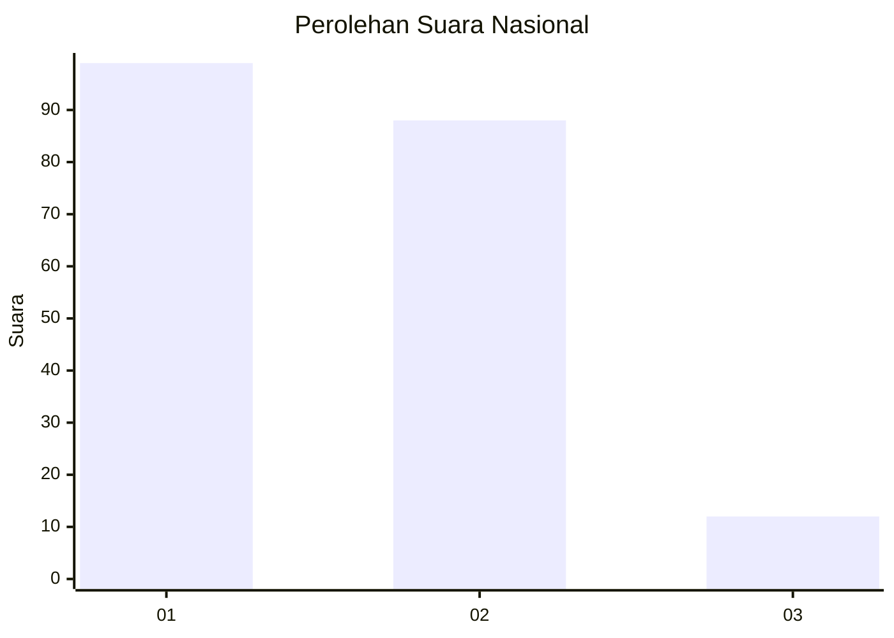
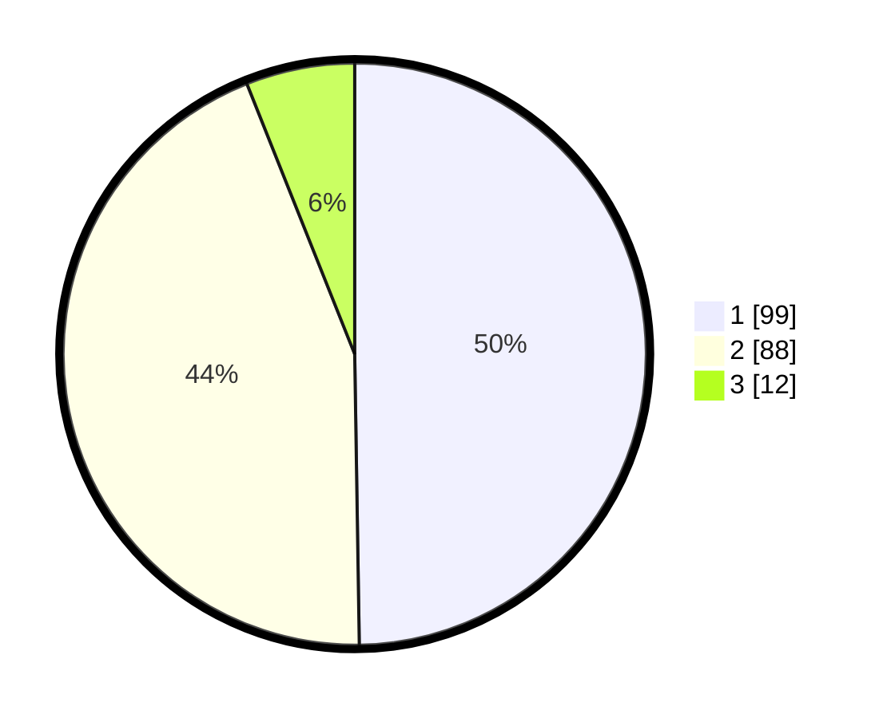

# Hasil

## Grafik

## Tabel

| No. | Nama Paslon    | Suara | Suara (raw) | Persentase |
|:--- |:-------------- | -----:| -----------:| ----------:|
| 1   | ANIES MUHAIMIN | 99    | [99][p-1]   | 49,75      |
| 2   | PRABOWO GIBRAN | 88    | [88][p-2]   | 44,22      |
| 3   | GANJAR MAHFUD  | 12    | [12][p-3]   | 6,03       |

[p-1]: https://github.com/gigit-pemilu/pemilu-2024/blob/main/pilpres/hitung-suara/sub/16-sumatera-selatan/sub/71-kota-palembang/sub/04-ilir-barat-satu/sub/1001-bukitlama/sub/014-tps/sub/paslon-1.txt
[p-2]: https://github.com/gigit-pemilu/pemilu-2024/blob/main/pilpres/hitung-suara/sub/16-sumatera-selatan/sub/71-kota-palembang/sub/04-ilir-barat-satu/sub/1001-bukitlama/sub/014-tps/sub/paslon-2.txt
[p-3]: https://github.com/gigit-pemilu/pemilu-2024/blob/main/pilpres/hitung-suara/sub/16-sumatera-selatan/sub/71-kota-palembang/sub/04-ilir-barat-satu/sub/1001-bukitlama/sub/014-tps/sub/paslon-3.txt

## Foto C Plano

https://sirekap-obj-formc.kpu.go.id/fa68/pemilu/ppwp/16/71/04/10/01/1671041001014-20240216-002504--d6a3903d-54f8-4190-b074-97be3ae6d92e.jpg

https://sirekap-obj-formc.kpu.go.id/fa68/pemilu/ppwp/16/71/04/10/01/1671041001014-20240216-002508--51a9d699-4f19-400f-8d27-6cb638cc5c9c.jpg

https://sirekap-obj-formc.kpu.go.id/fa68/pemilu/ppwp/16/71/04/10/01/1671041001014-20240216-002513--d53667b7-2eed-411d-ac38-cdaca77725c6.jpg

## Metadata

| Key        | Value               |
| ---------- | ------------------- |
| Time Stamp | 2024-02-25 12:00:00 |

