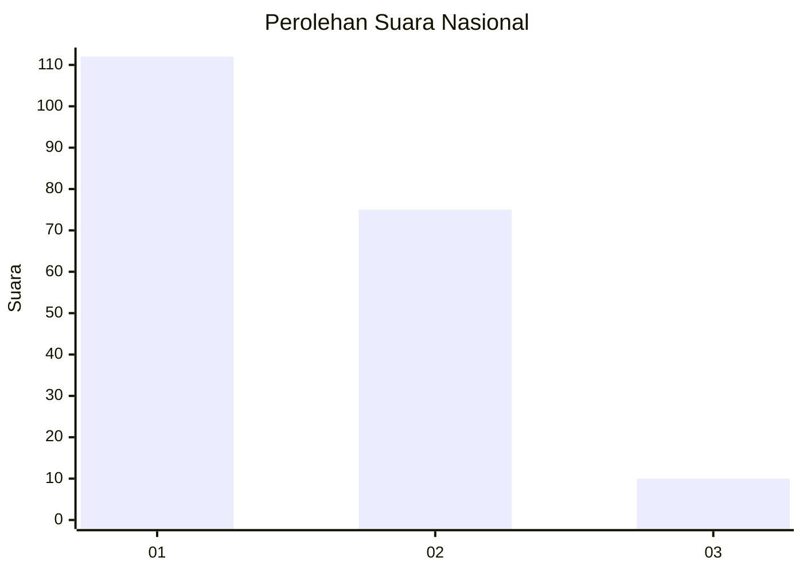
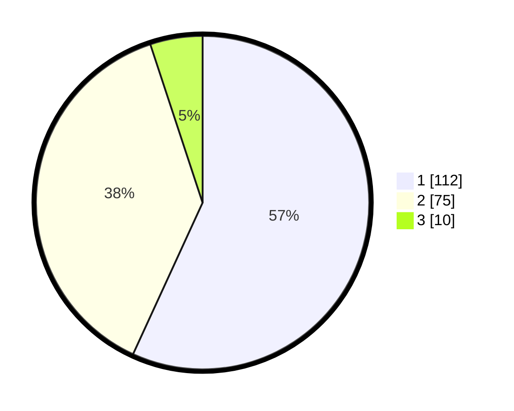

# Hasil

## Grafik

## Tabel

| No. | Nama Paslon    | Suara | Suara (raw) | Persentase |
|:--- |:-------------- | -----:| -----------:| ----------:|
| 1   | ANIES MUHAIMIN | 112   | [112][p-1]  | 56,85      |
| 2   | PRABOWO GIBRAN | 75    | [75][p-2]   | 38,07      |
| 3   | GANJAR MAHFUD  | 10    | [10][p-3]   | 5,08       |

[p-1]: https://github.com/gigit-pemilu/pemilu-2024/blob/main/pilpres/hitung-suara/sub/16-sumatera-selatan/sub/71-kota-palembang/sub/04-ilir-barat-satu/sub/1001-bukitlama/sub/017-tps/sub/paslon-1.txt
[p-2]: https://github.com/gigit-pemilu/pemilu-2024/blob/main/pilpres/hitung-suara/sub/16-sumatera-selatan/sub/71-kota-palembang/sub/04-ilir-barat-satu/sub/1001-bukitlama/sub/017-tps/sub/paslon-2.txt
[p-3]: https://github.com/gigit-pemilu/pemilu-2024/blob/main/pilpres/hitung-suara/sub/16-sumatera-selatan/sub/71-kota-palembang/sub/04-ilir-barat-satu/sub/1001-bukitlama/sub/017-tps/sub/paslon-3.txt

## Foto C Plano

https://sirekap-obj-formc.kpu.go.id/59f7/pemilu/ppwp/16/71/04/10/01/1671041001017-20240214-155408--08812a64-f0d5-4934-9ba6-646dcd7058cc.jpg

https://sirekap-obj-formc.kpu.go.id/59f7/pemilu/ppwp/16/71/04/10/01/1671041001017-20240214-155019--7f7543d8-3e89-4dc2-a951-b8bb6fab5d65.jpg

https://sirekap-obj-formc.kpu.go.id/59f7/pemilu/ppwp/16/71/04/10/01/1671041001017-20240214-155310--84aa63f0-9e67-45b5-9814-277212c091e3.jpg

## Metadata

| Key        | Value               |
| ---------- | ------------------- |
| Time Stamp | 2024-02-14 21:46:01 |

