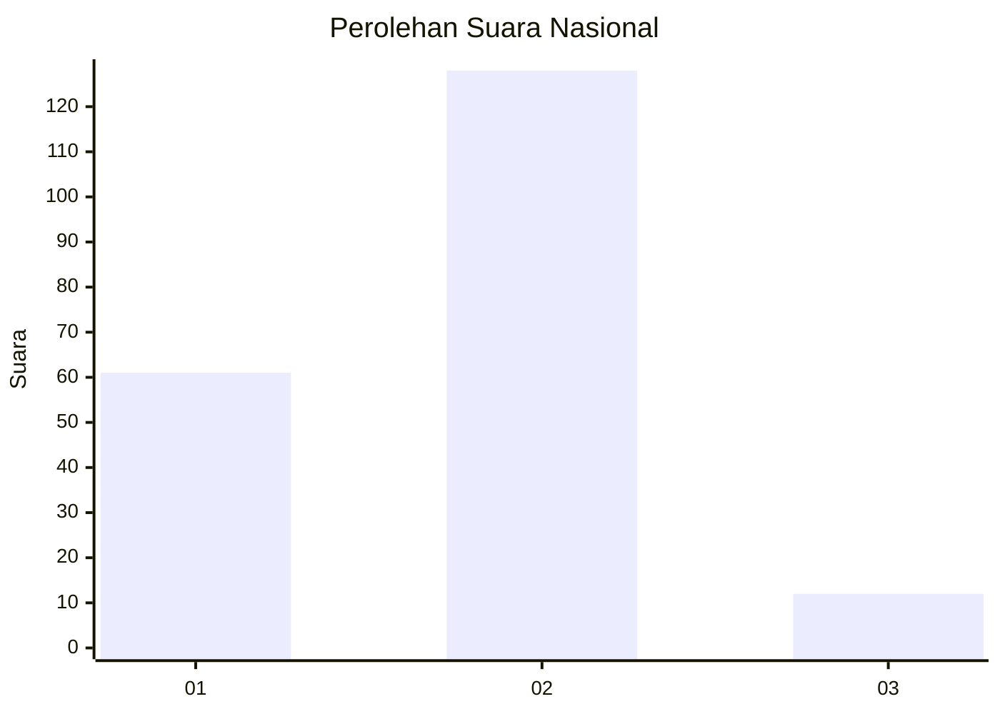
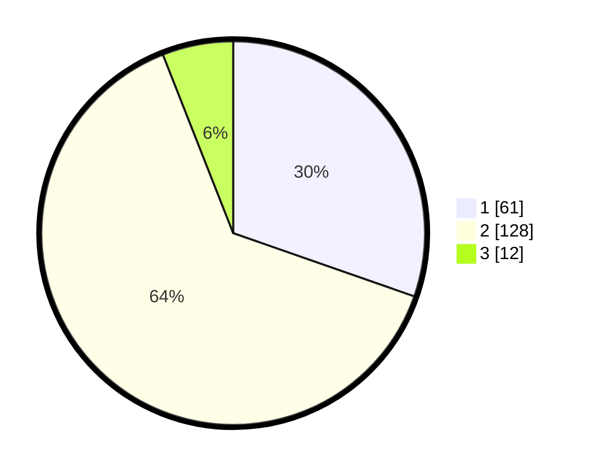

# Hasil

## Grafik

## Tabel

| No. | Nama Paslon    | Suara | Suara (raw) | Persentase |
|:--- |:-------------- | -----:| -----------:| ----------:|
| 1   | ANIES MUHAIMIN | 61    | [61][p-1]   | 30,35      |
| 2   | PRABOWO GIBRAN | 128   | [128][p-2]  | 63,68      |
| 3   | GANJAR MAHFUD  | 12    | [12][p-3]   | 5,97       |

[p-1]: https://github.com/gigit-pemilu/pemilu-2024/blob/main/pilpres/hitung-suara/sub/16-sumatera-selatan/sub/71-kota-palembang/sub/04-ilir-barat-satu/sub/1001-bukitlama/sub/023-tps/sub/paslon-1.txt
[p-2]: https://github.com/gigit-pemilu/pemilu-2024/blob/main/pilpres/hitung-suara/sub/16-sumatera-selatan/sub/71-kota-palembang/sub/04-ilir-barat-satu/sub/1001-bukitlama/sub/023-tps/sub/paslon-2.txt
[p-3]: https://github.com/gigit-pemilu/pemilu-2024/blob/main/pilpres/hitung-suara/sub/16-sumatera-selatan/sub/71-kota-palembang/sub/04-ilir-barat-satu/sub/1001-bukitlama/sub/023-tps/sub/paslon-3.txt

## Foto C Plano

https://sirekap-obj-formc.kpu.go.id/642f/pemilu/ppwp/16/71/04/10/01/1671041001023-20240220-101207--c5dbdbb6-5041-4c82-bf5f-9a7240987a04.jpg

https://sirekap-obj-formc.kpu.go.id/642f/pemilu/ppwp/16/71/04/10/01/1671041001023-20240220-101349--fb2100a2-dd32-4971-8797-9e92a39a32de.jpg

https://sirekap-obj-formc.kpu.go.id/642f/pemilu/ppwp/16/71/04/10/01/1671041001023-20240220-101445--378b8764-9bf1-4db1-b037-eb9308b2077a.jpg

## Metadata

| Key        | Value               |
| ---------- | ------------------- |
| Time Stamp | 2024-02-20 11:00:00 |

## DATA PEMILIH TETAP

Jumlah pemilih dalam DPT: **255**.
 * L: **214**.
 * P: **230**.

## DATA PENGGUNA HAK PILIH

Jumlah pengguna hak pilih dalam DPT: **154**.
 * L: **23**.
 * P: **411**.

Jumlah pengguna hak pilih dalam DPTb: **500**.
 * L: **0**.
 * P: **500**.

Jumlah pengguna hak pilih dalam DPK: **22**.
 * L: **4**.
 * P: **7**.

Jumlah pengguna hak pilih: **205**.
 * L: **27**.
 * P: **220**.

## JUMLAH SUARA SAH DAN TIDAK SAH

JUMLAH SELURUH SUARA SAH: **290**.

JUMLAH SUARA TIDAK SAH: **5**.

JUMLAH SELURUH SUARA SAH DAN SUARA TIDAK SAH: **205**.

