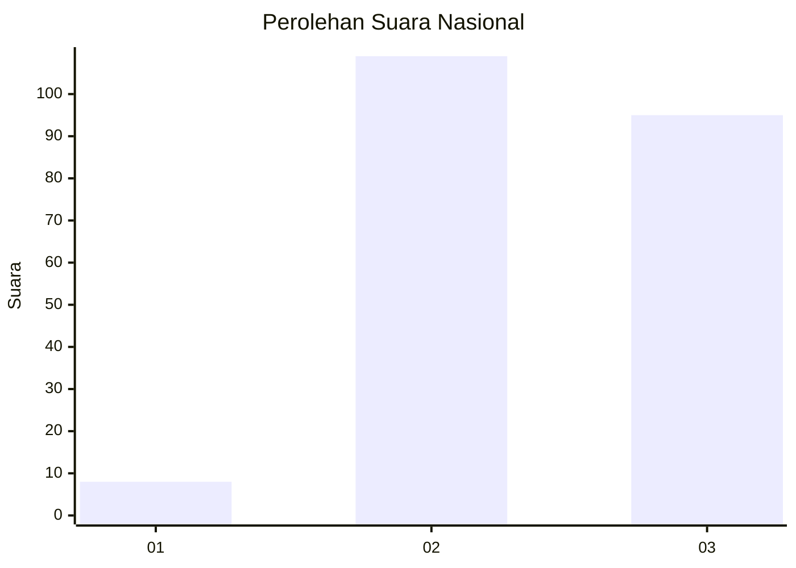
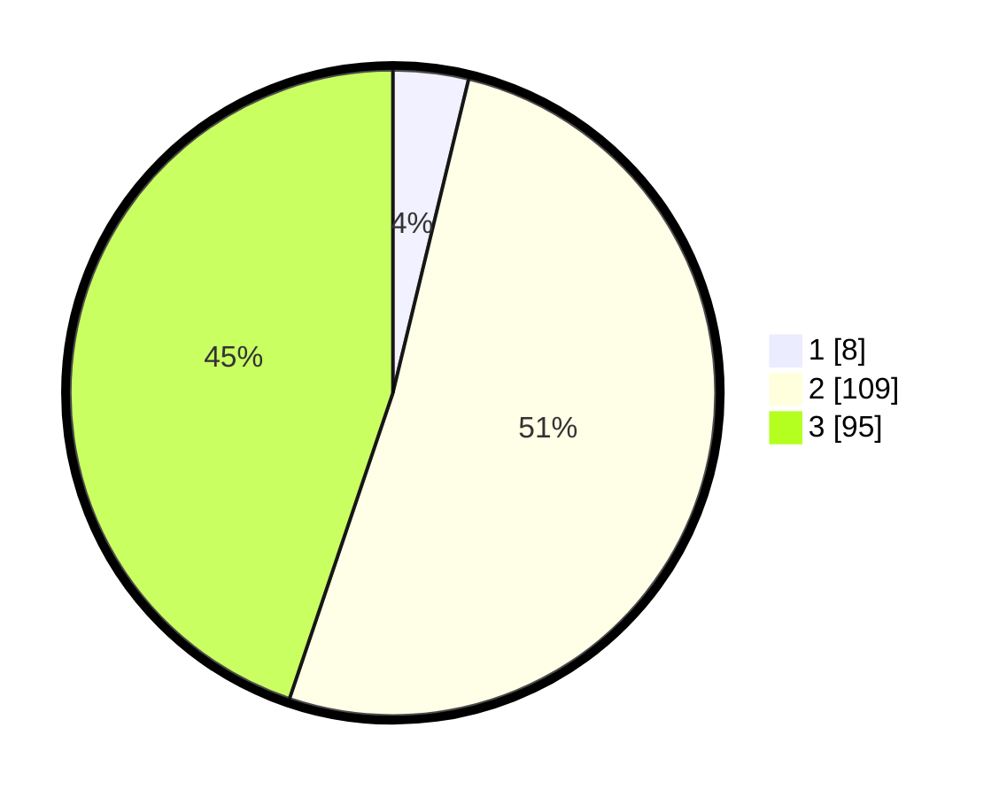

# Hasil

## Grafik

## Tabel

| No. | Nama Paslon    | Suara | Suara (raw) | Persentase |
|:--- |:-------------- | -----:| -----------:| ----------:|
| 1   | ANIES MUHAIMIN | 8     | [8][p-1]    | 3,77       |
| 2   | PRABOWO GIBRAN | 109   | [109][p-2]  | 51,42      |
| 3   | GANJAR MAHFUD  | 95    | [95][p-3]   | 44,81      |

[p-1]: https://github.com/gigit-pemilu/pemilu-2024/blob/main/pilpres/hitung-suara/sub/16-sumatera-selatan/sub/71-kota-palembang/sub/04-ilir-barat-satu/sub/1001-bukitlama/sub/059-tps/sub/paslon-1.txt
[p-2]: https://github.com/gigit-pemilu/pemilu-2024/blob/main/pilpres/hitung-suara/sub/16-sumatera-selatan/sub/71-kota-palembang/sub/04-ilir-barat-satu/sub/1001-bukitlama/sub/059-tps/sub/paslon-2.txt
[p-3]: https://github.com/gigit-pemilu/pemilu-2024/blob/main/pilpres/hitung-suara/sub/16-sumatera-selatan/sub/71-kota-palembang/sub/04-ilir-barat-satu/sub/1001-bukitlama/sub/059-tps/sub/paslon-3.txt

## Foto C Plano

https://sirekap-obj-formc.kpu.go.id/242f/pemilu/ppwp/16/71/04/10/01/1671041001059-20240220-173519--c70794f8-34be-49eb-a871-7fa9a6697418.jpg

https://sirekap-obj-formc.kpu.go.id/242f/pemilu/ppwp/16/71/04/10/01/1671041001059-20240220-173704--b814e715-0eb3-4e81-b3c6-eaa90862d00c.jpg

https://sirekap-obj-formc.kpu.go.id/242f/pemilu/ppwp/16/71/04/10/01/1671041001059-20240220-173922--6b94548f-ba5a-42c9-b4a5-8c562c8ad3e5.jpg

## Metadata

| Key        | Value               |
| ---------- | ------------------- |
| Time Stamp | 2024-02-20 18:00:00 |

## DATA PEMILIH TETAP

Jumlah pemilih dalam DPT: **255**.
 * L: **127**.
 * P: **132**.

## DATA PENGGUNA HAK PILIH

Jumlah pengguna hak pilih dalam DPT: **502**.
 * L: **411**.
 * P: **121**.

Jumlah pengguna hak pilih dalam DPTb: **2**.
 * L: **555**.
 * P: **555**.

Jumlah pengguna hak pilih dalam DPK: **0**.
 * L: **500**.
 * P: **0**.

Jumlah pengguna hak pilih: **5**.
 * L: **0**.
 * P: **0**.

## JUMLAH SUARA SAH DAN TIDAK SAH

JUMLAH SELURUH SUARA SAH: **212**.

JUMLAH SUARA TIDAK SAH: **3**.

JUMLAH SELURUH SUARA SAH DAN SUARA TIDAK SAH: **215**.

