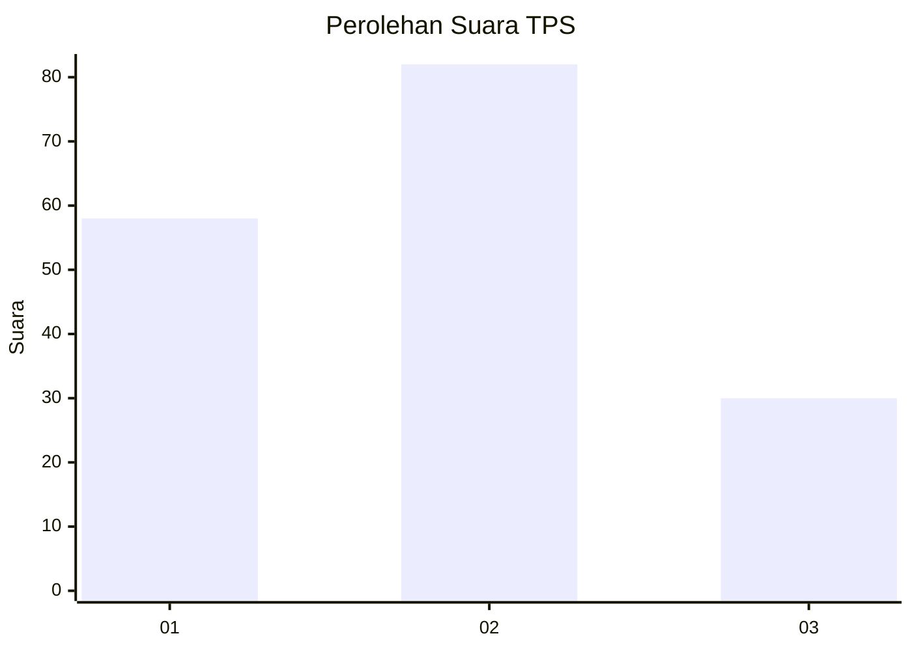
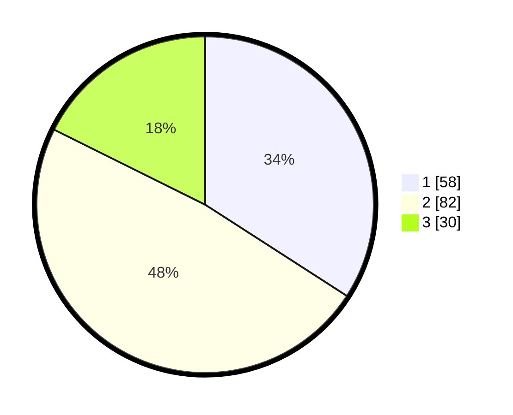

# Hasil

## Grafik

## Tabel

| No. | Nama Paslon    | Suara | Suara (raw) | Persentase |
|:--- |:-------------- | -----:| -----------:| ----------:|
| 1   | ANIES MUHAIMIN | 58    | [58][p-1]   | 34,12      |
| 2   | PRABOWO GIBRAN | 82    | [82][p-2]   | 48,24      |
| 3   | GANJAR MAHFUD  | 30    | [30][p-3]   | 17,65      |

[p-1]: https://github.com/gigit-pemilu/pemilu-2024-16-sumatera-selatan/blob/main/pilpres/hitung-suara/sub/16-sumatera-selatan/sub/71-kota-palembang/sub/04-ilir-barat-satu/sub/1001-bukitlama/sub/064-tps/sub/paslon-1.txt
[p-2]: https://github.com/gigit-pemilu/pemilu-2024-16-sumatera-selatan/blob/main/pilpres/hitung-suara/sub/16-sumatera-selatan/sub/71-kota-palembang/sub/04-ilir-barat-satu/sub/1001-bukitlama/sub/064-tps/sub/paslon-2.txt
[p-3]: https://github.com/gigit-pemilu/pemilu-2024-16-sumatera-selatan/blob/main/pilpres/hitung-suara/sub/16-sumatera-selatan/sub/71-kota-palembang/sub/04-ilir-barat-satu/sub/1001-bukitlama/sub/064-tps/sub/paslon-3.txt

## Foto C Plano

https://sirekap-obj-formc.kpu.go.id/cdab/pemilu/ppwp/16/71/04/10/01/1671041001064-20240214-193942--f987387e-c07f-4aae-acf2-2c6d27ceac0b.jpg

https://sirekap-obj-formc.kpu.go.id/cdab/pemilu/ppwp/16/71/04/10/01/1671041001064-20240214-195646--bf9444c4-e53a-46b3-b163-adfc2589a556.jpg

https://sirekap-obj-formc.kpu.go.id/cdab/pemilu/ppwp/16/71/04/10/01/1671041001064-20240214-193958--20c8d2c4-e42d-4516-8f33-765224c64379.jpg

## Metadata

| Key        | Value               |
| ---------- | ------------------- |
| Time Stamp | 2024-02-25 21:00:00 |

