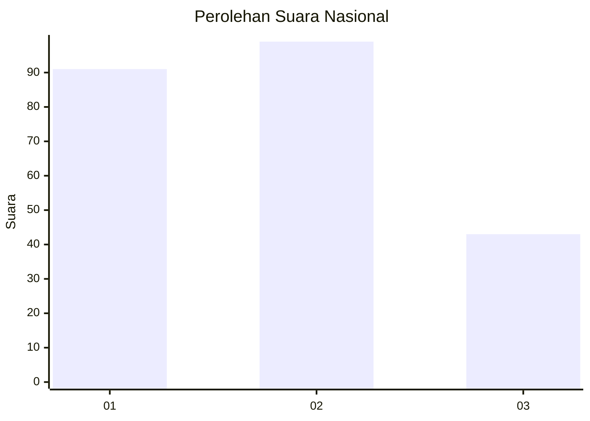
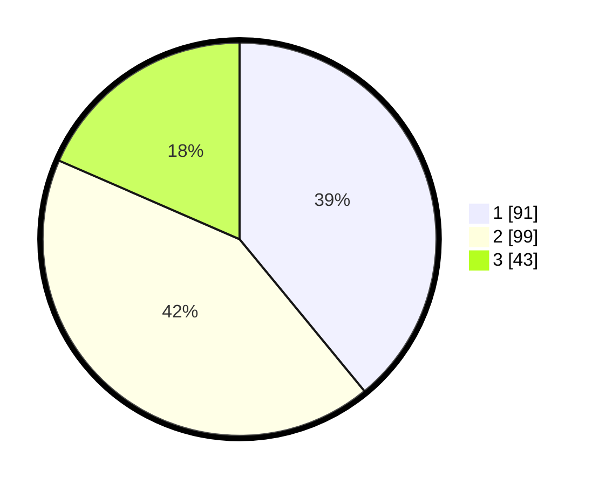

# Hasil

## Grafik

## Tabel

| No. | Nama Paslon    | Suara | Suara (raw) | Persentase |
|:--- |:-------------- | -----:| -----------:| ----------:|
| 1   | ANIES MUHAIMIN | 91    | [91][p-1]   | 39,06      |
| 2   | PRABOWO GIBRAN | 99    | [99][p-2]   | 42,49      |
| 3   | GANJAR MAHFUD  | 43    | [43][p-3]   | 18,45      |

[p-1]: https://github.com/gigit-pemilu/pemilu-2024/blob/main/pilpres/hitung-suara/sub/16-sumatera-selatan/sub/71-kota-palembang/sub/04-ilir-barat-satu/sub/1001-bukitlama/sub/069-tps/sub/paslon-1.txt
[p-2]: https://github.com/gigit-pemilu/pemilu-2024/blob/main/pilpres/hitung-suara/sub/16-sumatera-selatan/sub/71-kota-palembang/sub/04-ilir-barat-satu/sub/1001-bukitlama/sub/069-tps/sub/paslon-2.txt
[p-3]: https://github.com/gigit-pemilu/pemilu-2024/blob/main/pilpres/hitung-suara/sub/16-sumatera-selatan/sub/71-kota-palembang/sub/04-ilir-barat-satu/sub/1001-bukitlama/sub/069-tps/sub/paslon-3.txt

## Foto C Plano

https://sirekap-obj-formc.kpu.go.id/4ff0/pemilu/ppwp/16/71/04/10/01/1671041001069-20240215-084116--781411bb-5d92-45b5-90b4-7b7216705fd6.jpg

https://sirekap-obj-formc.kpu.go.id/4ff0/pemilu/ppwp/16/71/04/10/01/1671041001069-20240215-084127--56e90c3e-e711-48d9-9c00-d8881ee5ed58.jpg

https://sirekap-obj-formc.kpu.go.id/4ff0/pemilu/ppwp/16/71/04/10/01/1671041001069-20240215-084132--90ceb2fd-2bf5-4076-ab19-a4e9906782c5.jpg

## Metadata

| Key        | Value               |
| ---------- | ------------------- |
| Time Stamp | 2024-02-24 22:31:28 |

