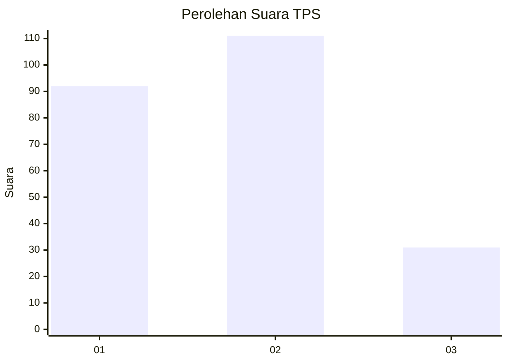
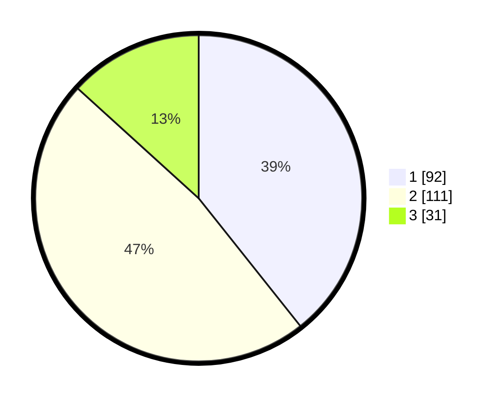

# Hasil

## Grafik

## Tabel

| No. | Nama Paslon    | Suara | Suara (raw) | Persentase |
|:--- |:-------------- | -----:| -----------:| ----------:|
| 1   | ANIES MUHAIMIN | 92    | [92][p-1]   | 39,32      |
| 2   | PRABOWO GIBRAN | 111   | [111][p-2]  | 47,44      |
| 3   | GANJAR MAHFUD  | 31    | [31][p-3]   | 13,25      |

[p-1]: https://github.com/gigit-pemilu/pemilu-2024-16-sumatera-selatan/blob/main/pilpres/hitung-suara/sub/16-sumatera-selatan/sub/71-kota-palembang/sub/04-ilir-barat-satu/sub/1001-bukitlama/sub/070-tps/sub/paslon-1.txt
[p-2]: https://github.com/gigit-pemilu/pemilu-2024-16-sumatera-selatan/blob/main/pilpres/hitung-suara/sub/16-sumatera-selatan/sub/71-kota-palembang/sub/04-ilir-barat-satu/sub/1001-bukitlama/sub/070-tps/sub/paslon-2.txt
[p-3]: https://github.com/gigit-pemilu/pemilu-2024-16-sumatera-selatan/blob/main/pilpres/hitung-suara/sub/16-sumatera-selatan/sub/71-kota-palembang/sub/04-ilir-barat-satu/sub/1001-bukitlama/sub/070-tps/sub/paslon-3.txt

## Foto C Plano

https://sirekap-obj-formc.kpu.go.id/4a54/pemilu/ppwp/16/71/04/10/01/1671041001070-20240215-093723--d8eb97a9-8363-4ecc-8513-7c9478e5cace.jpg

https://sirekap-obj-formc.kpu.go.id/4a54/pemilu/ppwp/16/71/04/10/01/1671041001070-20240215-093840--6ce6af3c-7f04-44cc-9d80-cf5f04e31883.jpg

https://sirekap-obj-formc.kpu.go.id/4a54/pemilu/ppwp/16/71/04/10/01/1671041001070-20240215-093950--b0d3c4f9-8198-4fc3-9f0f-1542408736be.jpg

## Metadata

| Key        | Value               |
| ---------- | ------------------- |
| Time Stamp | 2024-02-25 16:00:00 |

