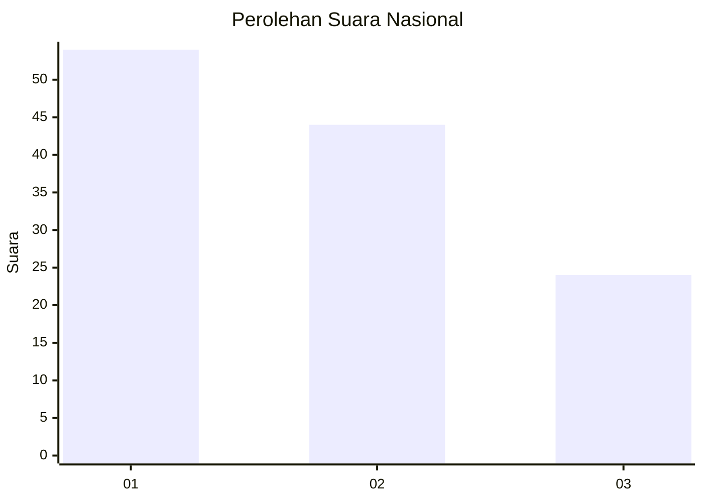
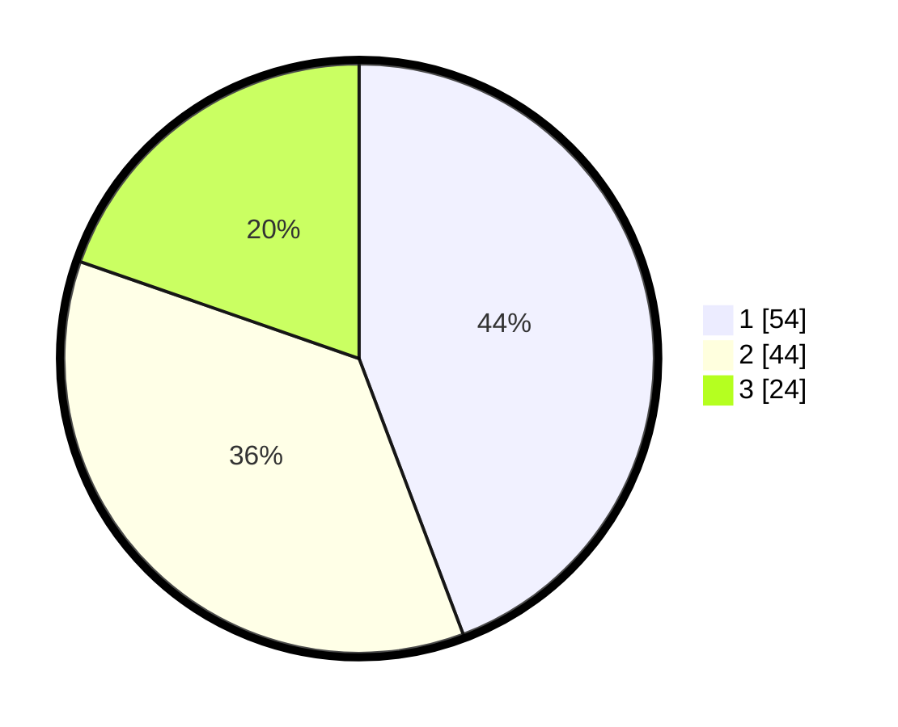

# Hasil

## Grafik

## Tabel

| No. | Nama Paslon    | Suara | Suara (raw) | Persentase |
|:--- |:-------------- | -----:| -----------:| ----------:|
| 1   | ANIES MUHAIMIN | 54    | [54][p-1]   | 44,26      |
| 2   | PRABOWO GIBRAN | 44    | [44][p-2]   | 36,07      |
| 3   | GANJAR MAHFUD  | 24    | [24][p-3]   | 19,67      |

[p-1]: https://github.com/gigit-pemilu/pemilu-2024/blob/main/pilpres/hitung-suara/sub/16-sumatera-selatan/sub/71-kota-palembang/sub/04-ilir-barat-satu/sub/1001-bukitlama/sub/081-tps/sub/paslon-1.txt
[p-2]: https://github.com/gigit-pemilu/pemilu-2024/blob/main/pilpres/hitung-suara/sub/16-sumatera-selatan/sub/71-kota-palembang/sub/04-ilir-barat-satu/sub/1001-bukitlama/sub/081-tps/sub/paslon-2.txt
[p-3]: https://github.com/gigit-pemilu/pemilu-2024/blob/main/pilpres/hitung-suara/sub/16-sumatera-selatan/sub/71-kota-palembang/sub/04-ilir-barat-satu/sub/1001-bukitlama/sub/081-tps/sub/paslon-3.txt

## Foto C Plano

https://sirekap-obj-formc.kpu.go.id/0474/pemilu/ppwp/16/71/04/10/01/1671041001081-20240221-105043--df4a6385-1b20-445b-86ea-c878248d2b67.jpg

https://sirekap-obj-formc.kpu.go.id/0474/pemilu/ppwp/16/71/04/10/01/1671041001081-20240221-105337--7e40efde-e98b-40f8-a21a-4381b796fa95.jpg

https://sirekap-obj-formc.kpu.go.id/0474/pemilu/ppwp/16/71/04/10/01/1671041001081-20240221-105532--1e13162d-9218-4224-ab47-71e9f3f1eca8.jpg

## Metadata

| Key        | Value               |
| ---------- | ------------------- |
| Time Stamp | 2024-02-21 11:00:00 |

## DATA PEMILIH TETAP

Jumlah pemilih dalam DPT: **225**.
 * L: **776**.
 * P: **709**.

## DATA PENGGUNA HAK PILIH

Jumlah pengguna hak pilih dalam DPT: **783**.
 * L: **80**.
 * P: **88**.

Jumlah pengguna hak pilih dalam DPTb: **5**.
 * L: **3**.
 * P: **2**.

Jumlah pengguna hak pilih dalam DPK: **8**.
 * L: **2**.
 * P: **6**.

Jumlah pengguna hak pilih: **788**.
 * L: **200**.
 * P: **88**.

## JUMLAH SUARA SAH DAN TIDAK SAH

JUMLAH SELURUH SUARA SAH: **180**.

JUMLAH SUARA TIDAK SAH: **8**.

JUMLAH SELURUH SUARA SAH DAN SUARA TIDAK SAH: **788**.

