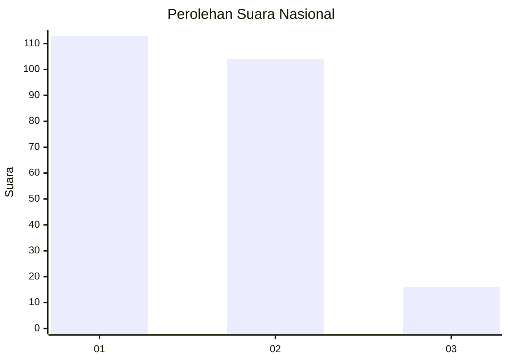
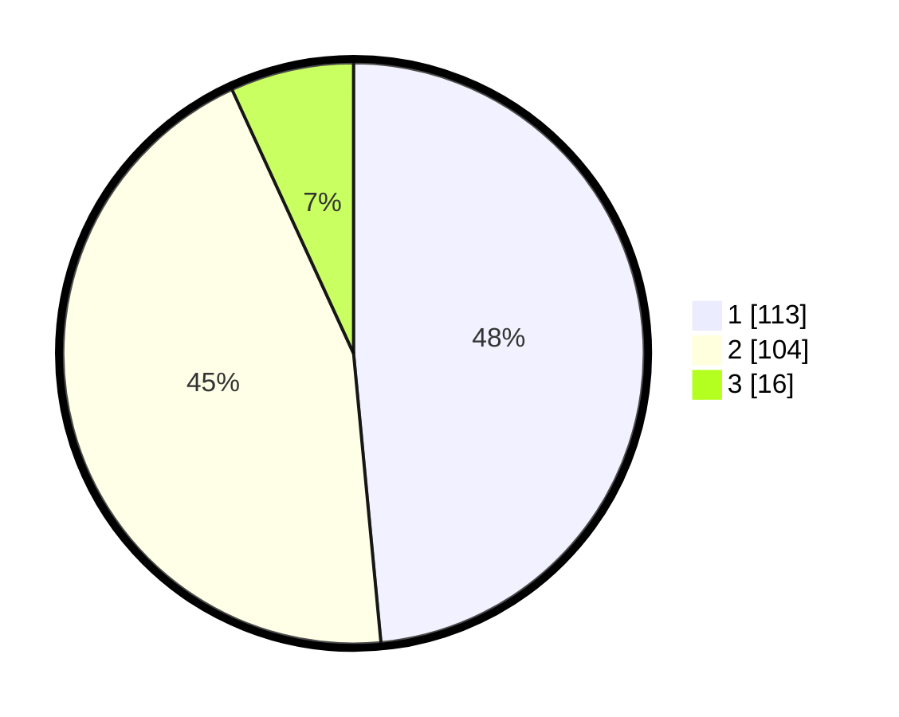

# Hasil

## Grafik

## Tabel

| No. | Nama Paslon    | Suara | Suara (raw) | Persentase |
|:--- |:-------------- | -----:| -----------:| ----------:|
| 1   | ANIES MUHAIMIN | 113   | [113][p-1]  | 48,50      |
| 2   | PRABOWO GIBRAN | 104   | [104][p-2]  | 44,64      |
| 3   | GANJAR MAHFUD  | 16    | [16][p-3]   | 6,87       |

[p-1]: https://github.com/gigit-pemilu/pemilu-2024/blob/main/pilpres/hitung-suara/sub/16-sumatera-selatan/sub/71-kota-palembang/sub/04-ilir-barat-satu/sub/1001-bukitlama/sub/087-tps/sub/paslon-1.txt
[p-2]: https://github.com/gigit-pemilu/pemilu-2024/blob/main/pilpres/hitung-suara/sub/16-sumatera-selatan/sub/71-kota-palembang/sub/04-ilir-barat-satu/sub/1001-bukitlama/sub/087-tps/sub/paslon-2.txt
[p-3]: https://github.com/gigit-pemilu/pemilu-2024/blob/main/pilpres/hitung-suara/sub/16-sumatera-selatan/sub/71-kota-palembang/sub/04-ilir-barat-satu/sub/1001-bukitlama/sub/087-tps/sub/paslon-3.txt

## Foto C Plano

https://sirekap-obj-formc.kpu.go.id/f326/pemilu/ppwp/16/71/04/10/01/1671041001087-20240221-113932--061fef89-b1f7-4258-a6fc-766a84f40c81.jpg

https://sirekap-obj-formc.kpu.go.id/f326/pemilu/ppwp/16/71/04/10/01/1671041001087-20240221-114034--cfff36bb-df02-4cfd-b596-0b4003fc0d67.jpg

https://sirekap-obj-formc.kpu.go.id/f326/pemilu/ppwp/16/71/04/10/01/1671041001087-20240221-114148--bf5c5e26-1195-4859-89e6-191b3315b8cd.jpg

## Metadata

| Key        | Value               |
| ---------- | ------------------- |
| Time Stamp | 2024-02-25 04:00:00 |

