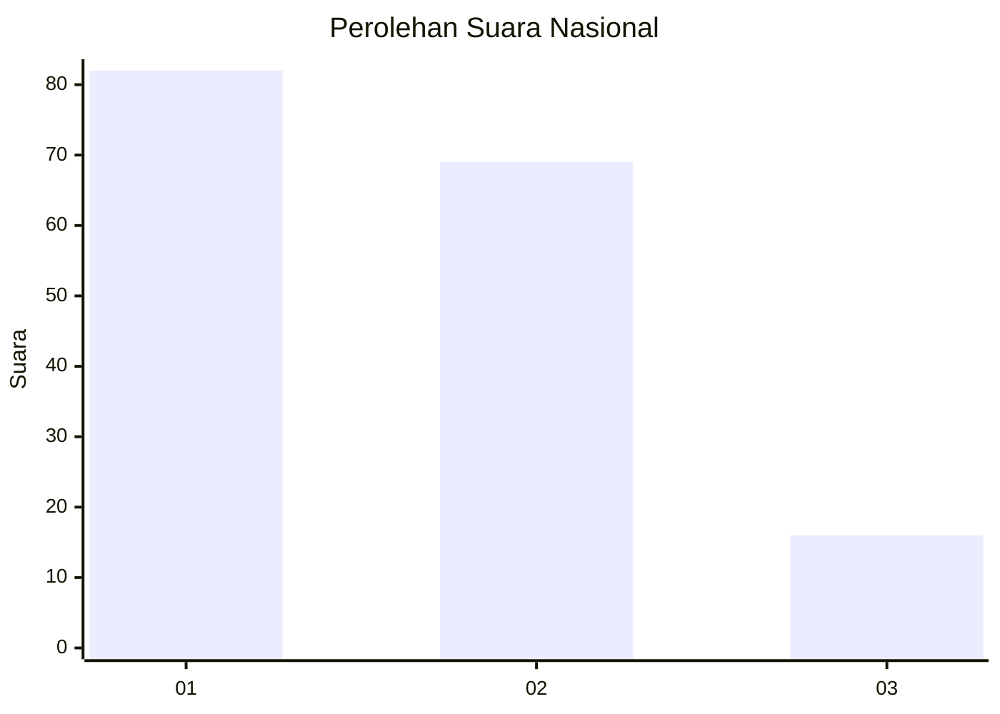
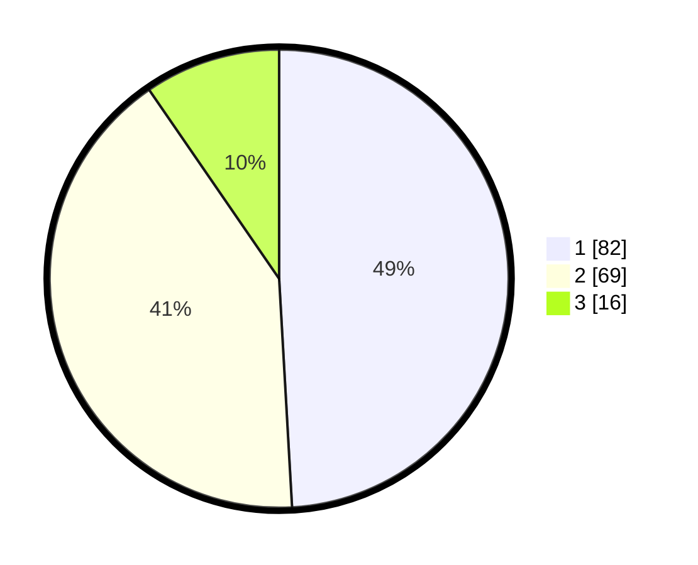

# Hasil

## Grafik

## Tabel

| No. | Nama Paslon    | Suara | Suara (raw) | Persentase |
|:--- |:-------------- | -----:| -----------:| ----------:|
| 1   | ANIES MUHAIMIN | 82    | [82][p-1]   | 49,10      |
| 2   | PRABOWO GIBRAN | 69    | [69][p-2]   | 41,32      |
| 3   | GANJAR MAHFUD  | 16    | [16][p-3]   | 9,58       |

[p-1]: https://github.com/gigit-pemilu/pemilu-2024/blob/main/pilpres/hitung-suara/sub/16-sumatera-selatan/sub/71-kota-palembang/sub/04-ilir-barat-satu/sub/1001-bukitlama/sub/096-tps/sub/paslon-1.txt
[p-2]: https://github.com/gigit-pemilu/pemilu-2024/blob/main/pilpres/hitung-suara/sub/16-sumatera-selatan/sub/71-kota-palembang/sub/04-ilir-barat-satu/sub/1001-bukitlama/sub/096-tps/sub/paslon-2.txt
[p-3]: https://github.com/gigit-pemilu/pemilu-2024/blob/main/pilpres/hitung-suara/sub/16-sumatera-selatan/sub/71-kota-palembang/sub/04-ilir-barat-satu/sub/1001-bukitlama/sub/096-tps/sub/paslon-3.txt

## Foto C Plano

https://sirekap-obj-formc.kpu.go.id/da81/pemilu/ppwp/16/71/04/10/01/1671041001096-20240221-142409--4bf2fff8-3189-4211-b522-9a7fda9b6bf1.jpg

https://sirekap-obj-formc.kpu.go.id/da81/pemilu/ppwp/16/71/04/10/01/1671041001096-20240221-142455--492ce90e-e3b0-4b53-999a-0c1fda141716.jpg

https://sirekap-obj-formc.kpu.go.id/da81/pemilu/ppwp/16/71/04/10/01/1671041001096-20240221-142611--621a3d10-aeba-440e-ac6a-b4efe861a482.jpg

## Metadata

| Key        | Value               |
| ---------- | ------------------- |
| Time Stamp | 2024-02-24 22:31:28 |

