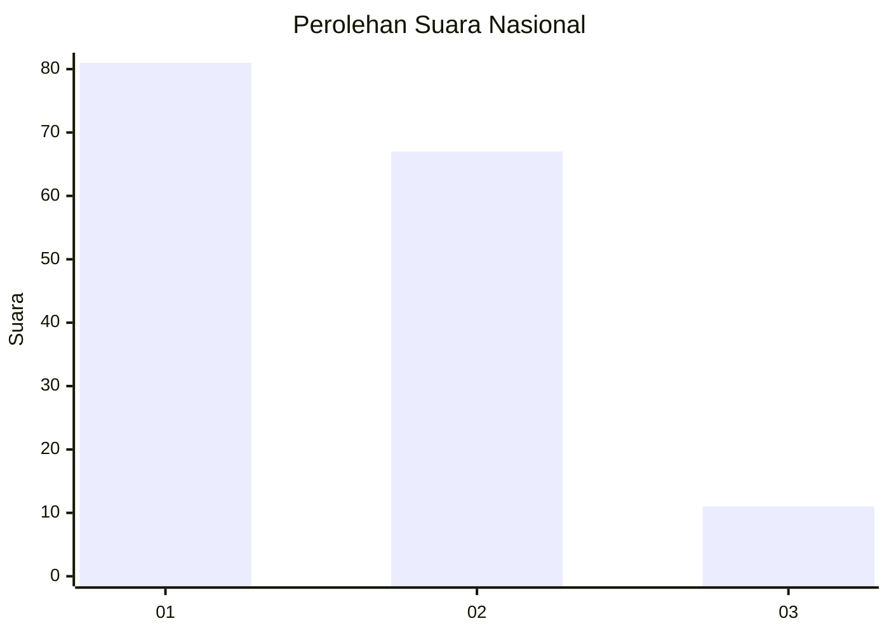
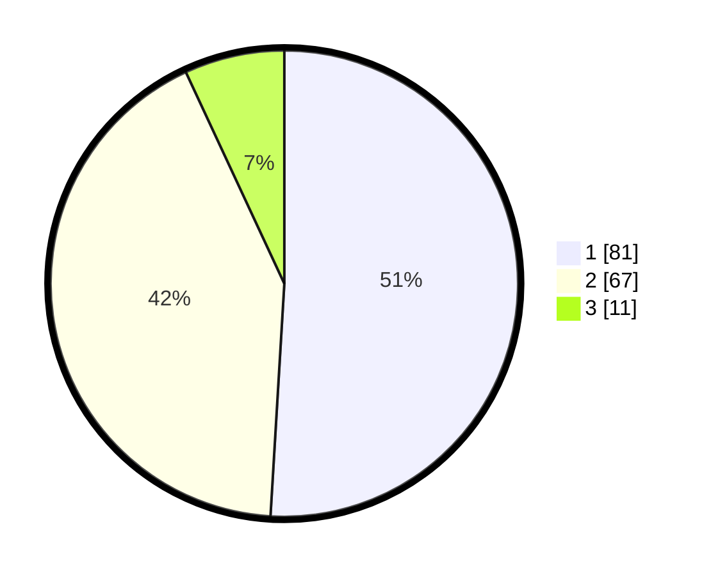

# Hasil

## Grafik

## Tabel

| No. | Nama Paslon    | Suara | Suara (raw) | Persentase |
|:--- |:-------------- | -----:| -----------:| ----------:|
| 1   | ANIES MUHAIMIN | 81    | [81][p-1]   | 50,94      |
| 2   | PRABOWO GIBRAN | 67    | [67][p-2]   | 42,14      |
| 3   | GANJAR MAHFUD  | 11    | [11][p-3]   | 6,92       |

[p-1]: https://github.com/gigit-pemilu/pemilu-2024/blob/main/pilpres/hitung-suara/sub/16-sumatera-selatan/sub/71-kota-palembang/sub/04-ilir-barat-satu/sub/1001-bukitlama/sub/102-tps/sub/paslon-1.txt
[p-2]: https://github.com/gigit-pemilu/pemilu-2024/blob/main/pilpres/hitung-suara/sub/16-sumatera-selatan/sub/71-kota-palembang/sub/04-ilir-barat-satu/sub/1001-bukitlama/sub/102-tps/sub/paslon-2.txt
[p-3]: https://github.com/gigit-pemilu/pemilu-2024/blob/main/pilpres/hitung-suara/sub/16-sumatera-selatan/sub/71-kota-palembang/sub/04-ilir-barat-satu/sub/1001-bukitlama/sub/102-tps/sub/paslon-3.txt

## Foto C Plano

https://sirekap-obj-formc.kpu.go.id/20fa/pemilu/ppwp/16/71/04/10/01/1671041001102-20240215-185742--129002c0-3ac3-4b35-ab83-cba2ff6d00fe.jpg

https://sirekap-obj-formc.kpu.go.id/20fa/pemilu/ppwp/16/71/04/10/01/1671041001102-20240215-162310--12e441b2-5bbd-4590-913e-981a3e931183.jpg

https://sirekap-obj-formc.kpu.go.id/20fa/pemilu/ppwp/16/71/04/10/01/1671041001102-20240215-162348--b30cc951-3457-4ada-8a29-4bf291149c42.jpg

## Metadata

| Key        | Value               |
| ---------- | ------------------- |
| Time Stamp | 2024-02-19 06:16:00 |

