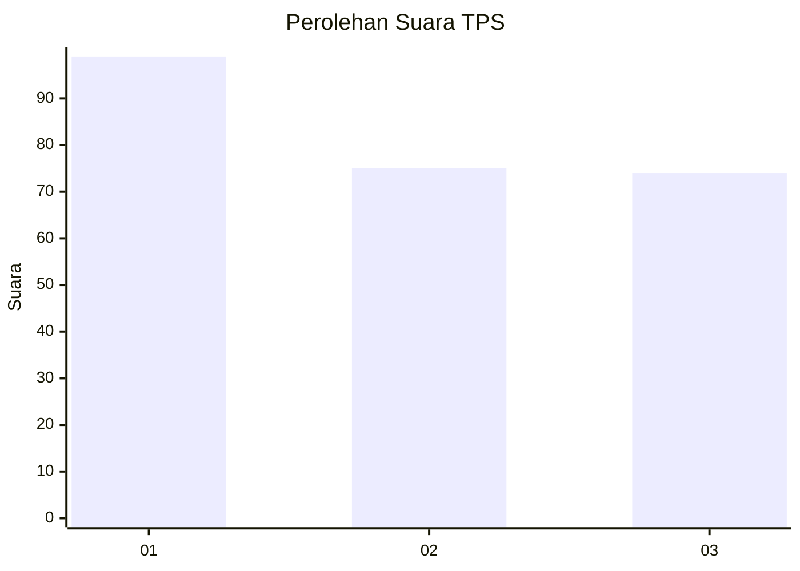
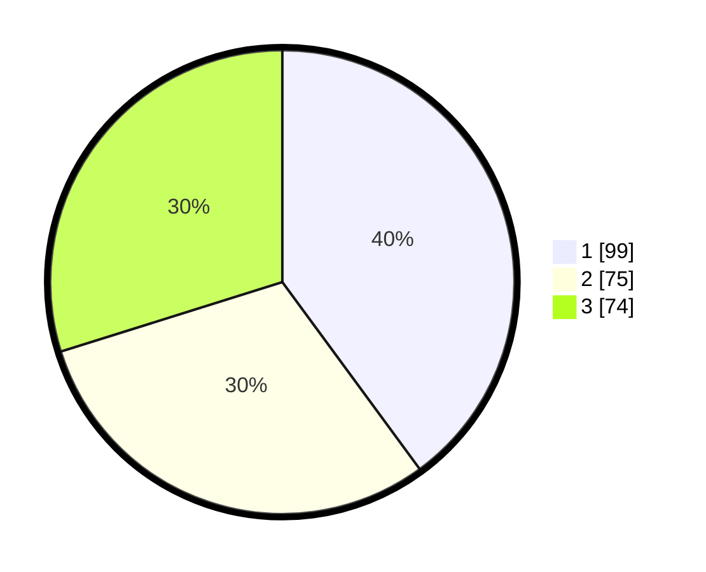

# Hasil

## Grafik

## Tabel

| No. | Nama Paslon    | Suara | Suara (raw) | Persentase |
|:--- |:-------------- | -----:| -----------:| ----------:|
| 1   | ANIES MUHAIMIN | 99    | [99][p-1]   | 39,92      |
| 2   | PRABOWO GIBRAN | 75    | [75][p-2]   | 30,24      |
| 3   | GANJAR MAHFUD  | 74    | [74][p-3]   | 29,84      |

[p-1]: https://github.com/gigit-pemilu/pemilu-2024-16-sumatera-selatan/blob/main/pilpres/hitung-suara/sub/16-sumatera-selatan/sub/71-kota-palembang/sub/04-ilir-barat-satu/sub/1001-bukitlama/sub/109-tps/sub/paslon-1.txt
[p-2]: https://github.com/gigit-pemilu/pemilu-2024-16-sumatera-selatan/blob/main/pilpres/hitung-suara/sub/16-sumatera-selatan/sub/71-kota-palembang/sub/04-ilir-barat-satu/sub/1001-bukitlama/sub/109-tps/sub/paslon-2.txt
[p-3]: https://github.com/gigit-pemilu/pemilu-2024-16-sumatera-selatan/blob/main/pilpres/hitung-suara/sub/16-sumatera-selatan/sub/71-kota-palembang/sub/04-ilir-barat-satu/sub/1001-bukitlama/sub/109-tps/sub/paslon-3.txt

## Foto C Plano

https://sirekap-obj-formc.kpu.go.id/ad99/pemilu/ppwp/16/71/04/10/01/1671041001109-20240214-155235--f52297c7-3094-4d02-b405-f8c26deda777.jpg

https://sirekap-obj-formc.kpu.go.id/ad99/pemilu/ppwp/16/71/04/10/01/1671041001109-20240214-155156--2c8fd058-50e0-4403-bec6-d3e369209268.jpg

https://sirekap-obj-formc.kpu.go.id/ad99/pemilu/ppwp/16/71/04/10/01/1671041001109-20240214-155517--2fde3810-bbf4-457d-a065-a89599712798.jpg

## Metadata

| Key        | Value               |
| ---------- | ------------------- |
| Time Stamp | 2024-02-14 21:46:01 |

