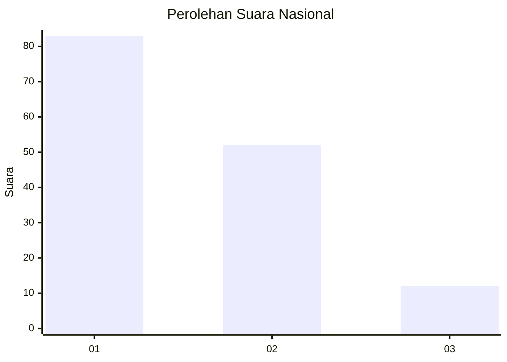
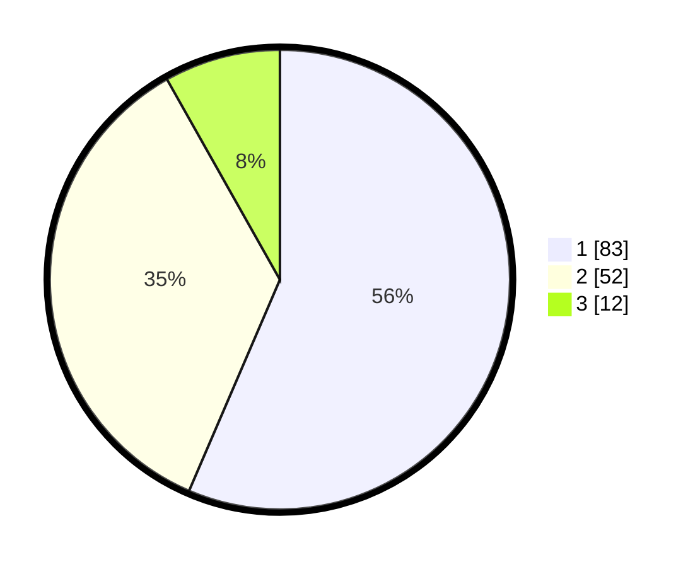

# Hasil

## Grafik

## Tabel

| No. | Nama Paslon    | Suara | Suara (raw) | Persentase |
|:--- |:-------------- | -----:| -----------:| ----------:|
| 1   | ANIES MUHAIMIN | 83    | [83][p-1]   | 56,46      |
| 2   | PRABOWO GIBRAN | 52    | [52][p-2]   | 35,37      |
| 3   | GANJAR MAHFUD  | 12    | [12][p-3]   | 8,16       |

[p-1]: https://github.com/gigit-pemilu/pemilu-2024/blob/main/pilpres/hitung-suara/sub/16-sumatera-selatan/sub/71-kota-palembang/sub/04-ilir-barat-satu/sub/1001-bukitlama/sub/116-tps/sub/paslon-1.txt
[p-2]: https://github.com/gigit-pemilu/pemilu-2024/blob/main/pilpres/hitung-suara/sub/16-sumatera-selatan/sub/71-kota-palembang/sub/04-ilir-barat-satu/sub/1001-bukitlama/sub/116-tps/sub/paslon-2.txt
[p-3]: https://github.com/gigit-pemilu/pemilu-2024/blob/main/pilpres/hitung-suara/sub/16-sumatera-selatan/sub/71-kota-palembang/sub/04-ilir-barat-satu/sub/1001-bukitlama/sub/116-tps/sub/paslon-3.txt

## Foto C Plano

https://sirekap-obj-formc.kpu.go.id/221d/pemilu/ppwp/16/71/04/10/01/1671041001116-20240221-195054--0d5a3003-d865-459e-a8e8-f46d24e32b86.jpg

https://sirekap-obj-formc.kpu.go.id/221d/pemilu/ppwp/16/71/04/10/01/1671041001116-20240221-195122--caf267ff-8804-4d0d-ae85-1acd6cf3ea3d.jpg

https://sirekap-obj-formc.kpu.go.id/221d/pemilu/ppwp/16/71/04/10/01/1671041001116-20240221-195154--304571be-6515-43bb-804e-d1f9059d4f63.jpg

## Metadata

| Key        | Value               |
| ---------- | ------------------- |
| Time Stamp | 2024-02-24 22:31:28 |

