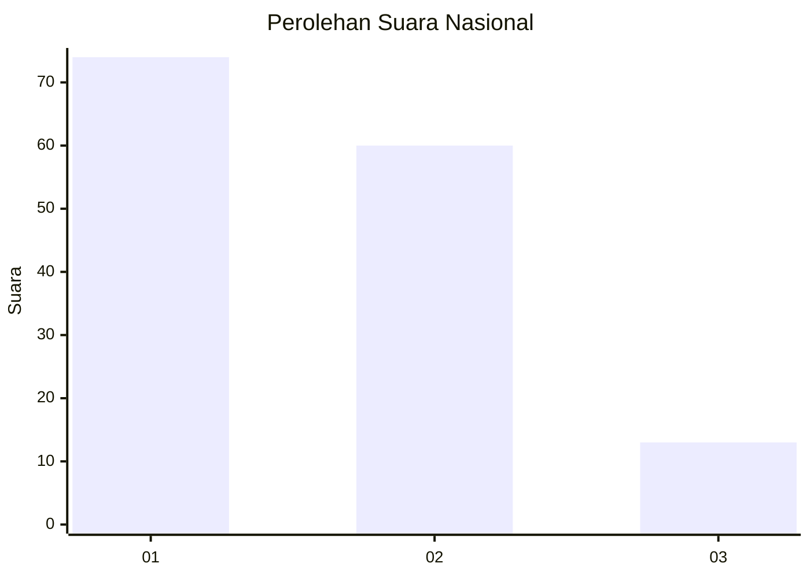
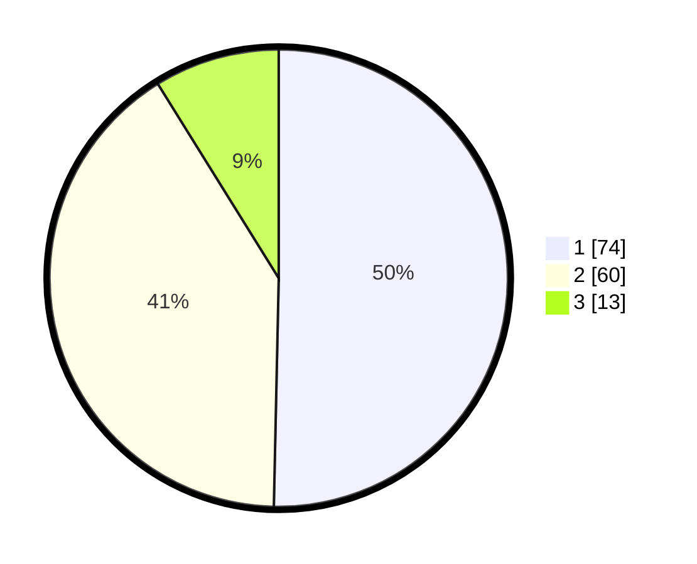

# Hasil

## Grafik

## Tabel

| No. | Nama Paslon    | Suara | Suara (raw) | Persentase |
|:--- |:-------------- | -----:| -----------:| ----------:|
| 1   | ANIES MUHAIMIN | 74    | [74][p-1]   | 50,34      |
| 2   | PRABOWO GIBRAN | 60    | [60][p-2]   | 40,82      |
| 3   | GANJAR MAHFUD  | 13    | [13][p-3]   | 8,84       |

[p-1]: https://github.com/gigit-pemilu/pemilu-2024/blob/main/pilpres/hitung-suara/sub/16-sumatera-selatan/sub/71-kota-palembang/sub/04-ilir-barat-satu/sub/1001-bukitlama/sub/117-tps/sub/paslon-1.txt
[p-2]: https://github.com/gigit-pemilu/pemilu-2024/blob/main/pilpres/hitung-suara/sub/16-sumatera-selatan/sub/71-kota-palembang/sub/04-ilir-barat-satu/sub/1001-bukitlama/sub/117-tps/sub/paslon-2.txt
[p-3]: https://github.com/gigit-pemilu/pemilu-2024/blob/main/pilpres/hitung-suara/sub/16-sumatera-selatan/sub/71-kota-palembang/sub/04-ilir-barat-satu/sub/1001-bukitlama/sub/117-tps/sub/paslon-3.txt

## Foto C Plano

https://sirekap-obj-formc.kpu.go.id/1fc9/pemilu/ppwp/16/71/04/10/01/1671041001117-20240221-194454--fa207c33-cc9e-4b0a-a84e-7ad0b2d5484f.jpg

https://sirekap-obj-formc.kpu.go.id/1fc9/pemilu/ppwp/16/71/04/10/01/1671041001117-20240221-194617--0d3004d8-7e0a-4791-a259-683e86cbac2a.jpg

https://sirekap-obj-formc.kpu.go.id/1fc9/pemilu/ppwp/16/71/04/10/01/1671041001117-20240221-194713--56df0bff-b9c5-4b2f-97a9-f3b2f6089eb5.jpg

## Metadata

| Key        | Value               |
| ---------- | ------------------- |
| Time Stamp | 2024-02-24 22:31:28 |

