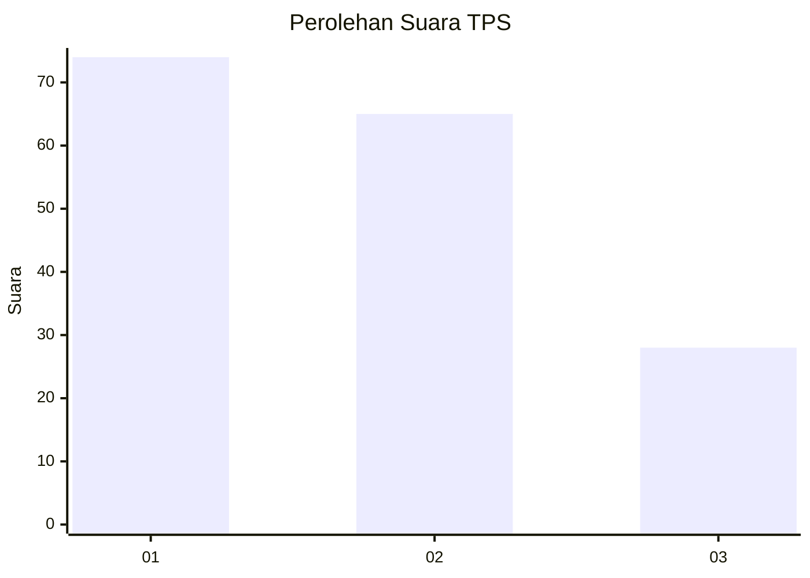
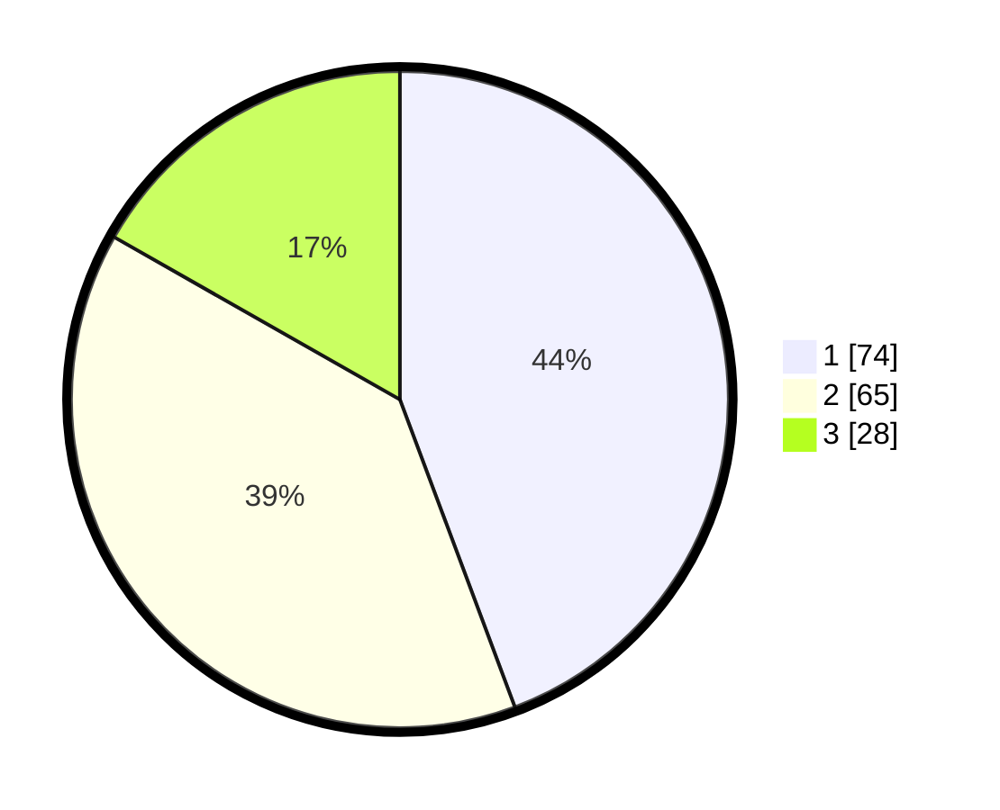

# Hasil

## Grafik

## Tabel

| No. | Nama Paslon    | Suara | Suara (raw) | Persentase |
|:--- |:-------------- | -----:| -----------:| ----------:|
| 1   | ANIES MUHAIMIN | 74    | [74][p-1]   | 44,31      |
| 2   | PRABOWO GIBRAN | 65    | [65][p-2]   | 38,92      |
| 3   | GANJAR MAHFUD  | 28    | [28][p-3]   | 16,77      |

[p-1]: https://github.com/gigit-pemilu/pemilu-2024-16-sumatera-selatan/blob/main/pilpres/hitung-suara/sub/16-sumatera-selatan/sub/71-kota-palembang/sub/04-ilir-barat-satu/sub/1001-bukitlama/sub/119-tps/sub/paslon-1.txt
[p-2]: https://github.com/gigit-pemilu/pemilu-2024-16-sumatera-selatan/blob/main/pilpres/hitung-suara/sub/16-sumatera-selatan/sub/71-kota-palembang/sub/04-ilir-barat-satu/sub/1001-bukitlama/sub/119-tps/sub/paslon-2.txt
[p-3]: https://github.com/gigit-pemilu/pemilu-2024-16-sumatera-selatan/blob/main/pilpres/hitung-suara/sub/16-sumatera-selatan/sub/71-kota-palembang/sub/04-ilir-barat-satu/sub/1001-bukitlama/sub/119-tps/sub/paslon-3.txt

## Foto C Plano

https://sirekap-obj-formc.kpu.go.id/739b/pemilu/ppwp/16/71/04/10/01/1671041001119-20240221-194735--67ee1520-e1f8-4d72-8eeb-cc242545b4b0.jpg

https://sirekap-obj-formc.kpu.go.id/739b/pemilu/ppwp/16/71/04/10/01/1671041001119-20240221-194842--4a48fc72-85b1-4f44-948c-658c50c0628b.jpg

https://sirekap-obj-formc.kpu.go.id/739b/pemilu/ppwp/16/71/04/10/01/1671041001119-20240221-195020--14fd58d4-2ac1-4fa1-8e8a-4cbfc40e1586.jpg

## Metadata

| Key        | Value               |
| ---------- | ------------------- |
| Time Stamp | 2024-02-25 10:00:00 |

