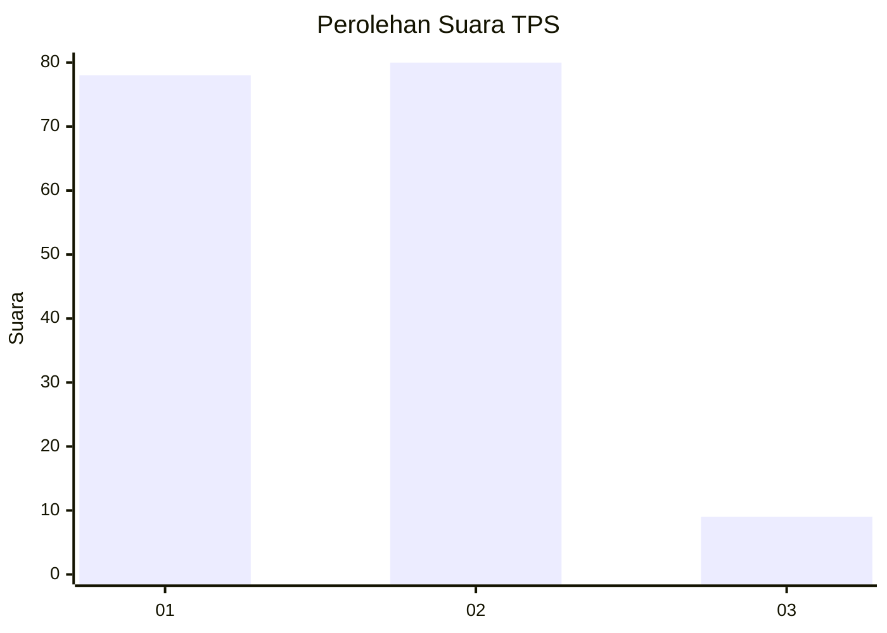
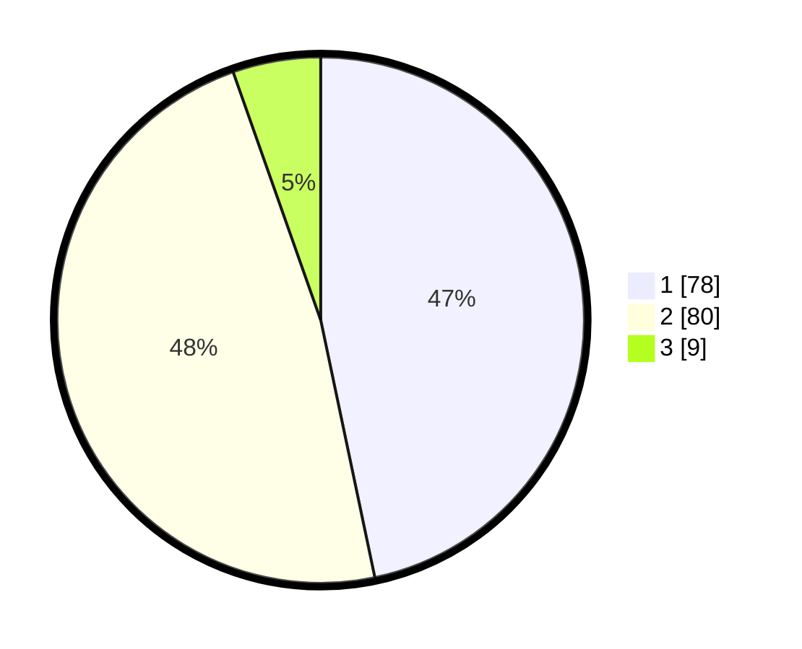

# Hasil

## Grafik

## Tabel

| No. | Nama Paslon    | Suara | Suara (raw) | Persentase |
|:--- |:-------------- | -----:| -----------:| ----------:|
| 1   | ANIES MUHAIMIN | 78    | [78][p-1]   | 46,71      |
| 2   | PRABOWO GIBRAN | 80    | [80][p-2]   | 47,90      |
| 3   | GANJAR MAHFUD  | 9     | [9][p-3]    | 5,39       |

[p-1]: https://github.com/gigit-pemilu/pemilu-2024-16-sumatera-selatan/blob/main/pilpres/hitung-suara/sub/16-sumatera-selatan/sub/71-kota-palembang/sub/04-ilir-barat-satu/sub/1002-lorokpakjo/sub/023-tps/sub/paslon-1.txt
[p-2]: https://github.com/gigit-pemilu/pemilu-2024-16-sumatera-selatan/blob/main/pilpres/hitung-suara/sub/16-sumatera-selatan/sub/71-kota-palembang/sub/04-ilir-barat-satu/sub/1002-lorokpakjo/sub/023-tps/sub/paslon-2.txt
[p-3]: https://github.com/gigit-pemilu/pemilu-2024-16-sumatera-selatan/blob/main/pilpres/hitung-suara/sub/16-sumatera-selatan/sub/71-kota-palembang/sub/04-ilir-barat-satu/sub/1002-lorokpakjo/sub/023-tps/sub/paslon-3.txt

## Foto C Plano

https://sirekap-obj-formc.kpu.go.id/9a16/pemilu/ppwp/16/71/04/10/02/1671041002023-20240219-100046--730293a0-3fe1-45d3-b8ed-a7678bc45182.jpg

https://sirekap-obj-formc.kpu.go.id/9a16/pemilu/ppwp/16/71/04/10/02/1671041002023-20240219-100920--a3098ac1-e7f5-44b0-9d13-e5781aa40723.jpg

https://sirekap-obj-formc.kpu.go.id/9a16/pemilu/ppwp/16/71/04/10/02/1671041002023-20240219-101232--9a96c46c-a7e4-482c-8251-f29b150462f0.jpg

## Metadata

| Key        | Value               |
| ---------- | ------------------- |
| Time Stamp | 2024-02-24 22:31:28 |

