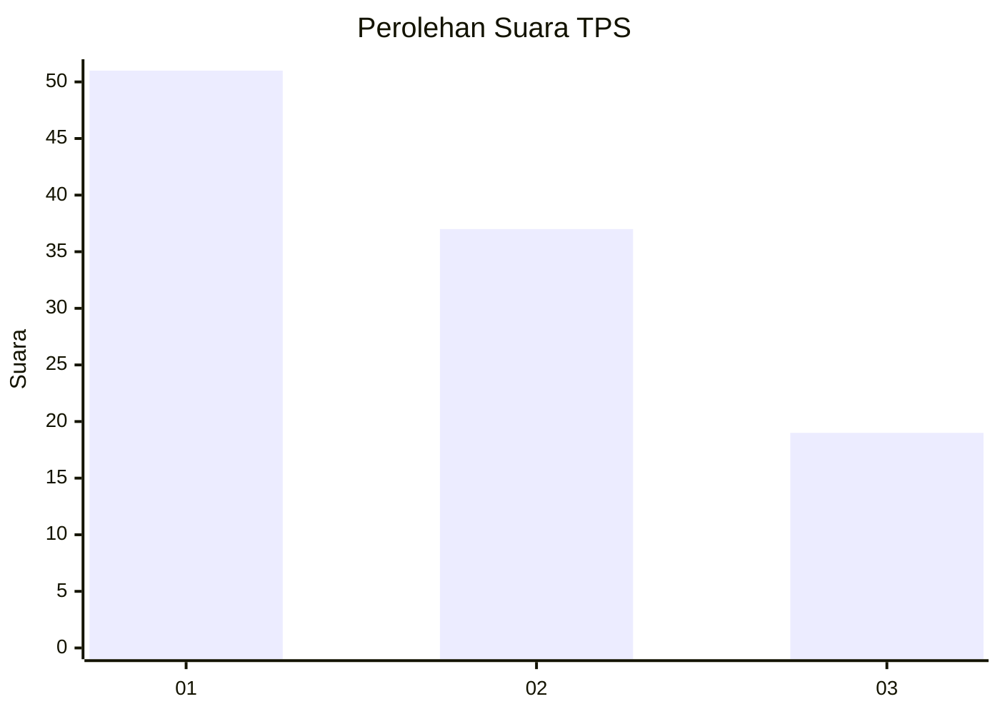
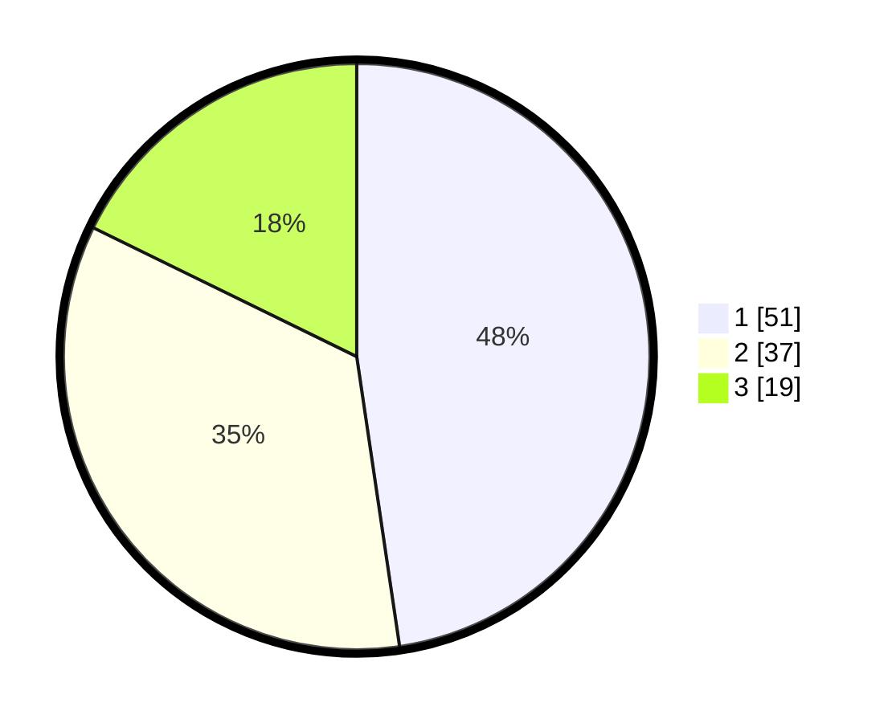

# Hasil

## Grafik

## Tabel

| No. | Nama Paslon    | Suara | Suara (raw) | Persentase |
|:--- |:-------------- | -----:| -----------:| ----------:|
| 1   | ANIES MUHAIMIN | 51    | [51][p-1]   | 47,66      |
| 2   | PRABOWO GIBRAN | 37    | [37][p-2]   | 34,58      |
| 3   | GANJAR MAHFUD  | 19    | [19][p-3]   | 17,76      |

[p-1]: https://github.com/gigit-pemilu/pemilu-2024-16-sumatera-selatan/blob/main/pilpres/hitung-suara/sub/16-sumatera-selatan/sub/71-kota-palembang/sub/04-ilir-barat-satu/sub/1002-lorokpakjo/sub/038-tps/sub/paslon-1.txt
[p-2]: https://github.com/gigit-pemilu/pemilu-2024-16-sumatera-selatan/blob/main/pilpres/hitung-suara/sub/16-sumatera-selatan/sub/71-kota-palembang/sub/04-ilir-barat-satu/sub/1002-lorokpakjo/sub/038-tps/sub/paslon-2.txt
[p-3]: https://github.com/gigit-pemilu/pemilu-2024-16-sumatera-selatan/blob/main/pilpres/hitung-suara/sub/16-sumatera-selatan/sub/71-kota-palembang/sub/04-ilir-barat-satu/sub/1002-lorokpakjo/sub/038-tps/sub/paslon-3.txt

## Foto C Plano

https://sirekap-obj-formc.kpu.go.id/8604/pemilu/ppwp/16/71/04/10/02/1671041002038-20240219-120515--d67ecd61-7028-4aef-8cee-c4badc78a518.jpg

https://sirekap-obj-formc.kpu.go.id/8604/pemilu/ppwp/16/71/04/10/02/1671041002038-20240219-120328--c5cddbc7-90f1-41c5-93aa-dd683802f097.jpg

https://sirekap-obj-formc.kpu.go.id/8604/pemilu/ppwp/16/71/04/10/02/1671041002038-20240219-120359--3b03d965-e6a6-4ba6-a9a8-a45629d11bb9.jpg

## Metadata

| Key        | Value               |
| ---------- | ------------------- |
| Time Stamp | 2024-02-25 15:00:00 |

