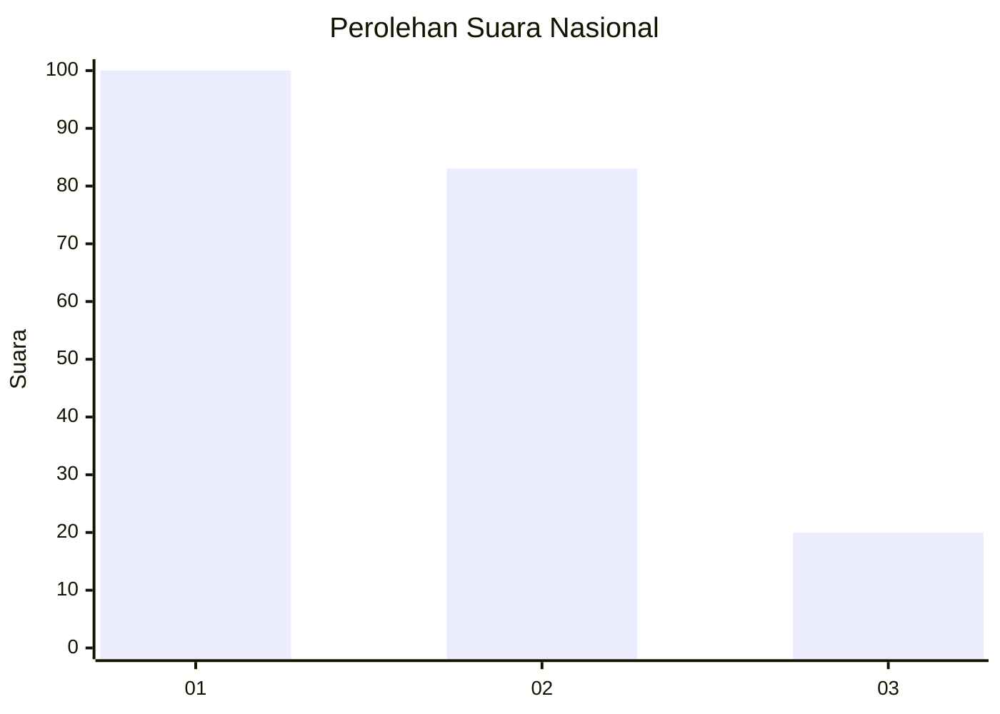
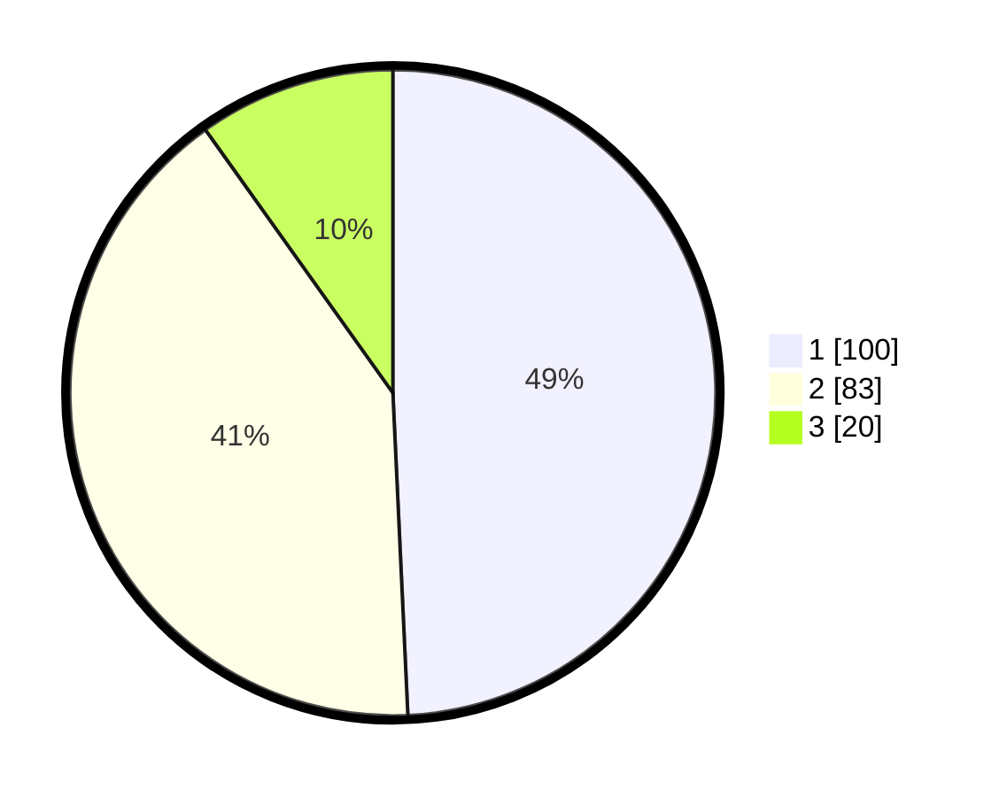

# Hasil

## Grafik

## Tabel

| No. | Nama Paslon    | Suara | Suara (raw) | Persentase |
|:--- |:-------------- | -----:| -----------:| ----------:|
| 1   | ANIES MUHAIMIN | 100   | [100][p-1]  | 49,26      |
| 2   | PRABOWO GIBRAN | 83    | [83][p-2]   | 40,89      |
| 3   | GANJAR MAHFUD  | 20    | [20][p-3]   | 9,85       |

[p-1]: https://github.com/gigit-pemilu/pemilu-2024/blob/main/pilpres/hitung-suara/sub/16-sumatera-selatan/sub/71-kota-palembang/sub/04-ilir-barat-satu/sub/1002-lorokpakjo/sub/039-tps/sub/paslon-1.txt
[p-2]: https://github.com/gigit-pemilu/pemilu-2024/blob/main/pilpres/hitung-suara/sub/16-sumatera-selatan/sub/71-kota-palembang/sub/04-ilir-barat-satu/sub/1002-lorokpakjo/sub/039-tps/sub/paslon-2.txt
[p-3]: https://github.com/gigit-pemilu/pemilu-2024/blob/main/pilpres/hitung-suara/sub/16-sumatera-selatan/sub/71-kota-palembang/sub/04-ilir-barat-satu/sub/1002-lorokpakjo/sub/039-tps/sub/paslon-3.txt

## Foto C Plano

https://sirekap-obj-formc.kpu.go.id/4143/pemilu/ppwp/16/71/04/10/02/1671041002039-20240219-121135--239e90c2-4732-4ecd-86e2-27de97e0a594.jpg

https://sirekap-obj-formc.kpu.go.id/4143/pemilu/ppwp/16/71/04/10/02/1671041002039-20240219-121208--d78ef3db-e29a-421d-9661-7699bc360f78.jpg

https://sirekap-obj-formc.kpu.go.id/4143/pemilu/ppwp/16/71/04/10/02/1671041002039-20240219-121241--c2ef74fc-33ef-4db3-ae31-150a6646b8bd.jpg

## Metadata

| Key        | Value               |
| ---------- | ------------------- |
| Time Stamp | 2024-02-24 22:31:28 |

