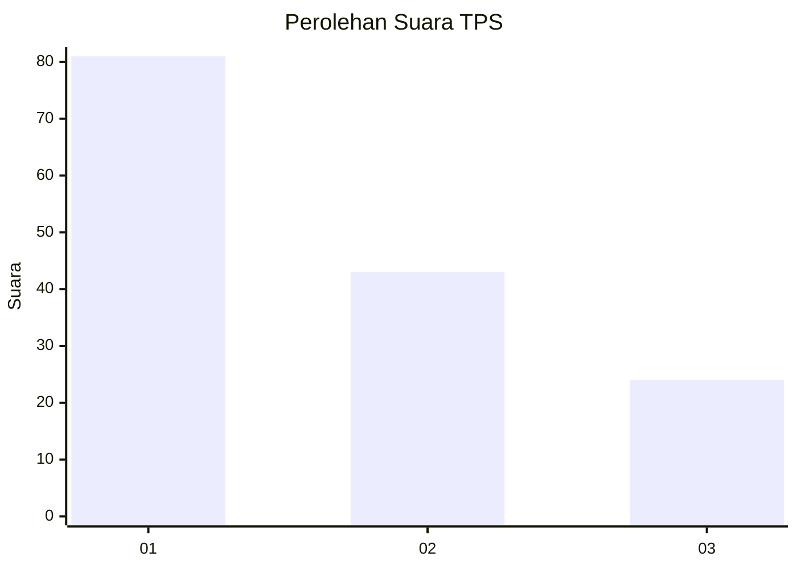
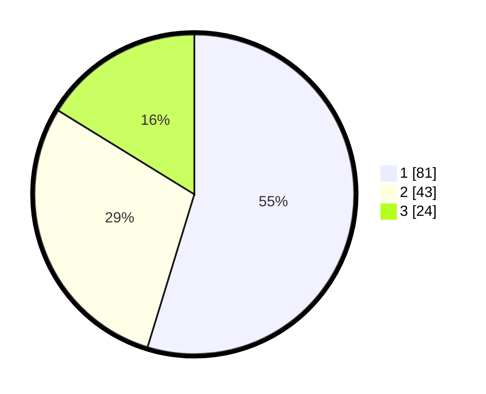

# Hasil

## Grafik

## Tabel

| No. | Nama Paslon    | Suara | Suara (raw) | Persentase |
|:--- |:-------------- | -----:| -----------:| ----------:|
| 1   | ANIES MUHAIMIN | 81    | [81][p-1]   | 54,73      |
| 2   | PRABOWO GIBRAN | 43    | [43][p-2]   | 29,05      |
| 3   | GANJAR MAHFUD  | 24    | [24][p-3]   | 16,22      |

[p-1]: https://github.com/gigit-pemilu/pemilu-2024-16-sumatera-selatan/blob/main/pilpres/hitung-suara/sub/16-sumatera-selatan/sub/71-kota-palembang/sub/04-ilir-barat-satu/sub/1002-lorokpakjo/sub/057-tps/sub/paslon-1.txt
[p-2]: https://github.com/gigit-pemilu/pemilu-2024-16-sumatera-selatan/blob/main/pilpres/hitung-suara/sub/16-sumatera-selatan/sub/71-kota-palembang/sub/04-ilir-barat-satu/sub/1002-lorokpakjo/sub/057-tps/sub/paslon-2.txt
[p-3]: https://github.com/gigit-pemilu/pemilu-2024-16-sumatera-selatan/blob/main/pilpres/hitung-suara/sub/16-sumatera-selatan/sub/71-kota-palembang/sub/04-ilir-barat-satu/sub/1002-lorokpakjo/sub/057-tps/sub/paslon-3.txt

## Foto C Plano

https://sirekap-obj-formc.kpu.go.id/7b17/pemilu/ppwp/16/71/04/10/02/1671041002057-20240219-155433--24c24883-fd69-432c-9bb8-d953f44dadcb.jpg

https://sirekap-obj-formc.kpu.go.id/7b17/pemilu/ppwp/16/71/04/10/02/1671041002057-20240219-155918--441e1ae1-1b90-4339-96cd-bab4e39e935d.jpg

https://sirekap-obj-formc.kpu.go.id/7b17/pemilu/ppwp/16/71/04/10/02/1671041002057-20240219-155956--46261857-0172-4cf7-81b5-e12f0e9839f4.jpg

## Metadata

| Key        | Value               |
| ---------- | ------------------- |
| Time Stamp | 2024-02-24 23:00:00 |

