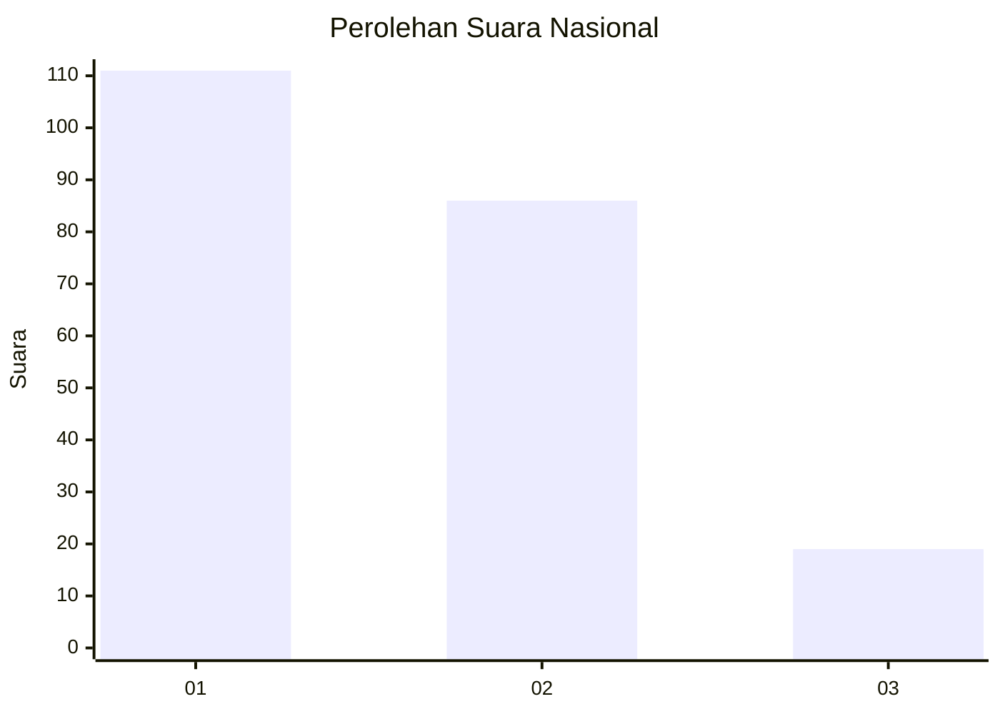
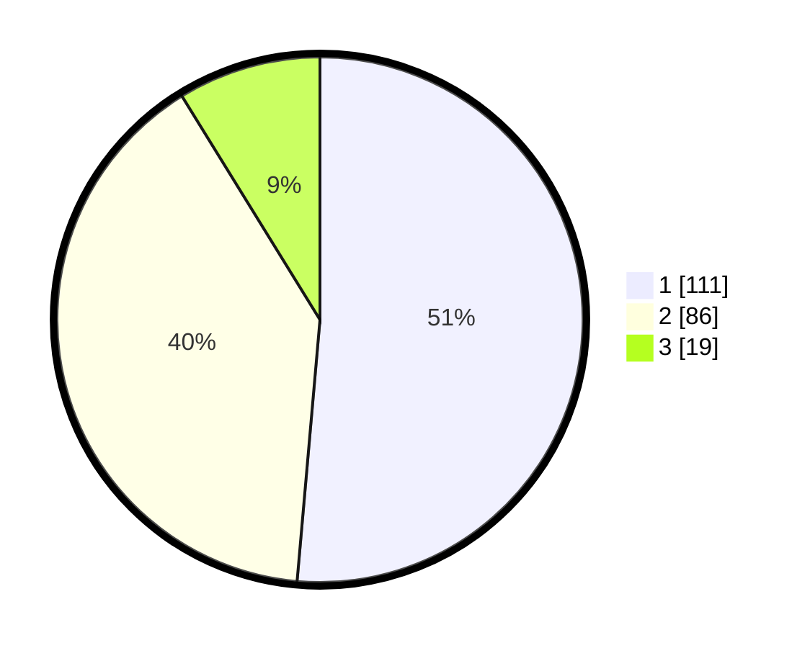

# Hasil

## Grafik

## Tabel

| No. | Nama Paslon    | Suara | Suara (raw) | Persentase |
|:--- |:-------------- | -----:| -----------:| ----------:|
| 1   | ANIES MUHAIMIN | 111   | [111][p-1]  | 51,39      |
| 2   | PRABOWO GIBRAN | 86    | [86][p-2]   | 39,81      |
| 3   | GANJAR MAHFUD  | 19    | [19][p-3]   | 8,80       |

[p-1]: https://github.com/gigit-pemilu/pemilu-2024/blob/main/pilpres/hitung-suara/sub/16-sumatera-selatan/sub/71-kota-palembang/sub/04-ilir-barat-satu/sub/1002-lorokpakjo/sub/058-tps/sub/paslon-1.txt
[p-2]: https://github.com/gigit-pemilu/pemilu-2024/blob/main/pilpres/hitung-suara/sub/16-sumatera-selatan/sub/71-kota-palembang/sub/04-ilir-barat-satu/sub/1002-lorokpakjo/sub/058-tps/sub/paslon-2.txt
[p-3]: https://github.com/gigit-pemilu/pemilu-2024/blob/main/pilpres/hitung-suara/sub/16-sumatera-selatan/sub/71-kota-palembang/sub/04-ilir-barat-satu/sub/1002-lorokpakjo/sub/058-tps/sub/paslon-3.txt

## Foto C Plano

https://sirekap-obj-formc.kpu.go.id/fb21/pemilu/ppwp/16/71/04/10/02/1671041002058-20240219-160125--99bcee43-27e0-4be3-ae4f-e1936f596bbe.jpg

https://sirekap-obj-formc.kpu.go.id/fb21/pemilu/ppwp/16/71/04/10/02/1671041002058-20240219-160226--f3e93bdf-71e2-4de0-81ce-1cbb9a9a6d49.jpg

https://sirekap-obj-formc.kpu.go.id/fb21/pemilu/ppwp/16/71/04/10/02/1671041002058-20240219-160410--bd530e3d-7c0c-416b-9341-c2033b012200.jpg

## Metadata

| Key        | Value               |
| ---------- | ------------------- |
| Time Stamp | 2024-02-25 22:00:00 |

