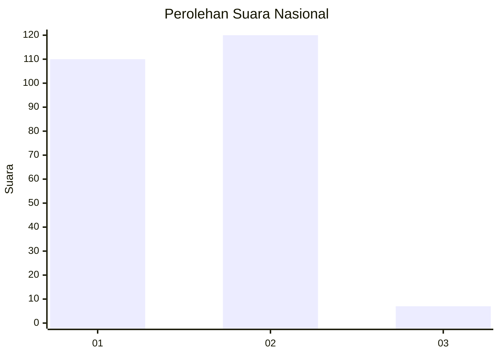
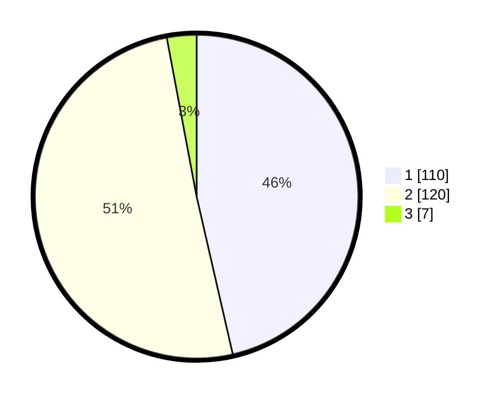

# Hasil

## Grafik

## Tabel

| No. | Nama Paslon    | Suara | Suara (raw) | Persentase |
|:--- |:-------------- | -----:| -----------:| ----------:|
| 1   | ANIES MUHAIMIN | 110   | [110][p-1]  | 46,41      |
| 2   | PRABOWO GIBRAN | 120   | [120][p-2]  | 50,63      |
| 3   | GANJAR MAHFUD  | 7     | [7][p-3]    | 2,95       |

[p-1]: https://github.com/gigit-pemilu/pemilu-2024/blob/main/pilpres/hitung-suara/sub/16-sumatera-selatan/sub/71-kota-palembang/sub/04-ilir-barat-satu/sub/1002-lorokpakjo/sub/059-tps/sub/paslon-1.txt
[p-2]: https://github.com/gigit-pemilu/pemilu-2024/blob/main/pilpres/hitung-suara/sub/16-sumatera-selatan/sub/71-kota-palembang/sub/04-ilir-barat-satu/sub/1002-lorokpakjo/sub/059-tps/sub/paslon-2.txt
[p-3]: https://github.com/gigit-pemilu/pemilu-2024/blob/main/pilpres/hitung-suara/sub/16-sumatera-selatan/sub/71-kota-palembang/sub/04-ilir-barat-satu/sub/1002-lorokpakjo/sub/059-tps/sub/paslon-3.txt

## Foto C Plano

https://sirekap-obj-formc.kpu.go.id/c78d/pemilu/ppwp/16/71/04/10/02/1671041002059-20240219-160702--e3aa8f25-243f-48c5-a5fe-81b48ed30aa5.jpg

https://sirekap-obj-formc.kpu.go.id/c78d/pemilu/ppwp/16/71/04/10/02/1671041002059-20240219-161202--eb016d64-b001-4048-98f1-15e2f1cff951.jpg

https://sirekap-obj-formc.kpu.go.id/c78d/pemilu/ppwp/16/71/04/10/02/1671041002059-20240219-161037--493e06d7-9c45-409c-a63a-ebca52f6fc39.jpg

## Metadata

| Key        | Value               |
| ---------- | ------------------- |
| Time Stamp | 2024-02-26 13:00:00 |

