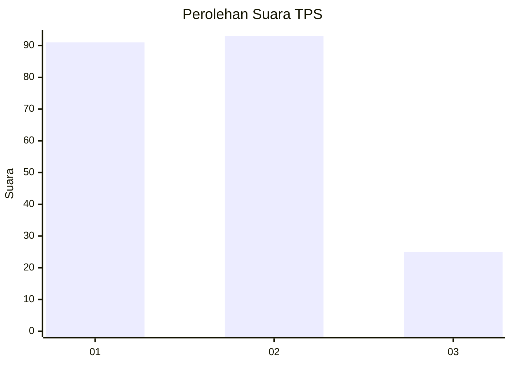
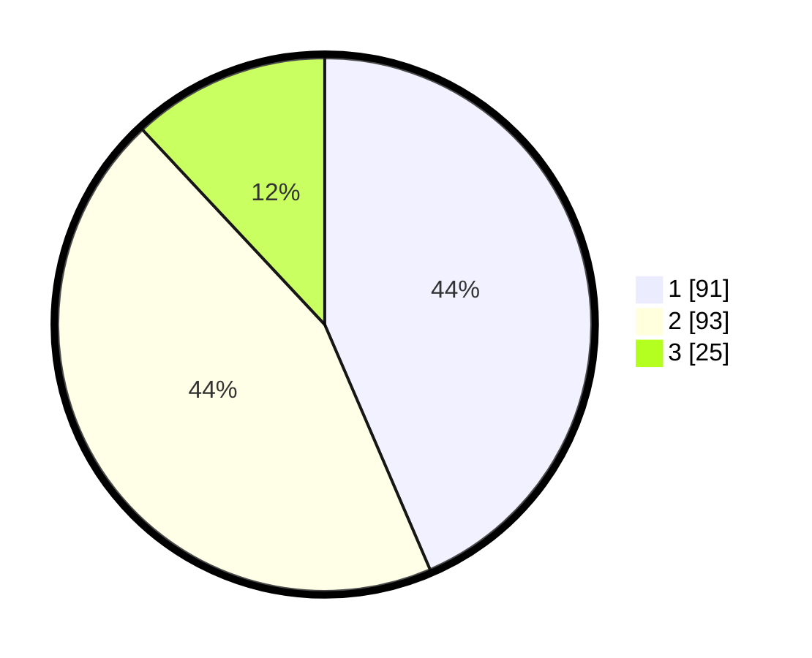

# Hasil

## Grafik

## Tabel

| No. | Nama Paslon    | Suara | Suara (raw) | Persentase |
|:--- |:-------------- | -----:| -----------:| ----------:|
| 1   | ANIES MUHAIMIN | 91    | [91][p-1]   | 43,54      |
| 2   | PRABOWO GIBRAN | 93    | [93][p-2]   | 44,50      |
| 3   | GANJAR MAHFUD  | 25    | [25][p-3]   | 11,96      |

[p-1]: https://github.com/gigit-pemilu/pemilu-2024-16-sumatera-selatan/blob/main/pilpres/hitung-suara/sub/16-sumatera-selatan/sub/71-kota-palembang/sub/04-ilir-barat-satu/sub/1002-lorokpakjo/sub/061-tps/sub/paslon-1.txt
[p-2]: https://github.com/gigit-pemilu/pemilu-2024-16-sumatera-selatan/blob/main/pilpres/hitung-suara/sub/16-sumatera-selatan/sub/71-kota-palembang/sub/04-ilir-barat-satu/sub/1002-lorokpakjo/sub/061-tps/sub/paslon-2.txt
[p-3]: https://github.com/gigit-pemilu/pemilu-2024-16-sumatera-selatan/blob/main/pilpres/hitung-suara/sub/16-sumatera-selatan/sub/71-kota-palembang/sub/04-ilir-barat-satu/sub/1002-lorokpakjo/sub/061-tps/sub/paslon-3.txt

## Foto C Plano

https://sirekap-obj-formc.kpu.go.id/4cec/pemilu/ppwp/16/71/04/10/02/1671041002061-20240219-174247--8c7771c1-cc5f-4365-be4a-defcd77ced7a.jpg

https://sirekap-obj-formc.kpu.go.id/4cec/pemilu/ppwp/16/71/04/10/02/1671041002061-20240219-173744--c297055b-a49b-43a6-91e7-47c4bdf10789.jpg

https://sirekap-obj-formc.kpu.go.id/4cec/pemilu/ppwp/16/71/04/10/02/1671041002061-20240219-174043--c57742c5-3fe8-4091-9926-3ef04071803d.jpg

## Metadata

| Key        | Value               |
| ---------- | ------------------- |
| Time Stamp | 2024-02-25 23:00:00 |

