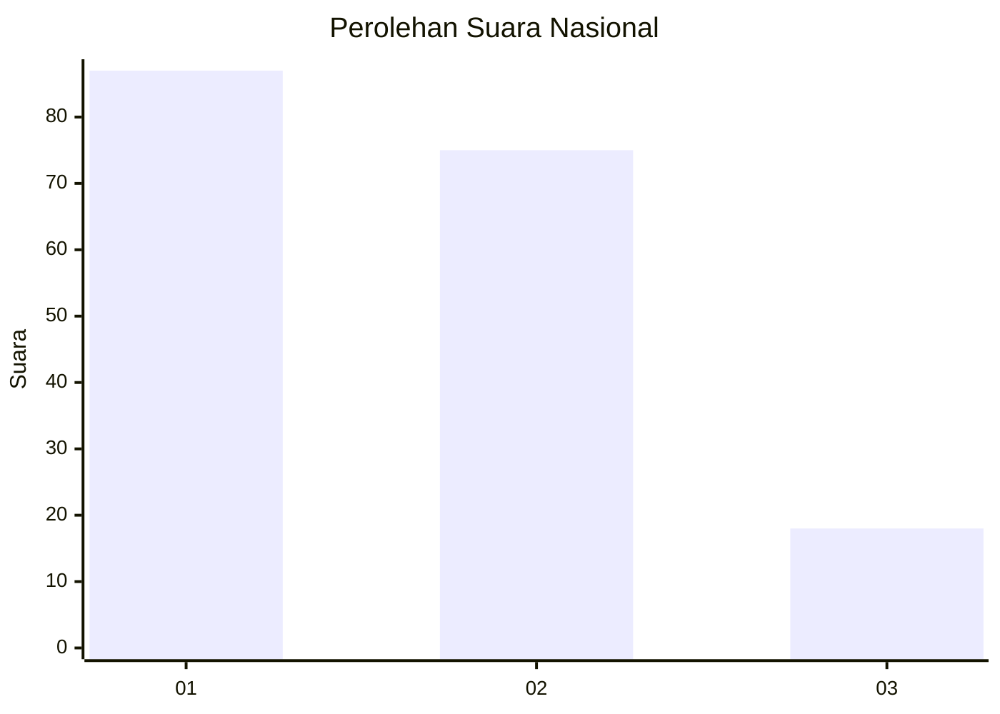
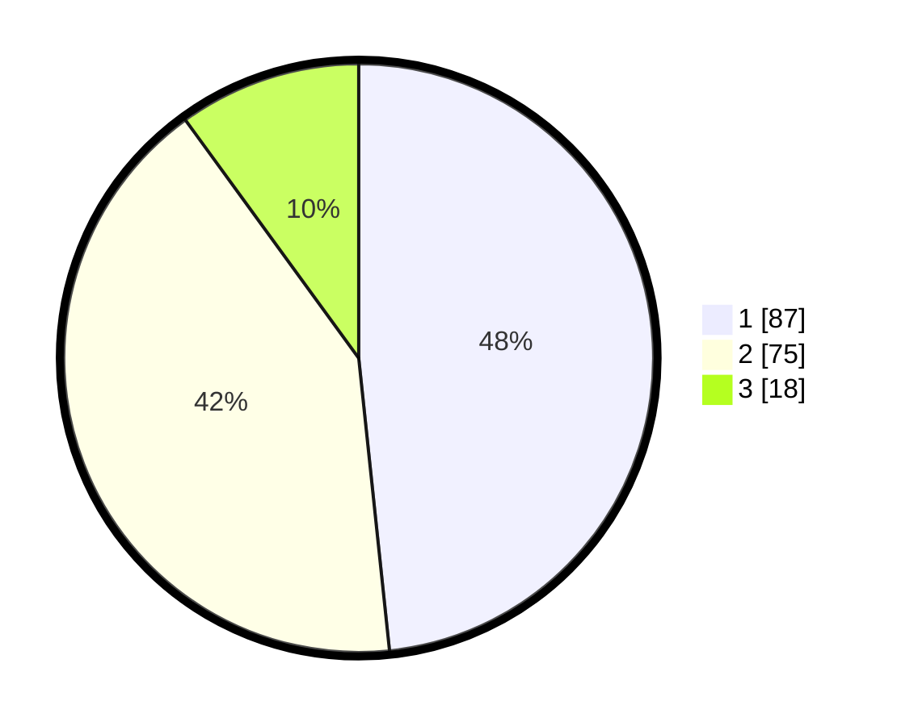

# Hasil

## Grafik

## Tabel

| No. | Nama Paslon    | Suara | Suara (raw) | Persentase |
|:--- |:-------------- | -----:| -----------:| ----------:|
| 1   | ANIES MUHAIMIN | 87    | [87][p-1]   | 48,33      |
| 2   | PRABOWO GIBRAN | 75    | [75][p-2]   | 41,67      |
| 3   | GANJAR MAHFUD  | 18    | [18][p-3]   | 10,00      |

[p-1]: https://github.com/gigit-pemilu/pemilu-2024/blob/main/pilpres/hitung-suara/sub/16-sumatera-selatan/sub/71-kota-palembang/sub/04-ilir-barat-satu/sub/1002-lorokpakjo/sub/063-tps/sub/paslon-1.txt
[p-2]: https://github.com/gigit-pemilu/pemilu-2024/blob/main/pilpres/hitung-suara/sub/16-sumatera-selatan/sub/71-kota-palembang/sub/04-ilir-barat-satu/sub/1002-lorokpakjo/sub/063-tps/sub/paslon-2.txt
[p-3]: https://github.com/gigit-pemilu/pemilu-2024/blob/main/pilpres/hitung-suara/sub/16-sumatera-selatan/sub/71-kota-palembang/sub/04-ilir-barat-satu/sub/1002-lorokpakjo/sub/063-tps/sub/paslon-3.txt

## Foto C Plano

https://sirekap-obj-formc.kpu.go.id/038d/pemilu/ppwp/16/71/04/10/02/1671041002063-20240214-225410--55883e47-1ad5-4693-b4ef-cffc15732d82.jpg

https://sirekap-obj-formc.kpu.go.id/038d/pemilu/ppwp/16/71/04/10/02/1671041002063-20240214-225521--5a485d11-e107-451b-8399-5b7281da6ac0.jpg

https://sirekap-obj-formc.kpu.go.id/038d/pemilu/ppwp/16/71/04/10/02/1671041002063-20240214-225611--62749ea4-17c3-4486-bef6-c05bb8001c91.jpg

## Metadata

| Key        | Value               |
| ---------- | ------------------- |
| Time Stamp | 2024-02-25 17:00:00 |

