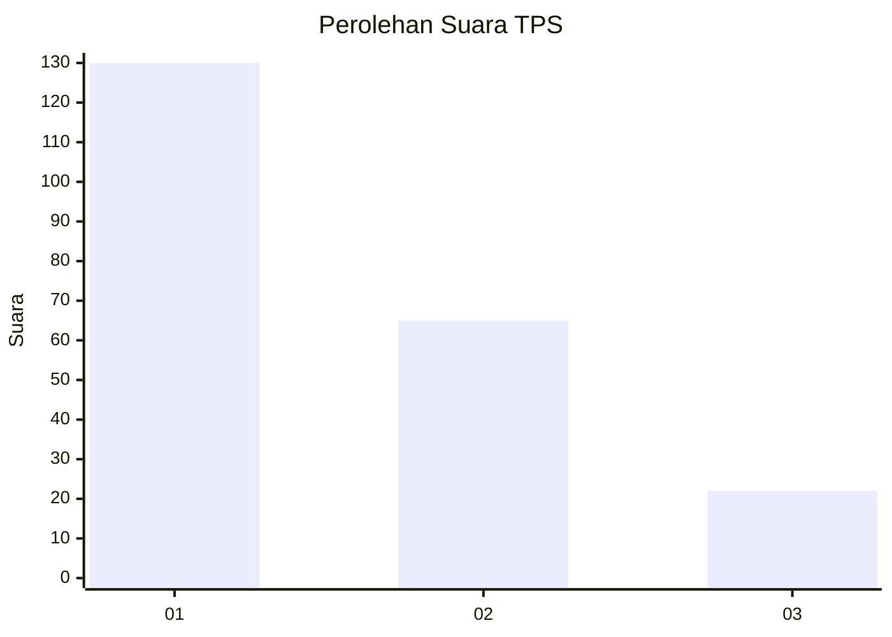
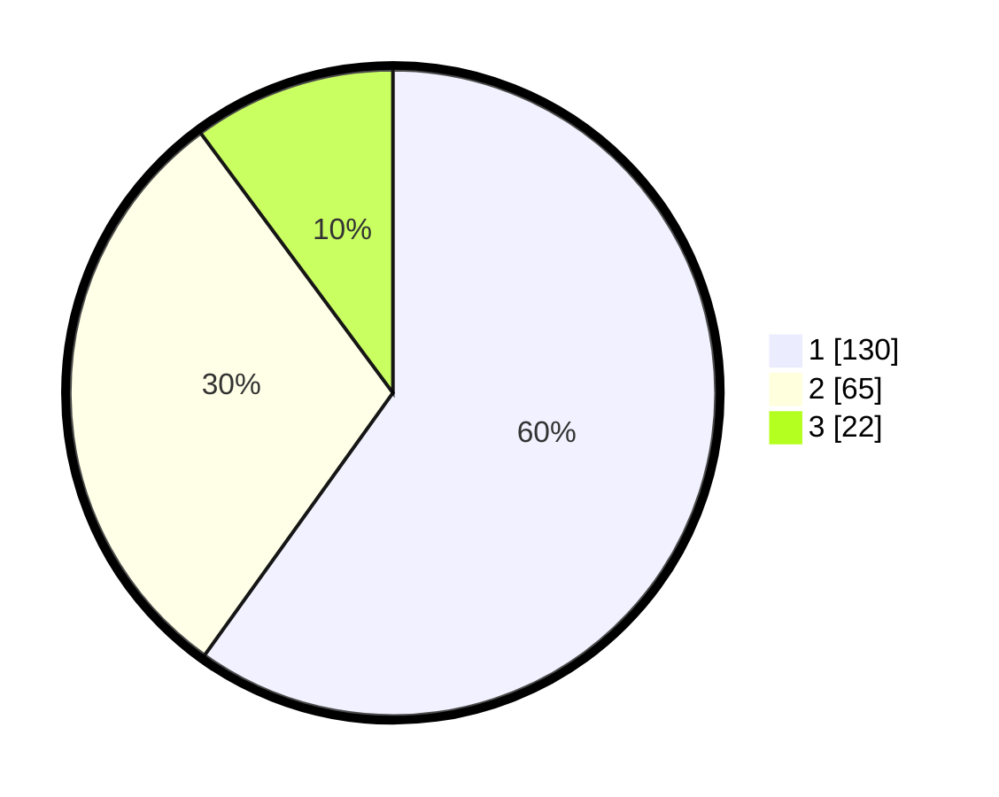

# Hasil

## Grafik

## Tabel

| No. | Nama Paslon    | Suara | Suara (raw) | Persentase |
|:--- |:-------------- | -----:| -----------:| ----------:|
| 1   | ANIES MUHAIMIN | 130   | [130][p-1]  | 59,91      |
| 2   | PRABOWO GIBRAN | 65    | [65][p-2]   | 29,95      |
| 3   | GANJAR MAHFUD  | 22    | [22][p-3]   | 10,14      |

[p-1]: https://github.com/gigit-pemilu/pemilu-2024-16-sumatera-selatan/blob/main/pilpres/hitung-suara/sub/16-sumatera-selatan/sub/71-kota-palembang/sub/04-ilir-barat-satu/sub/1002-lorokpakjo/sub/067-tps/sub/paslon-1.txt
[p-2]: https://github.com/gigit-pemilu/pemilu-2024-16-sumatera-selatan/blob/main/pilpres/hitung-suara/sub/16-sumatera-selatan/sub/71-kota-palembang/sub/04-ilir-barat-satu/sub/1002-lorokpakjo/sub/067-tps/sub/paslon-2.txt
[p-3]: https://github.com/gigit-pemilu/pemilu-2024-16-sumatera-selatan/blob/main/pilpres/hitung-suara/sub/16-sumatera-selatan/sub/71-kota-palembang/sub/04-ilir-barat-satu/sub/1002-lorokpakjo/sub/067-tps/sub/paslon-3.txt

## Foto C Plano

https://sirekap-obj-formc.kpu.go.id/50f3/pemilu/ppwp/16/71/04/10/02/1671041002067-20240214-222132--f6a281d9-76c3-4b89-babb-d4ad769e1aa7.jpg

https://sirekap-obj-formc.kpu.go.id/50f3/pemilu/ppwp/16/71/04/10/02/1671041002067-20240214-222251--b21619ac-377c-48c7-bddf-9a7f6e53a70c.jpg

https://sirekap-obj-formc.kpu.go.id/50f3/pemilu/ppwp/16/71/04/10/02/1671041002067-20240214-222348--51d33b35-06cc-4bec-9a98-84d97c226daf.jpg

## Metadata

| Key        | Value               |
| ---------- | ------------------- |
| Time Stamp | 2024-02-25 12:00:00 |

