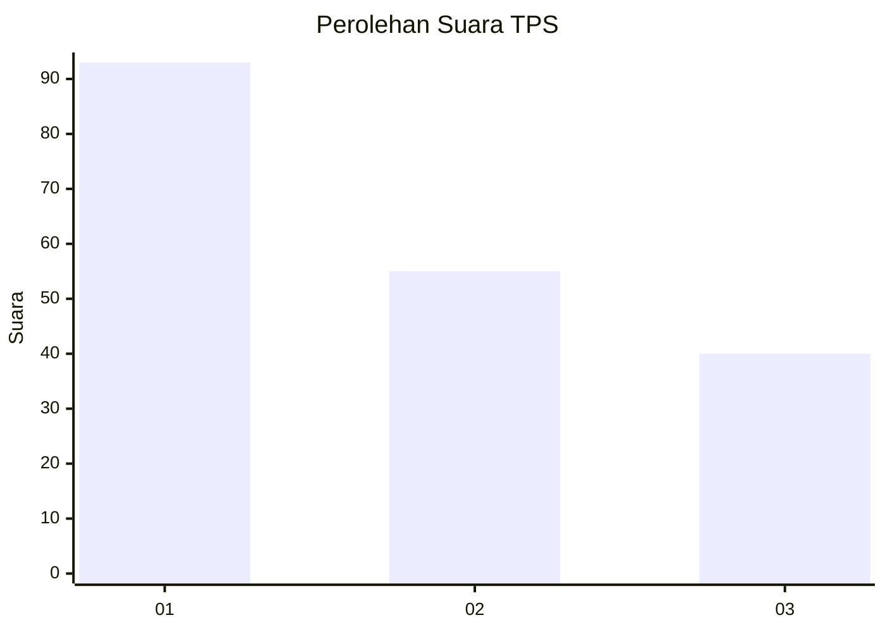
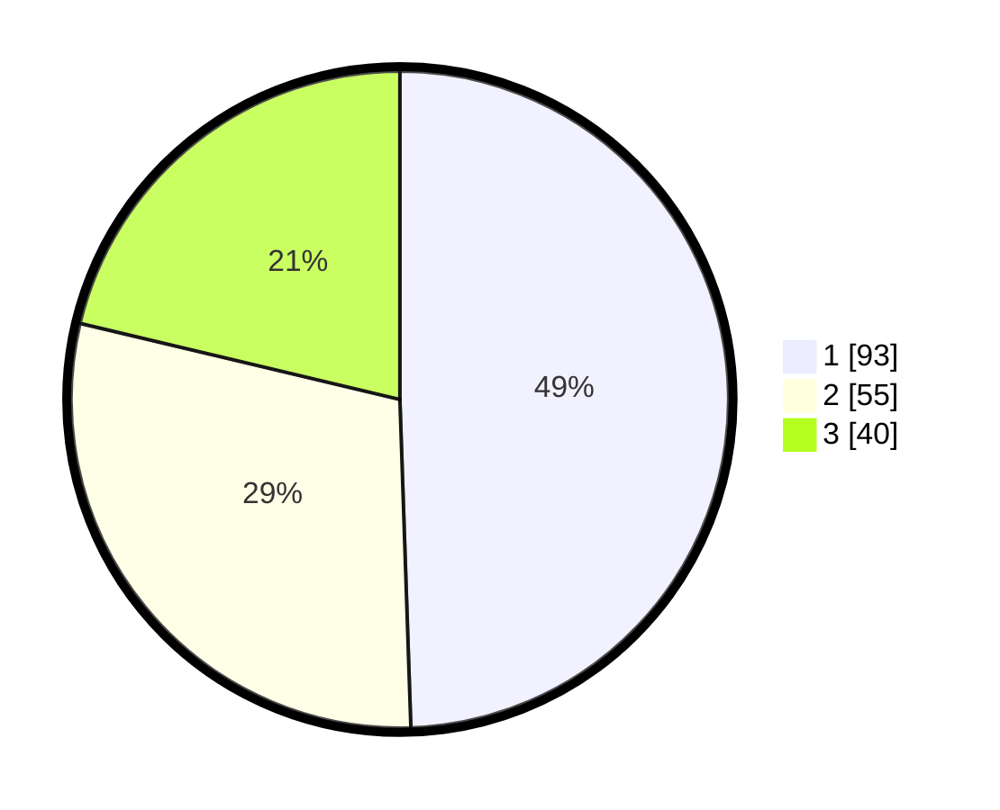

# Hasil

## Grafik

## Tabel

| No. | Nama Paslon    | Suara | Suara (raw) | Persentase |
|:--- |:-------------- | -----:| -----------:| ----------:|
| 1   | ANIES MUHAIMIN | 93    | [93][p-1]   | 49,47      |
| 2   | PRABOWO GIBRAN | 55    | [55][p-2]   | 29,26      |
| 3   | GANJAR MAHFUD  | 40    | [40][p-3]   | 21,28      |

[p-1]: https://github.com/gigit-pemilu/pemilu-2024-16-sumatera-selatan/blob/main/pilpres/hitung-suara/sub/16-sumatera-selatan/sub/71-kota-palembang/sub/04-ilir-barat-satu/sub/1002-lorokpakjo/sub/070-tps/sub/paslon-1.txt
[p-2]: https://github.com/gigit-pemilu/pemilu-2024-16-sumatera-selatan/blob/main/pilpres/hitung-suara/sub/16-sumatera-selatan/sub/71-kota-palembang/sub/04-ilir-barat-satu/sub/1002-lorokpakjo/sub/070-tps/sub/paslon-2.txt
[p-3]: https://github.com/gigit-pemilu/pemilu-2024-16-sumatera-selatan/blob/main/pilpres/hitung-suara/sub/16-sumatera-selatan/sub/71-kota-palembang/sub/04-ilir-barat-satu/sub/1002-lorokpakjo/sub/070-tps/sub/paslon-3.txt

## Foto C Plano

https://sirekap-obj-formc.kpu.go.id/32c0/pemilu/ppwp/16/71/04/10/02/1671041002070-20240219-195922--d0f6deeb-92ff-426c-a07f-a4fcc02be32e.jpg

https://sirekap-obj-formc.kpu.go.id/32c0/pemilu/ppwp/16/71/04/10/02/1671041002070-20240219-200103--cf8b7493-0b22-4103-ae40-f4901fefe9d4.jpg

https://sirekap-obj-formc.kpu.go.id/32c0/pemilu/ppwp/16/71/04/10/02/1671041002070-20240219-200311--7d615275-da62-4735-bc77-459cdf039057.jpg

## Metadata

| Key        | Value               |
| ---------- | ------------------- |
| Time Stamp | 2024-02-24 22:31:28 |

