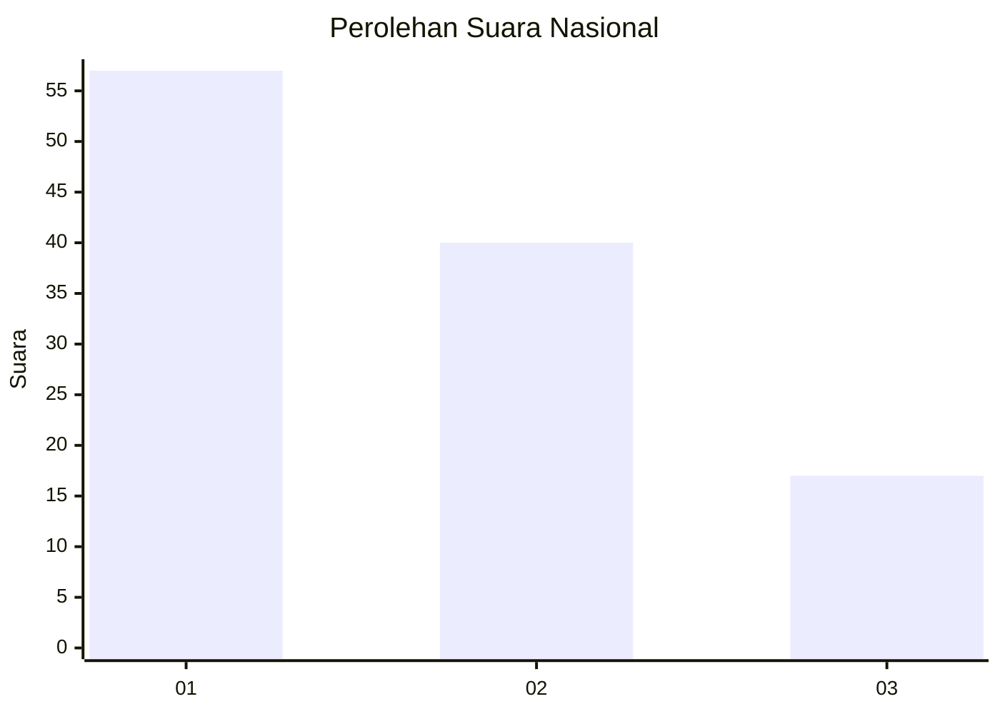
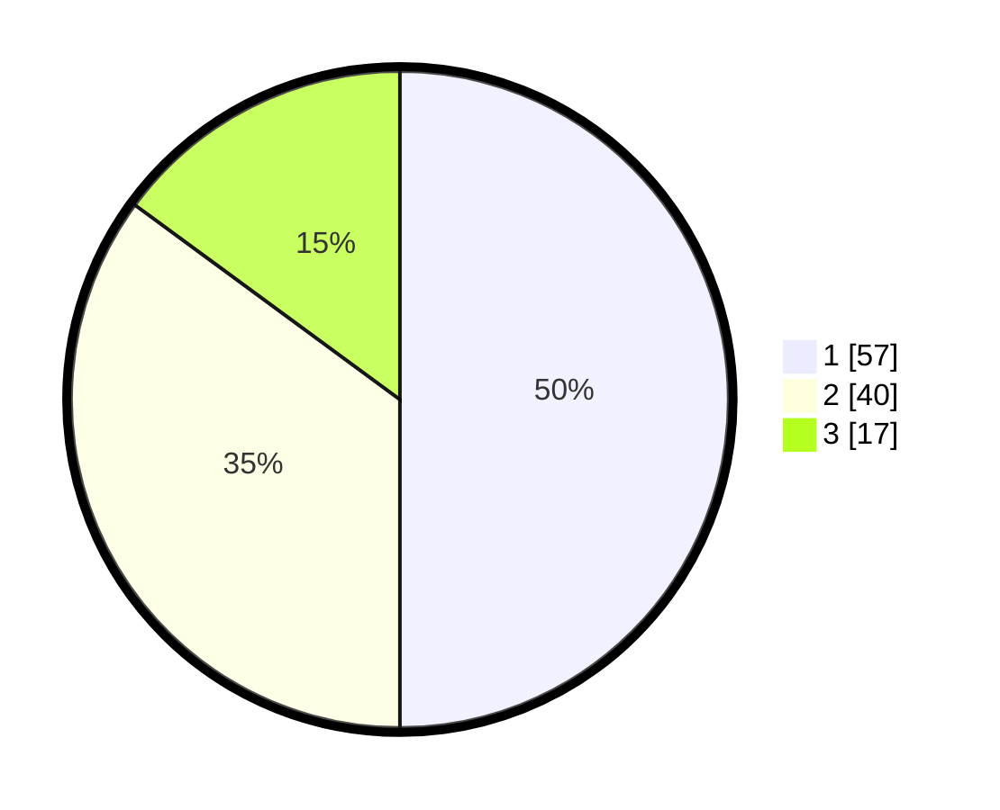

# Hasil

## Grafik

## Tabel

| No. | Nama Paslon    | Suara | Suara (raw) | Persentase |
|:--- |:-------------- | -----:| -----------:| ----------:|
| 1   | ANIES MUHAIMIN | 57    | [57][p-1]   | 50,00      |
| 2   | PRABOWO GIBRAN | 40    | [40][p-2]   | 35,09      |
| 3   | GANJAR MAHFUD  | 17    | [17][p-3]   | 14,91      |

[p-1]: https://github.com/gigit-pemilu/pemilu-2024/blob/main/pilpres/hitung-suara/sub/16-sumatera-selatan/sub/71-kota-palembang/sub/04-ilir-barat-satu/sub/1002-lorokpakjo/sub/071-tps/sub/paslon-1.txt
[p-2]: https://github.com/gigit-pemilu/pemilu-2024/blob/main/pilpres/hitung-suara/sub/16-sumatera-selatan/sub/71-kota-palembang/sub/04-ilir-barat-satu/sub/1002-lorokpakjo/sub/071-tps/sub/paslon-2.txt
[p-3]: https://github.com/gigit-pemilu/pemilu-2024/blob/main/pilpres/hitung-suara/sub/16-sumatera-selatan/sub/71-kota-palembang/sub/04-ilir-barat-satu/sub/1002-lorokpakjo/sub/071-tps/sub/paslon-3.txt

## Foto C Plano

https://sirekap-obj-formc.kpu.go.id/5e59/pemilu/ppwp/16/71/04/10/02/1671041002071-20240219-200537--e1a6fa3c-8bef-44b0-b7a9-3904f670fd43.jpg

https://sirekap-obj-formc.kpu.go.id/5e59/pemilu/ppwp/16/71/04/10/02/1671041002071-20240219-200708--6ce54887-76c8-4097-b6a0-fd33cd01bc1a.jpg

https://sirekap-obj-formc.kpu.go.id/5e59/pemilu/ppwp/16/71/04/10/02/1671041002071-20240219-200815--b1436f6a-451f-4ccd-bce6-13cdf01fb999.jpg

## Metadata

| Key        | Value               |
| ---------- | ------------------- |
| Time Stamp | 2024-02-25 22:00:00 |

