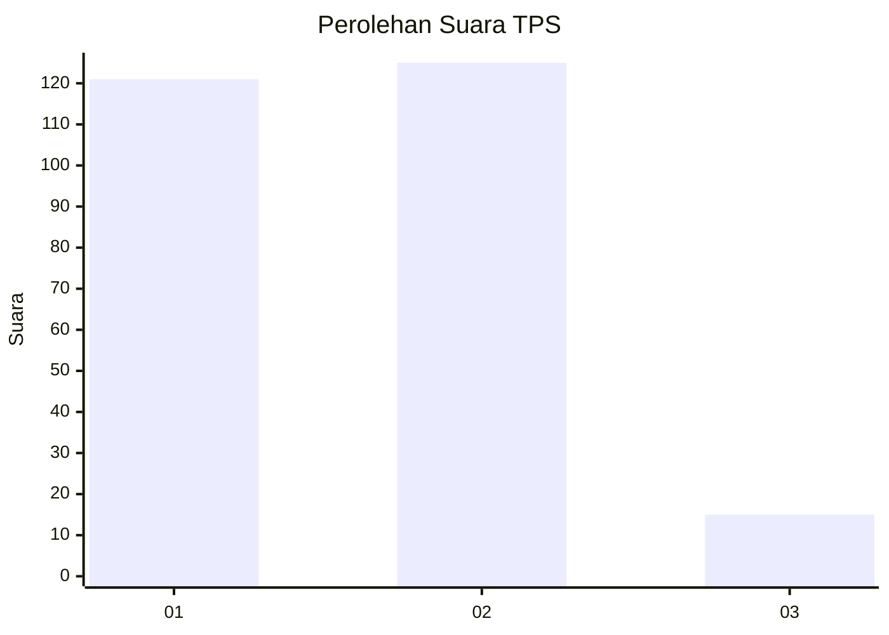
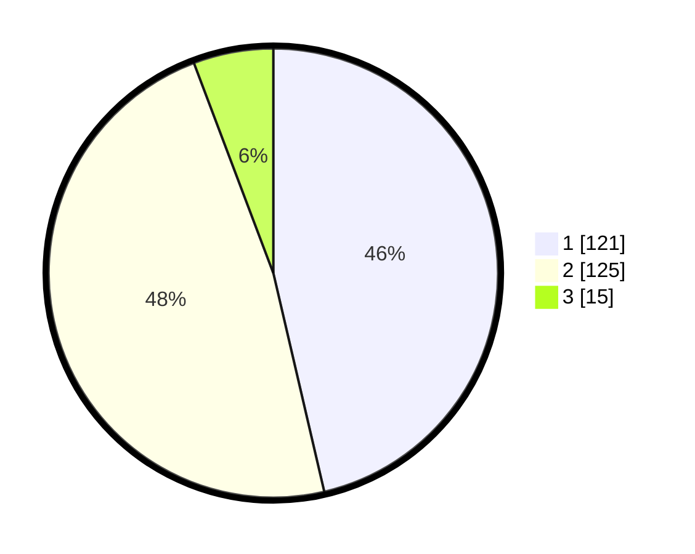

# Hasil

## Grafik

## Tabel

| No. | Nama Paslon    | Suara | Suara (raw) | Persentase |
|:--- |:-------------- | -----:| -----------:| ----------:|
| 1   | ANIES MUHAIMIN | 121   | [121][p-1]  | 46,36      |
| 2   | PRABOWO GIBRAN | 125   | [125][p-2]  | 47,89      |
| 3   | GANJAR MAHFUD  | 15    | [15][p-3]   | 5,75       |

[p-1]: https://github.com/gigit-pemilu/pemilu-2024-16-sumatera-selatan/blob/main/pilpres/hitung-suara/sub/16-sumatera-selatan/sub/71-kota-palembang/sub/04-ilir-barat-satu/sub/1002-lorokpakjo/sub/076-tps/sub/paslon-1.txt
[p-2]: https://github.com/gigit-pemilu/pemilu-2024-16-sumatera-selatan/blob/main/pilpres/hitung-suara/sub/16-sumatera-selatan/sub/71-kota-palembang/sub/04-ilir-barat-satu/sub/1002-lorokpakjo/sub/076-tps/sub/paslon-2.txt
[p-3]: https://github.com/gigit-pemilu/pemilu-2024-16-sumatera-selatan/blob/main/pilpres/hitung-suara/sub/16-sumatera-selatan/sub/71-kota-palembang/sub/04-ilir-barat-satu/sub/1002-lorokpakjo/sub/076-tps/sub/paslon-3.txt

## Foto C Plano

https://sirekap-obj-formc.kpu.go.id/9d3b/pemilu/ppwp/16/71/04/10/02/1671041002076-20240219-210822--de7f62f9-bc01-453d-9102-cbe91be3c1ba.jpg

https://sirekap-obj-formc.kpu.go.id/9d3b/pemilu/ppwp/16/71/04/10/02/1671041002076-20240219-210914--72d90e07-92b6-498c-8083-c87b992d20a7.jpg

https://sirekap-obj-formc.kpu.go.id/9d3b/pemilu/ppwp/16/71/04/10/02/1671041002076-20240219-211035--8d4bdc06-1633-4d15-91e6-5055bb41b3b4.jpg

## Metadata

| Key        | Value               |
| ---------- | ------------------- |
| Time Stamp | 2024-02-24 22:31:28 |

