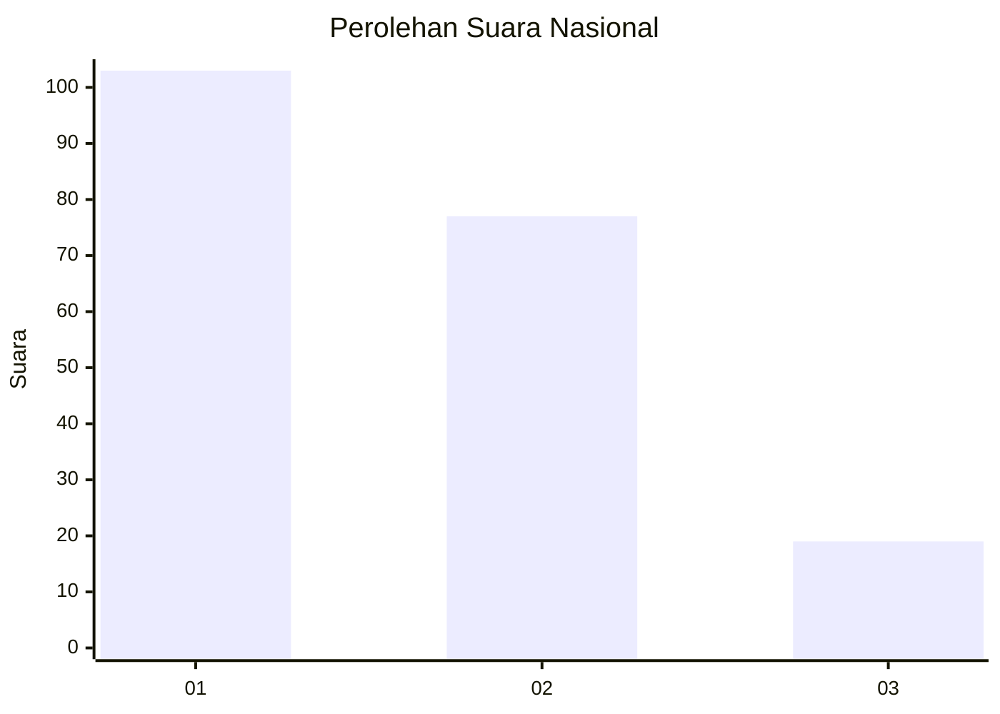
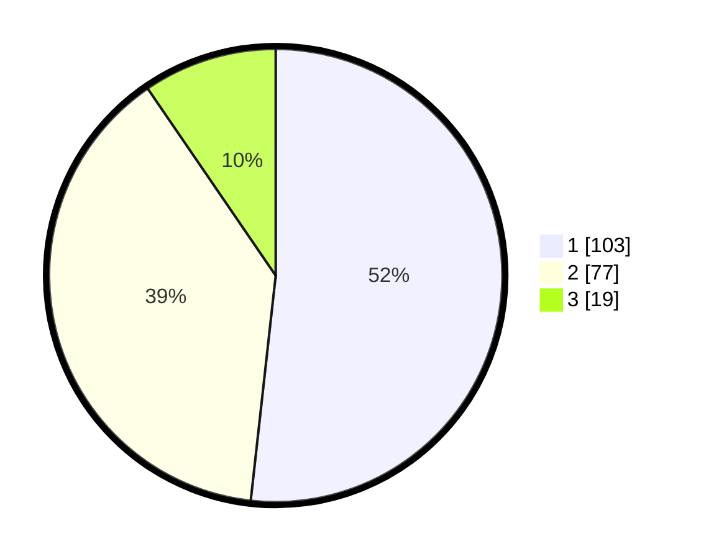

# Hasil

## Grafik

## Tabel

| No. | Nama Paslon    | Suara | Suara (raw) | Persentase |
|:--- |:-------------- | -----:| -----------:| ----------:|
| 1   | ANIES MUHAIMIN | 103   | [103][p-1]  | 51,76      |
| 2   | PRABOWO GIBRAN | 77    | [77][p-2]   | 38,69      |
| 3   | GANJAR MAHFUD  | 19    | [19][p-3]   | 9,55       |

[p-1]: https://github.com/gigit-pemilu/pemilu-2024/blob/main/pilpres/hitung-suara/sub/16-sumatera-selatan/sub/71-kota-palembang/sub/04-ilir-barat-satu/sub/1002-lorokpakjo/sub/077-tps/sub/paslon-1.txt
[p-2]: https://github.com/gigit-pemilu/pemilu-2024/blob/main/pilpres/hitung-suara/sub/16-sumatera-selatan/sub/71-kota-palembang/sub/04-ilir-barat-satu/sub/1002-lorokpakjo/sub/077-tps/sub/paslon-2.txt
[p-3]: https://github.com/gigit-pemilu/pemilu-2024/blob/main/pilpres/hitung-suara/sub/16-sumatera-selatan/sub/71-kota-palembang/sub/04-ilir-barat-satu/sub/1002-lorokpakjo/sub/077-tps/sub/paslon-3.txt

## Foto C Plano

https://sirekap-obj-formc.kpu.go.id/76cf/pemilu/ppwp/16/71/04/10/02/1671041002077-20240219-211256--4047c6d9-db7b-4405-ad00-1dd0964907ae.jpg

https://sirekap-obj-formc.kpu.go.id/76cf/pemilu/ppwp/16/71/04/10/02/1671041002077-20240219-211347--1488567d-4000-4911-a88f-9a8912f17d6a.jpg

https://sirekap-obj-formc.kpu.go.id/76cf/pemilu/ppwp/16/71/04/10/02/1671041002077-20240219-211434--f304b83a-19f9-45b5-bb03-d27eba8f314d.jpg

## Metadata

| Key        | Value               |
| ---------- | ------------------- |
| Time Stamp | 2024-02-25 14:00:00 |

